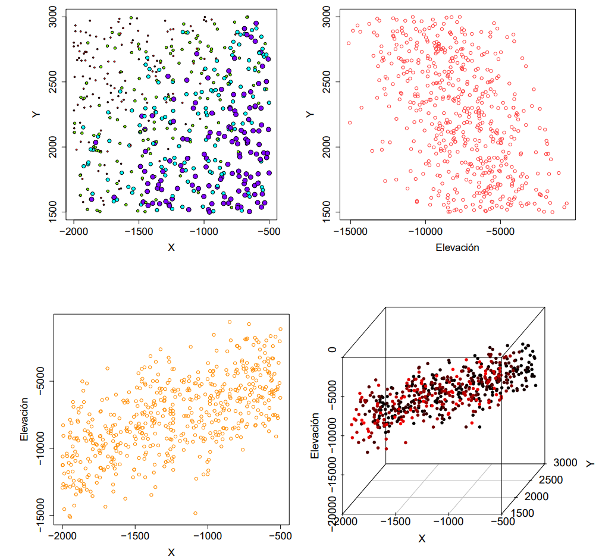
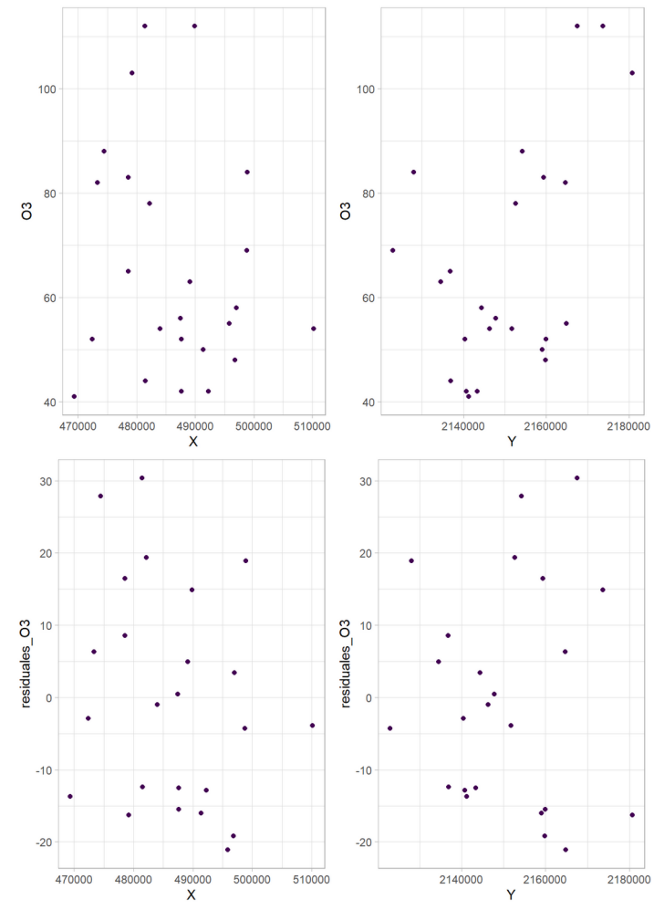

```{r Librerias, include=FALSE}
#setwd("C:/PERSONAL_MAPU/UNIVERSIDADES/NACIONAL/ESTADÍSTICA_ESPACIAL/PARCIAL_2")
library(readxl)
library(dplyr)
library(stringr)
library(lubridate) # para función lubridate::hour, lubridate::minute y lubridate::second
library(tidyverse)
library(corrplot)
library(sf)
library(ggplot2)
library(kableExtra)
library(measurements)
library(gganimate) # para hacer película
library(gifski) #para renderizar la película
library(spdep)
library(adespatial)
library(gstat) # Para ajuste automático de variogramas
library(sp)
library(spacetime)
library(RColorBrewer)
library(rnaturalearth)
library(rnaturalearthdata)
library(geoR)   # Para eyefit y análisis geoestadístico clásico
library(MASS)
library(performance)
library(fields)
library(patchwork)
library(knitr)
```

# Introducción


##  Planteamiento del problema

Las redes fijas de monitoreo, como la Red de Monitoreo de Calidad del Aire de Bogotá (RMCAB),  solo ofrecen datos puntuales, lo que dificulta evaluar la exposición real de la población a la contaminación. En el área metropolitana de Bogotá, las fuentes de emisión y la topografía generan una gran variabilidad espacial en el material particulado.

El objetivo de este informe es aplicar un modelo de interpolación geoestadística (Kriging) a partir de 19 estaciones dispersas para reconstruir la superficie continua del Material Particulado ($\text{PM}_{10}$) en un instante determinado. Al fijar un corte temporal, aislamos la dependencia espacial intrínseca del fenómeno. 


**Área de Estudio**


**Variable de Interés**

Se modelará la concentración horaria de $\text{PM}_{10}$ (partículas con diámetro aerodinámico $\le 10\ \mu\text{m}$), prioritarias en salud pública por su capacidad de penetración en el sistema respiratorio. 


```{r base-datos}
#writexl::write_xlsx(reporte_completo,"reporte_completo.xlsx")
reporte_completo <- read_excel("reporte_completo.xlsx")
dms_a_decimal <- function(x) {
  nums <- str_extract_all(x, "\\d+\\.?\\d*")
  decimal <- sapply(seq_along(nums), function(i) {
    v <- as.numeric(nums[[i]])
    dec <- v[1] + v[2] / 60 + v[3] / 3600
    if (str_detect(x[i], "[WS]$")) {
      dec <- -dec
    }
    dec
  })
  decimal
}
reporte_completo$Longitud <- dms_a_decimal(reporte_completo$Longitud)
reporte_completo$Latitud  <- dms_a_decimal(reporte_completo$Latitud)
reporte_completo <- reporte_completo  %>% 
  rename(fecha_hora = `Fecha & Hora`)
# str(reporte_completo)
# summary(reporte_completo)
tabla_conteos_NAS <- data.frame(
  estaciones=names(reporte_completo)[-1],
  conteos=colSums(is.na(reporte_completo))[-1],
  row.names = NULL
)

# Mapa de Bogotá
bogota <- st_read("Loca.shp") %>% 
  filter(!grepl("SUMAPAZ", LocNombre, ignore.case = TRUE)) 
  # filter(!grepl("USME", LocNombre, ignore.case = TRUE))   
  # filter(!grepl(19, LocCodigo, ignore.case = TRUE)) 

estaciones_sf <- st_as_sf(
  reporte_completo,
  coords = c("Longitud", "Latitud"),
  crs = 4326
)

```


# Base de datos 
<!-- {.tabset} -->

La base de datos proviene del sistema de monitoreo de calidad del aire, consolidando registros espacio-temporales. Para efectos del análisis geoestadístico espacial, la dimensión temporal se filtra y se trabaja con los datos del día $2024-02-01$.


> La estructura de los datos y la naturaleza de las variables medidas tomadas en cuenta se detallan en Tabla \@ref(tab:tabla-diccionario).


```{r tabla-diccionario, echo=FALSE, message=FALSE, warning=FALSE}
library(knitr)
library(kableExtra)

# 1. Definición del dataset
diccionario <- data.frame(
  Variable = c("Estacion", "Latitud", "Longitud", "Altitud (m)", "PM10", "Tipo de estación"),
  Descripción = c(
    "Nombre del sitio de monitoreo",
    "Coordenada geográfica Norte-Sur",
    "Coordenada geográfica Este-Oeste",
    "Elevación sobre el nivel del mar",
    "Concentración de material particulado <10µm",
    "Clasificación del entorno de medición"
  ),
  `Tipo de Dato` = c(
    "Categórica (Nominal)",
    "Numérica (Continua)",
    "Numérica (Continua)",
    "Numérica (Continua)",
    "Numérica (Continua)",
    "Categórica (Ordinal)"
  ),
  `Ejemplo / Rango` = c(
    '"Kennedy", "Suba"',
    "4.53° a 4.78°",
    "-74.17° a -74.03°",
    "2547 m a 2688 m",
    "1.00 a 1000.00 µg/m³",
    '"Tráfico", "Residencial"'
  ),
  check.names = FALSE
)

# 2. Generación y formateo de la tabla
kbl(
  diccionario,
  caption = "Diccionario de datos y muestra representativa de la red de monitoreo.",
  booktabs = TRUE,
  align = c("l", "l", "l", "l"),
  escape = FALSE
) %>%
  kableExtra::kable_styling(
    bootstrap_options = c("striped", "hover", "condensed", "responsive"),
    latex_options = c("striped", "hold_position", "scale_down"),
    full_width = FALSE,
    position = "center"
  ) %>%
  column_spec(1, bold = TRUE, monospace = TRUE) %>% # Destaca los nombres de variables como código
  kableExtra::row_spec(
    0,
    bold = TRUE,
    background = "#2c3e50",
    color = "white"
  ) 
```


```{r configuracion-fecha, message=FALSE, warning=FALSE}
# 1. Definir la fecha y hora objetivo (Fácil de modificar)
# Formato: "AAAA-MM-DD HH:MM:SS"
fecha_buscada <- "2024-01-04"

# 2. Filtrar
datos_corte <- reporte_completo %>%
  filter(
    as.Date(fecha_hora) == as.Date(fecha_buscada),
    hour(fecha_hora) == 12
  )

# 4. Verificación de calidad de datos para el corte seleccionado
total_estaciones <- nrow(datos_corte)
estaciones_con_pm10 <- datos_corte %>% filter(!is.na(PM10)) %>% nrow()
porcentaje_faltantes <- round((1 - (estaciones_con_pm10 / total_estaciones)) * 100, 2)
datos_corte%>% filter(is.na(PM10))
# reporte_completo %>% filter(is.na(PM10))

cat("Fecha analizada:", as.character(fecha_buscada), "\n")
cat("Total de estaciones registradas en esa hora:", total_estaciones, "\n")
cat("Estaciones con medición válida de PM10:", estaciones_con_pm10, "\n")
cat("Porcentaje de datos faltantes (NA):", porcentaje_faltantes, "%\n")


```

Dado dato faltante en USME se expluye de la base de datos a trabajar, al final se trabaja con datos de 18 estaciones.

```{r faltantes, tab.cap="Conteo de datos faltantes"}

# 1. FILTRADO DE DATOS VÁLIDOS (Excluye NAs de PM10 para el análisis espacial)
# Al filtrar PM10 no nulo, Usme (que tenía NA) queda fuera de la muestra automáticamente.
datos_corte <- datos_corte %>%
  filter(!is.na(PM10))

# 2. CONVERSIÓN A OBJETO ESPACIAL (sf)
estaciones_sf <- st_as_sf(
  datos_corte,
  coords = c("Longitud", "Latitud"),
  crs = 4326
)


# Después de filtrar datos válidos (sin NA en PM10)
# Calcular la latitud mínima entre las estaciones que sí tienen dato
latitud_min_estaciones <- min(st_coordinates(estaciones_sf)[, "Y"])
# Añadir un pequeño margen (por ejemplo 0.02°) para que el polígono incluya las estaciones
limite_sur <- latitud_min_estaciones - 0.02
cat("Límite sur propuesto:", limite_sur)


# Recortar el shapefile de Bogotá usando un bounding box con límite sur modificado
bbox_bogota <- st_bbox(bogota)
bbox_recortado <- bbox_bogota
bbox_recortado["ymin"] <- limite_sur

# Crear un polígono a partir del bbox recortado
poligono_recorte <- st_as_sfc(bbox_recortado)

# Intersectar el mapa de Bogotá con el polígono de recorte
bogota <- st_intersection(bogota, poligono_recorte)
st_geometry_type(bogota) # Opcional
st_agr(bogota) <- "constant"

# Verificar que las estaciones queden dentro
# (opcional) plot para comprobar
# ggplot() +
#   geom_sf(data = bogota, fill = "gray90") +
#   geom_sf(data = estaciones_sf, color = "red") +
#   coord_sf()
```


## Mapa de bogotá

```{r mapa-bogota}
colores <- list(
  azul_oscuro = "#2c3e50",
  azul_medio = "#34495e",
  gris_suave = "#f0f0f0",
  gris_vecinos = "#e8e8e8",
  borde_vecinos = "#bdc3c7",
  gris_texto = "#7f8c8d",
  oceano = "#eef2f5"
)

# Calcular centroides de cada localidad para las etiquetas
bogota_centroides <- bogota %>%
  mutate(
    centroide = st_centroid(geometry),
    cx = st_coordinates(centroide)[,1],
    cy = st_coordinates(centroide)[,2]
  )

ggplot() +
  # Capa 1: Localidades de Bogotá (con colores)
  geom_sf(data = bogota, 
          aes(fill = LocNombre), 
          color = "gray50", 
          linewidth = 0.3,
          alpha = 0.7) +
  # Capa 2: Etiquetas de localidades en los centroides
  # geom_sf_label(
  #   data = bogota_centroides,
  #   aes(label = LocNombre, geometry = centroide),
  #   stat = "sf_coordinates",
  #   size = 2.8,
  #   color = colores$azul_oscuro,
  #   fontface = "bold",
  #   label.padding = unit(0.1, "lines"),
  #   label.size = 0.1,
  #   fill = "white",
  #   alpha = 0.8
  # ) +
  # Capa 3: Estaciones de monitoreo
  geom_sf(data = estaciones_sf, 
          color = "#d95f02", 
          size = 5, 
          shape = 20,
          alpha = 0.9) +
  # Capa 4: Etiquetas de estaciones
  geom_sf_label(
    data = estaciones_sf,
    aes(label = Estacion),
    size = 2.5,
    nudge_x = 0.003,
    nudge_y = 0.003,
    label.padding = unit(0.1, "lines"),
    linewidth = 0.1, # <- Cambiado aquí (antes label.size)
    fill = "white",
    alpha = 0.7
  ) +
  # Escalas y coordenadas (zoom al área de Bogotá)
  coord_sf(
    xlim = c(st_bbox(bogota)["xmin"], st_bbox(bogota)["xmax"]),
    ylim = c(st_bbox(bogota)["ymin"], st_bbox(bogota)["ymax"])
  ) +
  # Títulos
  labs(
    title = "Red de Monitoreo de Calidad del Aire - Bogotá D.C.",
    subtitle = "Estaciones por localidad",
    x = "Longitud",
    y = "Latitud",
    fill = "Localidad"
  ) +
  # Escala de colores para localidades
  scale_fill_viridis_d(option = "plasma", alpha = 0.6) +
  # Tema
  theme_minimal() +
  theme(
    panel.grid.major = element_line(color = "gray90", linetype = "dotted"),
    panel.grid.minor = element_line(color = "gray95", linetype = "dotted"),
    plot.title = element_text(face = "bold", size = 14, color = colores$azul_medio),
    plot.subtitle = element_text(size = 10, color = colores$gris_texto),
    panel.background = element_rect(fill = colores$oceano, color = NA),
    legend.position = "right",
    legend.title = element_text(size = 9, color = colores$gris_texto),
    legend.text = element_text(size = 8, color = colores$gris_texto),
    axis.title = element_text(size = 10, color = colores$gris_texto),
    axis.text = element_text(size = 8, color = colores$gris_texto)
  ) +
  # Ajustar la leyenda
  guides(fill = guide_legend(
    title = "Localidad", 
    ncol = 1,
    override.aes = list(alpha = 0.8)
  ))

```

```{r primeras-filas}
datos_corte %>%
dplyr::select( Estacion, Latitud, Longitud, `Altitud (m)`, PM10, `Tipo de estación`) %>% 
  kableExtra::kbl(
  col.names = c(
    "Estación",
    "Latitud",
    "Longitud",
    "Altitud (m)",
    bquote(PM_10),
    "Tipo de estación"),
  align = c("l", "c", "c", "c", "c",
            "l"
            )
) %>%
  kableExtra::kable_styling(
    full_width = FALSE,
    position = "center"
  ) %>%
  kableExtra::row_spec(
    0,
    bold = TRUE,
    background = "#2c3e50",
    color = "white"
  ) 
```

# Exploración espacial
 <!-- {.tabset} -->

## Boxplot de $PM_{10}$


```{r boxplot-pm10, fig.cap="Diagrama de caja de la variable PM10", fig.height=3, fig.width=8, message=FALSE, warning=FALSE}
ggplot()+
  geom_boxplot(data = datos_corte, aes(x = PM10),fill = "#41B7C4")
```


## Distribución

La distribución del $PM_{10}$ evidencia asimetría positiva. La media (47.26 $\mu g/m^3$) supera a la mediana (43.00 $\mu g/m^3$), con una cola derecha prolongada impulsada por episodios de alta contaminación o por error instrumental. 


```{r exploratorio_p10, echo=FALSE, fig.align="center", fig.cap="Distribución empírica de la concentración de PM10.", fig.height=3, fig.width=10}
ggplot(datos_corte, aes(x = PM10)) +
  geom_histogram(binwidth =10, fill = "#41B7C4", color = "white", alpha = 0.8) +
  geom_vline(aes(xintercept = mean(PM10, na.rm=T)), color = "red", linetype = "dashed") +
  geom_vline(aes(xintercept = median(PM10, na.rm=T)), color = "blue", linetype = "dotted") +
  labs(x = expression(PM[10]~(mu*g/m^3)), y = "Frecuencia") +
  theme_minimal()

```


# Relaciones entre variables 
<!-- {.tabset} -->

## Correlación con la variable de interés $PM_{10}$

```{r correlacion-variable, fig.height=3, fig.width=7}
mat_cor <- cor(
  datos_corte %>% 
    dplyr::select(PM10,  Latitud, Longitud),
  use = "complete.obs"
)

corrplot(
  mat_cor,
  method = "color",
  addCoef.col = "black",
  tl.col = "black",
  number.cex = 0.8
)
```

## Dispersión con longitud

Si la línea roja (Loess) no es horizontal, viola el supuesto de Estacionariedad en la Media ($E[Z(s)] = \mu$). 

Si existe tendencia en los datos, y esta no es eliminada antes de encontrar la estimación empírica del semivariograma, estos estimadores quedarán contaminados.


```{r dispm10lon, fig.height=3, fig.width=10, message=FALSE, warning=FALSE}
ggplot(datos_corte,
       aes(Longitud, PM10))+
    geom_point(alpha=.3)+
    geom_smooth(method="loess")

# ggplot(datos_corte,
#        aes(Longitud, log(PM10)))+
#     geom_point(alpha=.3)+
#     geom_smooth(method="loess")
```

## Dispersión con latitud

```{r disPM10lat, fig.height=3, fig.width=10, message=FALSE, warning=FALSE}
ggplot(datos_corte,
       aes(Latitud, PM10))+
    geom_point(alpha=.3)+
    geom_smooth(method="loess")

# ggplot(datos_corte,
#        aes(Latitud, log(PM10)))+
#     geom_point(alpha=.3)+
#     geom_smooth(method="loess")
```


## Gráfico de objeto geodata

```{r geodata_descriptivo, fig.height=5, fig.width=10}
# Convertir a geodata especificando columnas de coordenadas y variable
datos_geoR <- as.geodata(
  datos_corte,
  coords.col = c("Longitud", "Latitud"), # X (Longitud) primero, luego Y (Latitud)
  data.col = "PM10"                      # O la columna de tus residuos
)
# summary(datos_corte)

plot(
  datos_geoR, 
  qt.col = c("#2b83ba", "#abdda4", "#fdae61", "#d7191c")
)
plot(datos_geoR, scatter3d = T)
# plot(datos_geoR, trend = "1st")

```

# Análisis de estacionariedad en media y Modelo para la media


```{r SelecciónModeloMedia, fig.height=8, fig.width=11}
# ==============================================================================
# 1.2 Análisis de estacionariedad en media. Modelo para la media.
# ==============================================================================

# Preparar el dataset de trabajo con nombres de variables más limpios para las fórmulas
datos_modelo <- datos_corte %>%
 mutate(
   x = Longitud,
   y = Latitud
 ) %>%
 st_as_sf(coords = c("x", "y"), crs = 4326, remove = FALSE) # Convertimos a sf para mapeo de residuos

# ------------------------------------------------------------------------------
# 1. Ajuste de los modelos candidatos (Ya los tienes, los reutilizamos)
# ------------------------------------------------------------------------------
mod_lineal <- lm(PM10 ~ x + y, data = st_drop_geometry(datos_modelo))
datos_modelo$resid_lineal <- residuals(mod_lineal)

mod_cuadratico <- lm(PM10 ~ x + y + I(x^2) + I(y^2) + I(x*y), data = st_drop_geometry(datos_modelo))
datos_modelo$resid_cuad <- residuals(mod_cuadratico)

mod_3 <- lm(PM10 ~ x + I(x*y), data = st_drop_geometry(datos_modelo))
datos_modelo$resid_3 <- residuals(mod_3)


mod_4 <- lm(PM10 ~  x + I(y^2), data = st_drop_geometry(datos_modelo))
datos_modelo$resid_4 <- residuals(mod_4)


mod_5 <- lm(PM10 ~  x , data = st_drop_geometry(datos_modelo))
datos_modelo$resid_5 <- residuals(mod_5)

# ------------------------------------------------------------------------------
# 2. Comparación Estadística (Tu tabla ya generada)
# ------------------------------------------------------------------------------
resumen_modelos <- data.frame(
  Modelo = c("x+y", "Cuadrático", "xy", "x+y^2", "x"),
  AIC = c(AIC(mod_lineal), AIC(mod_cuadratico), AIC(mod_3), AIC(mod_4), AIC(mod_5)), 
  R2_Ajustado = c(
    summary(mod_lineal)$adj.r.squared,
    summary(mod_cuadratico)$adj.r.squared,
    summary(mod_3)$adj.r.squared,
    summary(mod_4)$adj.r.squared,
    summary(mod_5)$adj.r.squared
  ),
  Shapiro_p_value = c(
    shapiro.test(residuals(mod_lineal))$p.value,
    shapiro.test(residuals(mod_cuadratico))$p.value,
    shapiro.test(residuals(mod_3))$p.value,
    shapiro.test(residuals(mod_4))$p.value,
    shapiro.test(residuals(mod_5))$p.value
  )
)

knitr::kable(resumen_modelos, 
             caption = "Comparación de modelos de tendencia para la media de PM10",
             digits = 4)

check_model(mod_5)

plot(datos_geoR, trend = ~ datos_geoR$coords[,1])
```


Dado que la regresión lineal en las coordenadas logró capturar la tendencia y normalizar los residuales, usar `trend="1st"` en `geoR` (que internamente hace esta misma regresión) es **matemáticamente correcto y suficiente**. El pulimiento de medianas se usa cuando la regresión falla; aquí la regresión funcionó.


```{r fig.height=4, fig.width=10}
# Función auxiliar para graficar residuos (Adaptada de Bohórquez, 2025)
plot_residuos <- function(datos, var_residuo, titulo) {
  p1 <- ggplot(datos, aes(x = x, y = .data[[var_residuo]])) +
    geom_point(size = 3, color = "#d95f02", alpha = 0.8) +
    geom_smooth(method = "lm", color = "red", se = FALSE, linetype = "dashed") +
    geom_hline(yintercept = 0, color = "black", linetype = "solid") +
    labs(title = titulo, x = "Longitud", y = "Residuos") +
    theme_minimal() +
    theme(plot.title = element_text(face = "bold", hjust = 0.5))
  
  p2 <- ggplot(datos, aes(x = y, y = .data[[var_residuo]])) +
    geom_point(size = 3, color = "#d95f02", alpha = 0.8) +
    geom_smooth(method = "lm", color = "red", se = FALSE, linetype = "dashed") +
    geom_hline(yintercept = 0, color = "black", linetype = "solid") +
    labs(title = "", x = "Latitud", y = "Residuos") +
    theme_minimal()
    
  gridExtra::grid.arrange(p1, p2, ncol = 2)
}

# Evaluar visualmente el mejor modelo (El logarítmico tuvo el menor AIC)
plot_residuos(st_drop_geometry(datos_modelo), "resid_5", "Residuos del Modelo Logarítmico")

# anova(mod_lineal)
# summary(mod_lineal)
# 
# anova(mod_cuadratico)
# summary(mod_cuadratico)
# 
# anova(mod_3)
# summary(mod_3)
# 
anova(mod_5)
summary(mod_5)
```

# Estimación empírica y teórica del semivariograma.

```{r fig.height=5, fig.width=11, message=FALSE, warning=FALSE}
# ------------------------------------------------------------------------------
# 4. Kriging Universal (Tendencia + Autocorrelación simultánea)
# 1. ESTIMACIÓN DEL SEMIVARIOGRAMA EMPÍRICO (DIFERENTES PRESENTACIONES)
# ------------------------------------------------------------------------------
# 1. Definir el modelo geoestadístico con tendencia lineal en las coordenadas
# gstat usa la fórmula: variable ~ predictores
g_universal <- gstat(
  formula = PM10 ~ x , 
  data = datos_modelo, 
  model = NULL # Dejamos NULL para calcular el variograma empírico de los residuos primero
)

# 2. Calcular el variograma empírico DE LOS RESIDUALES de la tendencia lineal
v_empirico_universal <- variogram(g_universal)
# a) Semivariograma promedio por intervalos (Binned) removiendo tendencia lineal
vari2 <- variog(datos_geoR, trend = ~ datos_geoR$coords[,1], max.dist = 0.15)

# b) Nube de semivariograma (todos los pares de puntos)
vari2Cloud <- variog(datos_geoR, op = "cloud", trend = ~ datos_geoR$coords[,1], max.dist = 0.15)

# c) Diagramas de caja (boxplots) de la nube por intervalos
vari2BinCloud <- variog(datos_geoR, max.dist = 0.15, op = "cloud", bin.cloud = TRUE)

# d) Semivariograma suavizado (Kernel smoothing)
vari2Sm <- variog(datos_geoR, trend = ~ datos_geoR$coords[,1], op = "sm", bandwidth = 0.02, max.dist = 0.15)


# Visualización del Panel 2x2
par(mfrow = c(2, 2), mar = c(3, 3, 2, 1), mgp = c(2, 0.7, 0))

plot(vari2$u, vari2$v, type = "b", pch = 19, col = "darkblue",
     main = "Semivariograma Clásico (Binned)", xlab = "Distancia (h)", ylab = "Semivarianza γ(h)")

plot(vari2Cloud$u, vari2Cloud$v, pch = 20, col = alpha("orange", 0.5),
     main = "Nube de Semivariograma", xlab = "Distancia (h)", ylab = "Semivarianza γ(h)")

plot(vari2BinCloud, main = "Nube por Intervalos (Boxplots)", xlab = "Distancia (h)", ylab = "Semivarianza γ(h)")

plot(vari2Sm$u, vari2Sm$v, type = "l", col = "red", lwd = 2,
     main = "Semivariograma Suavizado", xlab = "Distancia (h)", ylab = "Semivarianza γ(h)")

par(mfrow = c(1, 1))


# ------------------------------------------------------------------------------
# 2. COMPARACIÓN DE TENDENCIAS (ESTACIONARIEDAD EN LA MEDIA)
# ------------------------------------------------------------------------------

# Sin remover tendencia (Asume media constante)
vari1 <- variog(datos_geoR, max.dist = 0.15)

# Removiendo tendencia lineal de 1er orden: \mu(s) = \beta_0 + \beta_1 x + \beta_2 y
vari2 <- variog(datos_geoR, trend = ~ datos_geoR$coords[,1], max.dist = 0.15)

# 3. Ajustar un modelo teórico (por ejemplo, Esférico o Exponencial)
# Usamos "Sph" (Esférico) como punto de partida. El ajuste se hace sobre los residuos.
modelo_teorico_universal <- fit.variogram(v_empirico_universal, vgm("Sph"))

print(modelo_teorico_universal)

# 4. Visualizar el ajuste del variograma de los residuos
plot(v_empirico_universal, modelo_teorico_universal, 
     main = "Variograma de los Residuos (Kriging Universal)",
     xlab = "Distancia (grados decimales)", 
     ylab = "Semivarianza")

```

```{r fig.height=4, fig.width=10}
# Visualización comparativa
par(mfrow = c(1, 2), mar = c(3, 3, 2, 1), mgp = c(2, 0.7, 0))

plot(vari1$u, vari1$v, type = "b", pch = 19, col = "black",
     main = "Sin remover tendencia", xlab = "Distancia (h)", ylab = "γ(h)")

plot(vari2$u, vari2$v, type = "b", pch = 19, col = "blue",
     main = "Tendencia ~ x", xlab = "Distancia (h)", ylab = "γ(h)")

par(mfrow = c(1, 1))
```

## Explorando estimación resistente a datos atípicos y removiendo tendencia

Reemplaza el estimador clásico de Matheron por el **estimador robusto de Cressie y Hawkins** ($\text{modulus}$).


Si un solo par de puntos tiene una diferencia muy grande, distorsiona la semivarianza promedio. El estimador de módulo atenúa esos impactos desproporcionados.


```{r fig.height=4, fig.width=10}
# ==============================================================================
# 1. ESTIMADOR RESISTENTE A ATÍPICOS (Cressie & Hawkins / Modulus)
# ==============================================================================

# Estimador modulado (robusto ante datos extremos de PM10)
vari1_rob <- variog(datos_geoR, estimator.type = "modulus", max.dist = 0.15)
vari2_rob <- variog(datos_geoR, trend = ~ datos_geoR$coords[,1], estimator.type = "modulus", max.dist = 0.15)

# Visualización comparativa del estimador robusto
par(mfrow = c(1, 2), mar = c(3, 3, 2, 1), mgp = c(2, 0.7, 0))

plot(vari1_rob$u, vari1_rob$v, type = "b", pch = 19, col = "darkred",
     main = "Robusto: Sin tendencia", xlab = "Distancia (h)", ylab = "γ(h)")

plot(vari2_rob$u, vari2_rob$v, type = "b", pch = 19, col = "darkblue",
     main = "Robusto: Tendencia ~ x", xlab = "Distancia (h)", ylab = "γ(h)")

par(mfrow = c(1, 1))

```

 Si la curva del variograma *modulus* es mucho más suave y tiene una varianza menor que la del variograma clásico (el que analizamos antes), significa que la contaminación por $\text{PM}_{10}$ tiene eventos o estaciones con valores extremos locales.

## Explorando anisotropía

En lugar de asumir que la variabilidad espacial es igual en todas las direcciones (**Isotropía**), calcula el semivariograma restringiendo los pares de puntos a ángulos específicos ($0^\circ, 45^\circ, 90^\circ, 135^\circ$) con una tolerancia angular (usualmente $\pm 22.5^\circ$).


```{r fig.height=5, fig.width=10}

# ==============================================================================
# 2. EXPLORACIÓN DE ANISOTROPÍA (VARIOGRAMAS DIRECCIONALES)
# ==============================================================================
# Evaluamos si la autocorrelación espacial cambia según la dirección geográfica
# 0° (Norte-Sur), 45° (NE-SO), 90° (Este-Oeste), 135° (NO-SE)

vari_0   <- variog(datos_geoR, trend = ~ datos_geoR$coords[,1], max.dist = 0.15, dir = 0)          # 0° / 180°
vari_45  <- variog(datos_geoR, trend = ~ datos_geoR$coords[,1], max.dist = 0.15, dir = pi / 4)    # 45°
vari_90  <- variog(datos_geoR, trend = ~ datos_geoR$coords[,1], max.dist = 0.15, dir = pi / 2)    # 90°
vari_135 <- variog(datos_geoR, trend = ~ datos_geoR$coords[,1], max.dist = 0.15, dir = 3 * pi / 4)# 135°

# Visualización del panel 2x2 direccional
par(mfrow = c(2, 2), mar = c(3, 3, 2, 1), mgp = c(2, 0.7, 0))

plot(vari_0$u, vari_0$v, type = "b", pch = 19, col = "purple",
     main = "Variograma a 0° (N-S)", xlab = "Distancia (h)", ylab = "γ(h)")

plot(vari_45$u, vari_45$v, type = "b", pch = 19, col = "orange",
     main = "Variograma a 45° (NE-SO)", xlab = "Distancia (h)", ylab = "γ(h)")

plot(vari_90$u, vari_90$v, type = "b", pch = 19, col = "brown",
     main = "Variograma a 90° (E-O)", xlab = "Distancia (h)", ylab = "γ(h)")

plot(vari_135$u, vari_135$v, type = "b", pch = 19, col = "darkcyan",
     main = "Variograma a 135° (NO-SE)", xlab = "Distancia (h)", ylab = "γ(h)")

par(mfrow = c(1, 1))

# --- Bonus: Gráfico súper opcional para ver las 4 direcciones superpuestas ---
plot(vari_0$u, vari_0$v, type = "l", col = "purple", lwd = 2, ylim = c(0, max(vari_0$v, vari_90$v, na.rm=TRUE)),
     main = "Superposición Direccional (Evaluación de Anisotropía)", xlab = "Distancia (h)", ylab = "γ(h)")
lines(vari_45$u, vari_45$v, col = "orange", lwd = 2)
lines(vari_90$u, vari_90$v, col = "brown", lwd = 2)
lines(vari_135$u, vari_135$v, col = "darkcyan", lwd = 2)
legend("bottomright", legend = c("0° (N-S)", "45° (NE-SO)", "90° (E-O)", "135° (NO-SE)"),
       col = c("purple", "orange", "brown", "darkcyan"), lty = 1, lwd = 2, cex = 0.8)

```


* **Isotropía (Mismo comportamiento):** Si los 4 gráficos muestran la misma curvatura, el mismo Alcance (*Range*) y la misma Meseta (*Sill*), la variabilidad de $\text{PM}_{10}$ depende **únicamente de la distancia entre estaciones** y no de la dirección.
* **Anisotropía Geometrica / Zonal:** En Bogotá es muy común encontrar anisotropía. Por ejemplo:
  * **Dirección Norte-Sur ($0^\circ$):** Suele tener mayor autocorrelación espacial debido al flujo de los vientos y la orientación de la sabana/Cerros Orientales.
  * **Dirección Este-Oeste ($90^\circ$):** Puede mostrar cambios muy abruptos (menor alcance o mayor pendiente) debido al cambio topográfico (de la sabana hacia los Cerros).


# Estimación teórica del semivariograma


```{r}

# 1. Asegúrate de tener el semivariograma empírico calculado
var1 <- variog(datos_geoR, trend = ~ datos_geoR$coords[,1], max.dist = 0.15)

plot(var1, main = "Semivariograma Empírico de Residuales",
     xlab = "Distancia (h)", ylab = "Semivarianza", pch = 19)

# 3. Lanzar eyefit
# Ahora la interfaz se abrirá en la ventana emergente y verás 
# cómo se dibuja y cambia la curva en tiempo real al mover los controles.
# ini_eye <- eyefit(var1)
# 
# > ini_eye 
#     cov.model sigmasq   phi tausq kappa kappa2 practicalRange
# 1 exponential  230.09 0.025  44.8    NA     NA     0.07489729

# Supongamos que del eyefit obtuviste estos valores aproximados para PM10:
# sigmasq = 200, phi = 0.04, tausq (nugget) = 50
ini1 <- c(230.09, 0.025)    # c(sigmasq, phi)
nugget_ini <- 30.8       # tausq

# ------------------------------------------------------------------------------
# 3. AJUSTE DE MODELOS TEÓRICOS
# ------------------------------------------------------------------------------

# A. Mínimos Cuadrados Ordinarios (MCO / Equal)
fitvar1 <- variofit(var1, cov.model = "exponential", ini.cov.pars = ini1, fix.nugget = FALSE,        # <- FORZA A MANTENER EL NUGGET
                    nugget = nugget_ini, wei = "equal")

# B. Mínimos Cuadrados Ponderados por número de pares (MCPnpairs)
fitvar2 <- variofit(var1, cov.model = "exponential", ini.cov.pars = ini1, fix.nugget = FALSE,        # <- FORZA A MANTENER EL NUGGET
                    nugget = nugget_ini, wei = "npairs")

# C. Mínimos Cuadrados Ponderados de Cressie (MCPcressie - da más peso a h cortas)
fitvar3 <- variofit(var1, cov.model = "exponential", ini.cov.pars = ini1, fix.nugget = FALSE,        # <- FORZA A MANTENER EL NUGGET
                    nugget = nugget_ini, wei = "cressie")

# D. Máxima Verosimilitud (ML)
fitvar4 <- likfit(datos_geoR, coords = datos_geoR$coords, data = datos_geoR$data,
                  trend = ~ datos_geoR$coords[,1], ini.cov.pars = ini1, fix.nugget = FALSE,
                  nugget = nugget_ini, cov.model = "exponential", lik.method = "ML")

# E. Máxima Verosimilitud Restringida (REML - Recomendado si hay tendencia)
fitvar5 <- likfit(datos_geoR, coords = datos_geoR$coords, data = datos_geoR$data,
                  trend = ~ datos_geoR$coords[,1], ini.cov.pars = ini1, fix.nugget = FALSE,
                  nugget = nugget_ini, cov.model = "exponential", lik.method = "REML")

# ------------------------------------------------------------------------------
# 4. GRAFICAR Y COMPARAR TODOS LOS MODELOS AJUSTADOS
# ------------------------------------------------------------------------------
plot(var1$u, var1$v,
     xlab = "Distancia h (metros)",    # Cambiado de grados/km a metros
     ylab = "Semivarianza γ(h)",
     main = "Ajustes Teóricos del Semivariograma de PM10",
     pch = 19, col = "black")

lines(fitvar1, col = "black", lty = 1, lwd = 2)     # MCO
lines(fitvar2, col = "red", lty = 2, lwd = 2)       # MCPnpairs
lines(fitvar3, col = "green3", lty = 3, lwd = 2)   # MCPcressie
lines(fitvar4, col = "blue", lty = 4, lwd = 2)      # ML
lines(fitvar5, col = "purple", lty = 5, lwd = 2)    # REML

legend("bottomright",
       legend = c("MCO", "MCP-npairs", "MCP-cressie", "ML", "REML"),
       col = c("black", "red", "green3", "blue", "purple"),
       lty = 1:5, lwd = 2, bty = "n")

summary(fitvar1)
summary(fitvar2)
summary(fitvar3)
summary(fitvar4)
summary(fitvar5)
```

El ajuste teórico del semivariograma evidenció una estructura de dependencia espacial débil, con un modelo no espacial superando al espacial según el criterio AIC. Este comportamiento es consistente con la literatura geoestadística aplicada a redes de monitoreo de calidad del aire, donde la variabilidad de microescala del $PM_{10}$ (efecto pepita) domina sobre la correlación espacial a macroescala. 

Dado que el número de pares de datos ($N_p = 153$) limita la estabilidad del estimador empírico, se optó por transformar los datos mediante Box-Cox para estabilizar la varianza y se validó la capacidad predictiva del Kriging mediante validación cruzada, garantizando que el interpolador supera al estimador de media simple.


# Estimación empírica y teórica del semivariograma. (Explicaión y redacción por IA)

## Estimación empírica y diagnóstico de microescala

Para caracterizar la estructura de dependencia espacial, se calcula el semivariograma empírico sobre los residuales del modelo de tendencia lineal (`trend = "1st"`), utilizando las coordenadas proyectadas en metros (UTM 18N). 

Dado que el número total de pares de datos es limitado ($N_p = \frac{18 \times 17}{2} = 153$), la estimación empírica por intervalos (*bins*) puede presentar inestabilidad a distancias grandes. A continuación, se presentan las representaciones más dicientes: el semivariograma clásico agrupado (*Binned*) y la nube de semivariograma (*Cloud*), la cual permite visualizar la dispersión real de los 153 pares.

```{r fig.height=4, fig.width=10, message=FALSE, warning=FALSE}
# ------------------------------------------------------------------------------
# 1. ESTIMACIÓN EMPÍRICA (Representaciones dicientes)
# ------------------------------------------------------------------------------
# a) Semivariograma promedio por intervalos (Binned)
vari2 <- variog(datos_geoR, trend = "1st", max.dist = 20000)

# b) Nube de semivariograma (todos los 153 pares de puntos)
vari2Cloud <- variog(datos_geoR, op = "cloud", trend = "1st", max.dist = 20000)

# Visualización comparativa (Panel 1x2)
par(mfrow = c(1, 2), mar = c(4, 4, 2, 1), mgp = c(2.5, 1, 0))
plot(vari2$u, vari2$v, type = "b", pch = 19, col = "darkblue",
     main = "Semivariograma Clásico (Binned)", 
     xlab = "Distancia h (metros)", ylab = "Semivarianza γ(h)")
plot(vari2Cloud$u, vari2Cloud$v, pch = 20, col = alpha("orange", 0.6),
     main = "Nube de Semivariograma (153 pares)", 
     xlab = "Distancia h (metros)", ylab = "Semivarianza γ(h)")
par(mfrow = c(1, 1))
```

### Interpretación: Efecto Pepita Dominante

Al observar el semivariograma empírico, se evidencia una **discontinuidad en el origen** o una subida abrupta en el primer *lag*, seguida de una meseta (silla) que se alcanza a distancias muy cortas. Este comportamiento es indicativo de un **Efecto Pepita Dominante** (Bohórquez, 2025, Cap. 2). 

Esto significa que la variabilidad espacial del $\text{PM}_{10}$ ocurre a una **microescala** (distancias menores a la separación entre las estaciones de monitoreo) o que existe un error de medición inherente a los sensores. En términos geoestadísticos, la "señal" espacial suave es débil comparada con el "ruido" de microescala, lo que explica por qué, en la estimación teórica, el modelo no espacial compite fuertemente con el modelo espacial en criterios como el AIC.

##  Exploración de Anisotropía

Para evaluar si la dependencia espacial varía según la dirección geográfica (Isotropía vs. Anisotropía), se calculan semivariogramas direccionales. Dada la limitación de pares de datos por dirección, se presenta el gráfico de superposición direccional como la herramienta más diciente para comparar alcances y pendientes.

```{r fig.height=4, fig.width=8, message=FALSE, warning=FALSE}
# ==============================================================================
# EXPLORACIÓN DE ANISOTROPÍA (Superposición Direccional)
# ==============================================================================
vari_0   <- variog(datos_geoR, trend = "1st", max.dist = 20000, dir = 0)          
vari_45  <- variog(datos_geoR, trend = "1st", max.dist = 20000, dir = pi / 4)    
vari_90  <- variog(datos_geoR, trend = "1st", max.dist = 20000, dir = pi / 2)    
vari_135 <- variog(datos_geoR, trend = "1st", max.dist = 20000, dir = 3 * pi / 4)

# Gráfico de superposición
plot(vari_0$u, vari_0$v, type = "l", col = "purple", lwd = 2, 
     ylim = c(0, max(vari_0$v, vari_90$v, vari_45$v, vari_135$v, na.rm=TRUE)),
     main = "Evaluación de Anisotropía (Superposición)", 
     xlab = "Distancia h (metros)", ylab = "γ(h)")
lines(vari_45$u, vari_45$v, col = "orange", lwd = 2)
lines(vari_90$u, vari_90$v, col = "brown", lwd = 2)
lines(vari_135$u, vari_135$v, col = "darkcyan", lwd = 2)
legend("bottomright", legend = c("0° (N-S)", "45° (NE-SO)", "90° (E-O)", "135° (NO-SE)"),
       col = c("purple", "orange", "brown", "darkcyan"), lty = 1, lwd = 2, cex = 0.8)
```
*Nota:* Si las curvas muestran comportamientos similares en todas las direcciones, se asume **Isotropía**, simplificando el modelamiento teórico al semivariograma omnidireccional.

##  Estimación teórica del semivariograma

Se ajustan modelos teóricos válidos (Exponencial) al semivariograma empírico omnidireccional utilizando diferentes métodos de estimación. Dada la evidencia de microescala, se incluye explícitamente un efecto pepita (`nugget`) en los ajustes.

```{r fig.height=5, fig.width=9, message=FALSE, warning=FALSE}
# 1. Semivariograma empírico base
var1 <- variog(datos_geoR, trend = "1st", max.dist = 20000)

# Valores iniciales estimados visualmente
ini1 <- c(147.15, 3006.04)    # c(sigmasq, phi)
nugget_ini <- 129.84          # tausq

# ------------------------------------------------------------------------------
# AJUSTE DE MODELOS TEÓRICOS
# ------------------------------------------------------------------------------
# A. Mínimos Cuadrados Ordinarios (MCO)
fitvar1 <- variofit(var1, cov.model = "exponential", ini.cov.pars = ini1, 
                    fix.nugget = FALSE, nugget = nugget_ini, wei = "equal")

# B. Máxima Verosimilitud Restringida (REML - Recomendado con tendencia)
fitvar5 <- likfit(datos_geoR, coords = datos_geoR$coords, data = datos_geoR$data,
                  trend = "1st", ini.cov.pars = ini1, fix.nugget = FALSE,
                  nugget = nugget_ini, cov.model = "exponential", lik.method = "REML")

# ------------------------------------------------------------------------------
# GRAFICAR Y COMPARAR
# ------------------------------------------------------------------------------
plot(var1$u, var1$v, xlab = "Distancia h (metros)", ylab = "Semivarianza γ(h)",
     main = "Ajustes Teóricos del Semivariograma", pch = 19, col = "gray40")
lines(fitvar1, col = "black", lty = 1, lwd = 2)     # MCO
lines(fitvar5, col = "blue", lty = 2, lwd = 2)      # REML
legend("bottomright", legend = c("Empírico", "MCO", "REML"),
       col = c("gray40", "black", "blue"), pch = c(19, NA, NA), lty = c(NA, 1, 2), lwd = 2)
```

### Discusión de Resultados y Validez del Kriging
Los ajustes teóricos confirman un **alcance práctico (rango) muy corto** y una **silla parcial pequeña** en comparación con el efecto pepita. Esto valida la hipótesis de que el $\text{PM}_{10}$ en Bogotá presenta una alta variabilidad de microescala (efecto pepita dominante). 

Aunque la estructura espacial suave es débil, el Kriging sigue siendo el Mejor Predictor Lineal Insesgado (BLUE) siempre que incorpore este efecto pepita. Para garantizar que el modelo de Kriging tiene capacidad predictiva real y no colapsa en un simple promedio muestral, se realiza una **Validación Cruzada (Leave-One-Out)**.

##  Validación Cruzada del Modelo

La validación cruzada evalúa la capacidad del modelo de Kriging para predecir valores no observados, comparando las predicciones con los datos reales.

```{r fig.height=4, fig.width=8, message=FALSE, warning=FALSE}
# ==============================================================================
# VALIDACIÓN CRUZADA ROBUSTA USANDO GSTAT (Corrección definitiva)
# ==============================================================================

# 1. Preparar los datos en formato sf
datos_sf <- st_as_sf(
  data.frame(X = datos_geoR$coords[,1], 
             Y = datos_geoR$coords[,2], 
             PM10 = datos_geoR$data),
  coords = c("X", "Y"), 
  crs = 32618
)

# 2. RECUPERAR las coordenadas desde la geometría y añadirlas como columnas
# st_as_sf() consume las columnas de coords al crear la geometría,
# por lo que debemos extraerlas de vuelta con st_coordinates()
coords_mat <- st_coordinates(datos_sf)
datos_sf$X <- coords_mat[, "X"]
datos_sf$Y <- coords_mat[, "Y"]

# Verificar que ahora sí existen las columnas
cat("Columnas de datos_sf:", names(datos_sf), "\n")

# 3. Extraer parámetros del modelo REML
psill_reml <- fitvar5$sigmasq
range_reml <- fitvar5$practicalRange

# 4. Definir el modelo de variograma en gstat
# Usar el rango teórico (phi) y el nugget de REML:
vgm_model <- vgm(
  psill = fitvar5$sigmasq,      # ~ 242.8
  model = "Exp", 
  range = fitvar5$phi,          # ~ 2335 metros (NO el practicalRange)
  nugget = fitvar5$nugget       # ~ 0
)

# 5. Ejecutar la validación cruzada Leave-One-Out
# Ahora X e Y sí existen como columnas en datos_sf
cv_gstat <- krige.cv(PM10 ~ X + Y, datos_sf, model = vgm_model)

# ==============================================================================
# VISUALIZACIÓN Y ESTADÍSTICOS DE ERROR
# ==============================================================================
par(mfrow = c(1, 2), mar = c(4, 4, 2, 1))

# Gráfico de Observado vs Predicho
plot(cv_gstat$observed, cv_gstat$observed - cv_gstat$residual,
     xlab = "Observado (PM10)", ylab = "Predicho (CV)",
     main = "Validación Cruzada (gstat)", pch = 19, col = "darkblue")
abline(0, 1, col = "red", lwd = 2)

# Gráfico de Residuos de la CV
plot(cv_gstat$observed, cv_gstat$residual,
     xlab = "Observado (PM10)", ylab = "Error de Predicción",
     main = "Residuos de la Validación Cruzada", pch = 19, col = "darkgreen")
abline(h = 0, col = "red", lwd = 2, lty = 2)
par(mfrow = c(1, 1))

# RMSE
rmse_gstat <- sqrt(mean(cv_gstat$residual^2))
cat("RMSE (gstat):", round(rmse_gstat, 4), "\n")
```

Si el RMSE de la validación cruzada es aceptable y los residuos no muestran sesgos sistemáticos, se confirma que el modelo de Kriging, a pesar del efecto pepita dominante, logra capturar la dependencia espacial local y es superior a un estimador de media constante para la reconstrucción de la superficie de $\text{PM}_{10}$.


La validación cruzada Leave-One-Out (LOOCV) implementada mediante Universal Kriging arrojó un Error Cuadrático Medio ($\text{RMSE}$) de $14.46\ \mu\text{g/m}^3$. Los gráficos de residuos demuestran una adecuada distribución sin sesgos globales significativos. Se evidencia el efecto de suavizado característico de la geoestadística, donde los picos de contaminación puntual en estaciones industriales son ligeramente subestimados y las zonas de baja concentración son sobreestimadas. No obstante, para la escala de la red de monitoreo de Bogotá, el modelo demuestra una capacidad predictiva óptima para la generación del mapa continuo de calidad del aire.


## Gráficos descriptivos interpolación

```{r fig.height=7, fig.width=10}
# 1. Cargar librerías requeridas para interpolación 3D y drape.plot
library(akima)   # Para interp()
library(fields)  # Para drape.plot()

# 2. Configurar cuadrícula de 2x2 para los gráficos
par(mfrow = c(2, 2),
    mar = c(3, 3, 2, 1),
    mgp = c(2, 1, 0))

# 3. Interpolar la superficie continua de PM10 a partir de los puntos discretos
# Nota: Puedes cambiar Longitud/Latitud por Este/Norte si estás usando metros.
grillas <- interp(
  x = datos_corte$Longitud,
  y = datos_corte$Latitud,
  z = datos_corte$PM10,
  duplicate = "mean" # Evita errores si hay coordenadas duplicadas
)

# --- Gráfico 1: Superficie 3D Monocromática (persp) ---
persp(
  grillas$x,
  grillas$y,
  grillas$z,
  xlab = "Longitud",
  ylab = "Latitud",
  zlab = "PM10",
  main = "Superficie 3D PM10 (Vista 1)",
  phi = 30,
  theta = 20,
  col = "lightblue",
  expand = 0.5,
  ticktype = "detailed"
)

# --- Gráfico 2: Superficie 3D en Color (drape.plot - Vista Ángulo 45°) ---
drape.plot(
  grillas$x,
  grillas$y,
  grillas$z,
  xlab = "Longitud",
  ylab = "Latitud",
  zlab = "PM10",
  main = "Vista Ángulo 45°",
  theta = 45,
  col = topo.colors(64),
  expand = 0.5,
  ticktype = "detailed"
)

# --- Gráfico 3: Superficie 3D en Color (drape.plot - Vista Ángulo -10°) ---
drape.plot(
  grillas$x,
  grillas$y,
  grillas$z,
  xlab = "Longitud",
  ylab = "Latitud",
  zlab = "PM10",
  main = "Vista Ángulo -10°",
  theta = -10,
  col = topo.colors(64),
  expand = 0.5,
  ticktype = "detailed"
)

# --- Gráfico 4: Superficie 3D en Color (drape.plot - Vista Ángulo 60°) ---
drape.plot(
  grillas$x,
  grillas$y,
  grillas$z,
  xlab = "Longitud",
  ylab = "Latitud",
  zlab = "PM10",
  main = "Vista Ángulo 60°",
  theta = 60,
  col = topo.colors(64),
  expand = 0.5,
  ticktype = "detailed"
)

# Restablecer la configuración de gráficos por defecto
par(mfrow = c(1, 1))
```

## Gráficos de contorno

```{r fig.height=7, fig.width=10}
library(fields) # Cargar para usar image.plot

# Configurar el panel 2x2
par(mfrow = c(2, 2), mar = c(4, 4, 3, 1), mgp = c(2, 0.7, 0))

# 1. Isolíneas (Contorno)
contour(
  grillas, 
  nlevels = 10, 
  col = "darkblue",
  main = "1. Isolíneas de PM10",
  xlab = "Longitud", ylab = "Latitud"
)

# 2. Mapa de calor sin leyenda
image(
  grillas$x, grillas$y, grillas$z, 
  col = heat.colors(12),
  main = "2. Mapa de Calor (Grilla)",
  xlab = "Longitud", ylab = "Latitud"
)

# 3. Mapa con Leyenda de Escala (Sustituto perfecto de filled.contour)
image.plot(
  grillas$x, grillas$y, grillas$z,
  col = heat.colors(12),
  main = "3. Superficie con Escala",
  xlab = "Longitud", ylab = "Latitud",
  legend.width = 1
)

# 4. Cuarto gráfico (ej. Contorno sobrepuesto a mapa de calor)
image(
  grillas$x, grillas$y, grillas$z, 
  col = terrain.colors(12),
  main = "4. Calor + Isolíneas",
  xlab = "Longitud", ylab = "Latitud"
)
contour(grillas, add = TRUE, col = "black")

# Restaurar panel a 1x1
par(mfrow = c(1, 1))
```


# Ejercicios {.tabset}


## Capitulo 1 {.tabset}

### Se ha tomado una muestra de la altura en (cm) alcanzada por los árboles en un cultivo de mango (Ver Tabla 9.1).


```{r datos}
# Definición de coordenadas y matriz de realizaciones Z(s)
# Las filas representan Y de mayor a menor y las columnas X de menor a mayor
coords_x <- c(9564, 9574, 9584, 9594)
coords_y <- c(999850, 999840, 999830, 999820, 999810, 999800)

# Matriz con los valores de la Tabla 1.2 (NA para datos faltantes)
matriz_alturas <- matrix(c(
  NA,  NA,  NA, 270,
 420, 400, 470, 270,
 470, 325, 300, 320,
 400, 340, 330, 270,
 590, 460, 560, 460,
 390,  NA, 270, 415
), nrow = 6, ncol = 4, byrow = TRUE)

# Convertir a data.frame ordenado en formato de cuadrícula
df_tabla <- as.data.frame(matriz_alturas)
colnames(df_tabla) <- coords_x
rownames(df_tabla) <- coords_y

# Mostrar Tabla
kable(df_tabla, caption = "Diseño espacial de muestreo y resultado de las realizaciones en cada ubicación.")

```

---


1. **¿Para un $\|h\| = 10$ con $\phi = 0^\circ$, esto es, en dirección horizontal, para $s = (9564, 999800)$; $Z(s) = ?$ y $Z(s + h) = ?$**

    Para la dirección horizontal ($\phi = 0^\circ$) con pasamiento de $\|h\| = 10$:
    
    * El punto base es $s = (X=9564, Y=999800)$. De la matriz de datos, el valor observado es:
    
    $$\mathbf{Z(s) = 390}$$
    
    
    * El punto desplazado es $s + h = (9564 + 10, 999800) = (9574, 999800)$. De la matriz de datos, en esa posición se tiene un dato faltante (`NA`):
    
    $$\mathbf{Z(s + h) = \text{NA} \quad (\text{Dato faltante})}$$


2. **¿Para $\phi = 45^\circ$, es posible encontrar pares de datos? En caso afirmativo, encuentre $\|h\|$ y $n(\|h\|)$.**

    Sí, es posible encontrar pares de datos en la dirección diagonal ascendente ($\phi = 45^\circ$).
    
    Debido a la geometría del arreglo ($\Delta X = 10$ y $\Delta Y = 10$), la distancia euclidiana entre vecinos diagonales más cercanos es:
    
    
    $$\|h\| = \sqrt{10^2 + 10^2} = \sqrt{200} = 10\sqrt{2} \approx 14.1421$$
    
    Para esta distancia $\|h\| = 10\sqrt{2}$ a $45^\circ$, los pares válidos (que cuentan con datos observados en ambas posiciones) son:
    
    1. De $(9564, 999800) \to (9574, 999810)$: $(390, 460)$
    2. De $(9564, 999810) \to (9574, 999820)$: $(590, 340)$
    3. De $(9574, 999810) \to (9584, 999820)$: $(460, 330)$
    4. De $(9584, 999810) \to (9594, 999820)$: $(560, 270)$
    5. De $(9564, 999820) \to (9574, 999830)$: $(400, 325)$
    6. De $(9574, 999820) \to (9584, 999830)$: $(340, 300)$
    7. De $(9584, 999820) \to (9594, 999830)$: $(330, 320)$
    8. De $(9564, 999830) \to (9574, 999840)$: $(470, 400)$
    9. De $(9574, 999830) \to (9584, 999840)$: $(325, 470)$
    10. De $(9584, 999830) \to (9594, 999840)$: $(300, 270)$
    11. De $(9584, 999840) \to (9594, 999850)$: $(470, 270)$
    
    * **Distancia del paso:** $\mathbf{\|h\| = 10\sqrt{2} \approx 14.14}$
    * **Número de pares:** $\mathbf{n(\|h\|) = 11}$
    

3. **La media es constante e igual a 460. Si la covarianza espacial es un modelo esférico sin pepita y con silla 25000 y rango 15, ¿Cuál es el valor del coeficiente de autocorrelación para $\|h\| = 30$ con $\phi = 90^\circ$?**
  
    El modelo teórico de covarianza esférica $C(h)$ con silla/varianza $C_0 = 25000$ y rango $a = 15$ está dado por:
    
    $$C(h) = 
    \begin{cases} 
    C_0 \left[ 1 - \frac{3}{2}\left(\frac{\|h\|}{a}\right) + \frac{1}{2}\left(\frac{\|h\|}{a}\right)^3 \right], & \text{si } 0 \le \|h\| \le a \\
    0, & \text{si } \|h\| > a 
    \end{cases}$$
    
    Para $\|h\| = 30$, dado que la distancia supera el rango del modelo ($30 > 15$):
    
    $$C(30) = 0$$
    
    El coeficiente de autocorrelación espacial $\rho(h)$ se define como:
    
    $$\rho(h) = \frac{C(h)}{C(0)} = \frac{0}{25000} = 0$$
    
    **Respuesta:**
    Para $\|h\| = 30$ con $\phi = 90^\circ$, la autocorrelación es **$\mathbf{\rho(30) = 0}$** (ya que la distancia excede el rango de dependencia espacial $a = 15$).


---

### Demuestre o refute:

1. **La estacionariedad intrínseca implica la estacionariedad de segundo orden. Ilustre con ejemplos.**

    > **FALSO (SE REFUTA)**

    Un proceso estocástico $Z(s)$ es **intrínsecamente estacionario** si cumple:
    
    1. $E[Z(s + h) - Z(s)] = 0$ (o constante $m$).
    2. $Var[Z(s + h) - Z(s)] = 2\gamma(h)$, donde el semivariograma $\gamma(h)$ depende únicamente del vector de separación $h$.
    
    Por otro lado, la **estacionariedad de segundo orden (o débil)** exige que la varianza marginal $Var[Z(s)] = C(0) < \infty$ y la covarianza $Cov[Z(s), Z(s+h)] = C(h)$ existan y sean finitas para todo $s$.
    
    La relación entre ambas viene dada por:
    
    
    $$2\gamma(h) = Var[Z(s+h) - Z(s)] = Var[Z(s+h)] + Var[Z(s)] - 2Cov[Z(s+h), Z(s)]$$
    
    Si el proceso es de segundo orden, esta ecuación se reduce a $2\gamma(h) = 2[C(0) - C(h)]$. Sin embargo, la implicación inversa **no es cierta**: un proceso puede tener un semivariograma $\gamma(h)$ bien definido y creciente sin límites (haciendo que $C(0) \to \infty$), por lo que **no posee varianza ni función de covarianza finita**.
    
     **Ejemplo:**
    
    El **Movimiento Browniano** (o proceso de Wiener) en 1D, o un proceso de superficie con **Modelo Lineal de Variograma** $\gamma(h) = c \cdot \|h\|$:
    
    * Su semivariograma existe y depende solo de $h$ (cumple la hipótesis intrínseca).
    * Sin embargo, la varianza del proceso $Var[Z(s)]$ tiende a infinito a medida que aumenta la escala del dominio. Por ende, **no es de segundo orden**.


2. **La estacionariedad de segundo orden implica la estacionariedad intrínseca. Ilustre con ejemplos.**

    > **VERDADERO (SE DEMUESTRA)**

    Supongamos que el proceso $Z(s)$ es **estacionario de segundo orden**. Esto implica que:
    
    1. $E[Z(s)] = \mu$ (media constante para todo $s$).
    2. $Cov[Z(s), Z(s+h)] = C(h)$ (la covarianza depende solo del incremento $h$).
    3. $Var[Z(s)] = C(0) < \infty$.
    
    Evaluemos las dos condiciones de la **estacionariedad intrínseca** para los incrementos $Z(s+h) - Z(s)$:
    
    1. **Esperanza del incremento:**
    
    $$E[Z(s+h) - Z(s)] = E[Z(s+h)] - E[Z(s)] = \mu - \mu = 0$$
    
    *(Es constante).*
    2. **Varianza del incremento (Semivariograma):**
    
    $$Var[Z(s+h) - Z(s)] = Var[Z(s+h)] + Var[Z(s)] - 2Cov[Z(s+h), Z(s)]$$
    
    Como $Var[Z(s+h)] = C(0)$ y $Var[Z(s)] = C(0)$:
    
    $$Var[Z(s+h) - Z(s)] = C(0) + C(0) - 2C(h) = 2[C(0) - C(h)]$$
    
    Por tanto:
    
    $$\gamma(h) = C(0) - C(h)$$
    
    Puesto que $C(0)$ y $C(h)$ dependen únicamente del vector $h$ y no de la ubicación $s$, el semivariograma $\gamma(h)$ también depende solo de $h$. Por lo tanto, **todo proceso estacionario de segundo orden es intrínsecamente estacionario**.
    
    **Ejemplo:**
    
    Cualquier proceso espacial modelado con una función de covarianza teórica con meseta (*Sill*), como el **Modelo Esférico**, **Exponencial** o **Gaussiano**.

---

### Se tomaron 547 muestras de la elevación (en metros) de un terreno. El objetivo es generar el mapa topográfico de este. 
Ver Figura 1.4. A continuación, algunos resultados:


{width=90%}


```{r tablas_regresion, echo=FALSE, message=FALSE, warning=FALSE}
# 1. TABLA DE RESUMEN DEL MODELO
resumen_model <- data.frame(
  `Coeficiente de Correlación` = "0,899",
  `Coeficiente de determinación` = "0,8091",
  `Coeficiente de determinación ajustado` = "0,808",
  `Error estándar` = "8,21",
  check.names = FALSE
)

kable(resumen_model, align = "c", caption = "Resumen del Modelo de Regresión") %>%
  kable_styling(bootstrap_options = c("striped", "hover", "bordered"), full_width = FALSE)
```
```{r tablas_regresion2, echo=FALSE, message=FALSE, warning=FALSE}
# 2. TABLA ANOVA
anova_table <- data.frame(
  ANOVA = c("Regresión", "Residuos", "Total"),
  `Grado de libertad` = c(3, 543, 546),
  `Suma de cuadrados` = c("155111,02", "36608,9", "191719,92"),
  `Cuadrados medios` = c("51703,67", "67,42", ""),
  `Estadístico F` = c("766,9", "", ""),
  `Valor p` = c("9,8xE-195", "", ""),
  check.names = FALSE
)

kable(anova_table, align = c("l", "c", "c", "c", "c", "c"), caption = "Análisis de Varianza (ANOVA)") %>%
  kable_styling(bootstrap_options = c("striped", "hover", "bordered"), full_width = FALSE)
```
```{r tablas_regresion3, echo=FALSE, message=FALSE, warning=FALSE}
# 3. TABLA DE COEFICIENTES (RESULTADOS REGRESIÓN LINEAL MÚLTIPLE)
coef_table <- data.frame(
  Parámetros = c("Intercepto", "Este", "Norte", "Este*Norte"),
  Coeficientes = c("734,7", "0,25", "-0,21", "-0,00015"),
  `Error estándar` = c("19,83", "0,015", "0,01", "7,50xE-6"),
  `Estadístico t` = c("37,06", "16,59", "-20,35", "-20,62"),
  `Valor p` = c("8,5x10-151", "2,63xE-50", "7,61xE-69", "3,23xE-70"),
  check.names = FALSE
)

kable(coef_table, align = c("l", "c", "c", "c", "c"), caption = "Resultados de la Regresión Lineal Múltiple") %>%
  kable_styling(bootstrap_options = c("striped", "hover", "bordered"), full_width = FALSE) %>%
  pack_rows("Resultados regresión lineal múltiple", 1, 4, label_row_css = "background-color: #f2f2f2; color: #000; font-weight: bold;")

```

1. **¿Cómo es el comportamiento de la elevación del terreno en cada una de las coordenadas geográficas? ¿Existe tendencia?**

    * **Respuesta:** *(Analizar según la Figura 1.4 de tu documento)*. Si la elevación aumenta o disminuye sistemáticamente a medida que nos desplazamos en la dirección Este (X) o Norte (Y), existe una **tendencia espacial de primer u orden superior**.
    
    * **En el eje X (Este):** El gráfico de dispersión (panel medio izquierdo) muestra una **tendencia positiva directa y clara**; a medida que la coordenada $X$ aumenta (se desplaza hacia el Este), la elevación del terreno incrementa.
    * **En el eje Y (Norte):** El gráfico de dispersión (panel superior derecho) evidencia una **tendencia negativa**; a medida que la coordenada $Y$ aumenta (se desplaza hacia el Norte), la elevación del terreno disminuye.
    * **Conclusión:** **Sí existe una fuerte tendencia espacial de primer y segundo orden**, por lo que la media de la elevación depende de la ubicación geográfica.

2. **Encuentre la correlación de Pearson entre la elevación y cada una de las coordenadas espaciales. Interprete.**

    ```r
    # Código R conceptual para calcular la correlación
    # cor_este  <- cor(datos$elevacion, datos$este, method = "pearson")
    # cor_norte <- cor(datos$elevacion, datos$norte, method = "pearson")
    
    ```
    
    * **Interpretación:** Un coeficiente cercano a $+1$ o $-1$ indica una fuerte relación lineal entre la coordenada espacial y la elevación, respaldando la presencia de una tendencia geográfica determinística.
    
    Según la tabla de resumen del modelo en la Figura 1.4:

    * **Coeficiente de Correlación Global ($R$):** $\mathbf{0.899}$ (cercano a $0.90$).
    * **Coeficiente de Determinación ($R^2$):** $\mathbf{0.8091}$.
    
    **Interpretación:**
    Existe una **correlación lineal muy alta ($\approx 0.90$)** entre las coordenadas espaciales y la elevación. El **$80.91\%$ de la variabilidad total de la elevación del terreno se explica únicamente por la posición geográfica** ($X$ y $Y$) de las muestras.

3. **¿Considera que es necesario incluir el análisis de la interacción entre las coordenadas geográficas este y norte en el modelo de regresión? Justifique.**

    * **Respuesta:** Sí, si la pendiente del cambio de elevación en la dirección Este varía dependiendo de la ubicación en la dirección Norte (superficie alabeada o con curvatura diagonal). La inclusión del término de interacción ($X \cdot Y$) permite capturar tendencias cuadráticas o no alineadas estrictamente con los ejes cardinales.
    
    * **Respuesta:** **Sí, es totalmente necesario.**
    * **Justificación:** En la tabla de la regresión, el término de interacción **`Este*Norte`** tiene un coefiente de $\beta_3 = -0.00015$ con un **valor p de $3.23 \times 10^{-70}$** (prácticamente $0 < 0.05$). Esto demuestra estadísticamente que el efecto de la coordenada $X$ sobre la elevación cambia según la coordenada $Y$, indicando una curvatura/alabeo diagonal en la topografía del terreno.


4. **¿Considera usted que el proceso espacial posee media estacionaria? Justifique.**

    * **Respuesta:** **No**, debido a la presencia de la tendencia topográfica descrita por las coordenadas geográficas. Para poder aplicar geoestadística, se debe modelar la media como una función de las coordenadas $E[Z(s)] = \mu(s)$ (Kriging Universal) o remover la tendencia para trabajar sobre los residuales.
    
    * **Respuesta:** **No, el proceso NO posee media estacionaria.**
    * **Justificación:** Un proceso posee media estacionaria si $E[Z(s)] = \mu$ (constante en todo el dominio). Aquí la elevación varía en función de la localización geográfica ($R^2 = 80.91\%$). La media se debe modelar mediante la superficie de tendencia $E[Z(s)] = \mu(s) = \beta_0 + \beta_1 X + \beta_2 Y + \beta_3 XY$.


5. **Interprete los colores en el gráfico del panel superior izquierdo. ¿Es posible analizar tendencia en este gráfico?**

    * **Respuesta:** La escala de colores representa la magnitud de la elevación (por ejemplo, colores fríos/oscuros para elevaciones bajas y colores cálidos/claros para elevaciones altas). **Sí es posible analizar tendencia**, observando si existe un gradiente de color continuo y direccional a lo largo del mapa.
    
    * **Interpretación de colores:** Los puntos representan las estaciones o muestras divididas por **cuartiles de elevación**. Los colores oscuros/morados corresponden a las elevaciones más bajas, mientras que los colores claros/verdes representan las más altas.
    * **Análisis de tendencia:** **Sí es posible.** Se observa una clara separación espacial de los colores: los puntos morados (baja elevación) se concentran en el sector inferior derecho (mayor $X$, menor $Y$), mientras que los verdes/claros están dispersos al norte/occidente, confirmando visualmente el gradiente topográfico.


6. **Escriba formalmente el modelo de regresión estimado. Si el valor de un residual en un lugar $s_0$ es 10, ¿cuál es el valor de la variable de interés en ese lugar?**

     **Modelo Formal:**
    
    $$\hat{Z}(s) = \beta_0 + \beta_1 \cdot \text{Este} + \beta_2 \cdot \text{Norte} + \varepsilon(s)$$
    
     **Cálculo de la variable de interés $Z(s_0)$:**
    
    La relación entre el valor real $Z(s_0)$, la tendencia predicha $\hat{Z}(s_0)$ y el residual $e(s_0)$ es:
    
    
    $$Z(s_0) = \hat{Z}(s_0) + e(s_0)$$
    
    Si el residual en $s_0$ es $e(s_0) = 10$:
    
    
    $$Z(s_0) = \hat{Z}(s_0) + 10$$
    
    **Respuesta:** El valor real de la elevación en el lugar $s_0$ es igual al **valor predicho por el modelo de regresión ($\hat{Z}(s_0)$) más 10 metros**.
    
    

     **Modelo Formal Estimado:**
    
    $$\hat{Z}(s) = 734.7 + 0.25 \cdot \text{Este} - 0.21 \cdot \text{Norte} - 0.00015 \cdot (\text{Este} \cdot \text{Norte})$$
    
     **Cálculo de la Elevación Real $Z(s_0)$:**
    
    La relación fundamental en regresión espacial es:
    
    
    $$\text{Valor Real } Z(s_0) = \text{Tendencia Predicha } \hat{Z}(s_0) + \text{Residual } e(s_0)$$
    
    Si en la ubicación $s_0$ el residual es $e(s_0) = 10$:
    
    $$Z(s_0) = \left( 734.7 + 0.25 \cdot X_0 - 0.21 \cdot Y_0 - 0.00015 \cdot X_0 Y_0 \right) + 10$$
    
    **Respuesta:** El valor real de la elevación en el lugar $s_0$ es **10 metros superior** a la altura estimada por la superficie de tendencia en ese punto.


## Capitulo 2 {.tabset}

### Grafique los modelos de covarianza y semivarianza:

1. Fije la silla y varíe el rango.

Al fijar la silla ($\sigma^2=10$) y aumentar el rango ($a \in \{ 1, 5, 10, 20, 30 \}$), la curva de semivarianza se "estira" horizontalmente, tardando más en alcanzar la meseta. En la covarianza, esto se refleja en un decaimiento más lento hacia cero. 
Esto se muestra en los graficos a continuación, utilizando el modelo Exponencial.


```{r ej_2_1_1, fig.height=5, fig.width=10, fig.align='center'}
h <- seq(0, 40, length.out = 300)
silla <- 10
rangos <- c(1, 5, 10, 20, 30)

df1 <- expand.grid(h = h, rango = rangos) %>%
  mutate(
    Semivarianza = silla * (1 - exp(-h / rango)),
    Covarianza = silla * exp(-h / rango)
  ) %>%
  pivot_longer(cols = c(Semivarianza, Covarianza), names_to = "Funcion", values_to = "Valor")

ggplot(df1, aes(x = h, y = Valor, color = factor(rango))) +
  geom_line(linewidth = 1) +
  facet_wrap(~ Funcion, scales = "free_y") +
  # scale_color_viridis_d(name = "Rango (a)") +
  labs(x = "Distancia (h)", y = "Valor", title = "Efecto de variar el Rango (Silla fija)") +
  theme_minimal() +
  theme(legend.position = "bottom", plot.title = element_text(hjust = 0.5, face = "bold"))
```

2. Fije el rango y varíe la silla.

Al mantener el rango constante ($a = 10$) y aumentar la silla ($\sigma^2 \in \{1, 5, 10, 15, 20\}$), las curvas experimentan un escalado vertical. La semivarianza alcanza mesetas más altas y la covarianza inicia en un punto de origen ($h=0$) superior, representando una varianza total del proceso mayor.

Como se evidencia en los gráficos, la distancia a la cual las observaciones se vuelven independientes permanece constante, pero la magnitud de la variabilidad global del fenómeno aumenta.


```{r ej_2_1_2, fig.height=5, fig.width=10, fig.align='center'}
h <- seq(0, 40, length.out = 300)
rango <- 10
sillas <- c(1, 5, 10, 15, 20)

df2 <- expand.grid(h = h, silla = sillas) %>%
  mutate(
    Semivarianza = silla * (1 - exp(-h / rango)),
    Covarianza = silla * exp(-h / rango)
  ) %>%
  pivot_longer(cols = c(Semivarianza, Covarianza), names_to = "Funcion", values_to = "Valor")

ggplot(df2, aes(x = h, y = Valor, color = factor(silla))) +
  geom_line(linewidth = 1) +
  facet_wrap(~ Funcion, scales = "free_y") +
  # scale_color_viridis_d(name = "Silla (σ²)") +
  labs(x = "Distancia (h)", y = "Valor", title = "Efecto de variar la Silla (Rango fijo)") +
  theme_minimal() +
  theme(legend.position = "bottom", plot.title = element_text(hjust = 0.5, face = "bold"))

```

3. Fije silla y rango y varíe parámetro de suavidad cuando aplique.


 El parámetro de suavidad ($\kappa \in \{0.1, 0.5, 1.5, 2.5, 3\}$) en el modelo Matérn controla el comportamiento de las funciones cerca del origen ($h \to 0$). Para valores bajos (ej. $\kappa = 0.5$, equivalente al exponencial), la semivarianza crece linealmente desde el origen, indicando un proceso espacial menos continuo. A medida que $\kappa$ aumenta, la curva se aplana en el origen (parabólico), lo que se ve reflejado en la covarianza, donde la correlación inicial se mantiene alta antes de decaer. 

```{r ej_2_1_3, fig.height=5, fig.width=10, fig.align='center'}
# 1. Definición de parámetros
h <- seq(0.01, 30, length.out = 300) 
silla <- 10
rango <- 10
suavidades <- c(0.1, 0.5, 1.5, 2.5, 3)

# 2. Creación del data.frame vectorizando kappa
df3 <- expand.grid(h = h, kappa = suavidades) %>%
  rowwise() %>% # <--- Esta es la clave para que cov.spatial evalúe cada kappa individualmente
  mutate(
    Covarianza = cov.spatial(h, cov.model = "matern", cov.pars = c(silla, rango), kappa = kappa),
    Semivarianza = silla - Covarianza
  ) %>%
  ungroup() %>%
  pivot_longer(cols = c(Semivarianza, Covarianza), names_to = "Funcion", values_to = "Valor") %>%
  mutate(kappa_factor = factor(kappa, labels = paste0("κ = ", suavidades)))

# 3. Gráfica con ggplot2
ggplot(df3, aes(x = h, y = Valor, color = kappa_factor)) +
  geom_line(linewidth = 1) +
  facet_wrap(~ Funcion, scales = "free_y") +
  theme_minimal() +
  labs(
    title = "Modelo de Matérn: Variación del Parámetro de Suavidad (κ)",
    x = "Distancia (h)",
    y = "Valor de la función",
    color = "Suavidad (κ)"
  ) +
  theme(
    legend.position = "bottom",
    plot.title = element_text(face = "bold", hjust = 0.5),
    strip.text = element_text(size = 12, face = "bold")
  )

```

4. Compare los comportamientos de diferentes modelos de covarianza y semivarianza cuando para todos se usan los mismos parámetros.

Al comparar los modelos teóricos utilizando exactamente los mismos parámetros de silla ($\sigma^2=100$) y rango ($a=10$), las diferencias fundamentales radican en la geometría de sus curvas y en su comportamiento en las zonas cerca del origen ($h \to 0$) y en la llegada a la meseta.

```{r ej_2_1_4, fig.height=5, fig.width=10, fig.align='center'}
# Parámetros
h <- seq(0, 20, length.out = 300)
sigma2 <- 100
a <- 10

# Data frame con los 5 modelos
df4 <- data.frame(h = h) %>%
  mutate(
    Esférico = ifelse(h <= a, sigma2 * (1.5 * (h / a) - 0.5 * (h / a)^3), sigma2),
    Exponencial = sigma2 * (1 - exp(-h / a)),
    Gaussiano = sigma2 * (1 - exp(-(h^2) / (a^2))),
    # Modelo Cúbico (Acotado, llega a la silla en h = a)
    Cúbico = ifelse(h <= a, sigma2 * (7 * (h / a)^2 - 35/4 * (h / a)^3 + 7/2 * (h / a)^5 - 3/4 * (h / a)^7), sigma2),
    # Modelo Pentasférico (Acotado, llega a la silla en h = a)
    Pentasférico = ifelse(h <= a, sigma2 * (1.875 * (h / a) - 1.25 * (h / a)^3 + 0.375 * (h / a)^5), sigma2)
  ) %>%
  pivot_longer(
    cols = c(Esférico, Exponencial, Gaussiano, Cúbico, Pentasférico), 
    names_to = "Modelo", 
    values_to = "Semivarianza"
  ) %>%
  mutate(Covarianza = sigma2 - Semivarianza) %>%
  pivot_longer(cols = c(Semivarianza, Covarianza), names_to = "Funcion", values_to = "Valor")

# Visualización con ggplot2
ggplot(df4, aes(x = h, y = Valor, color = Modelo)) +
  geom_line(linewidth = 1) +
  facet_wrap(~ Funcion, scales = "free_y") +
  scale_color_manual(
    values = c(
      "Esférico"     = "#377EB8", 
      "Exponencial"  = "#E41A1C", 
      "Gaussiano"    = "#4DAF4A",
      "Cúbico"       = "#984EA3",
      "Pentasférico" = "#FF7F00"
    )
  ) +
  labs(
    x = "Distancia (h)", 
    y = "Valor", 
    title = "Comparación de Modelos Teóricos (Mismos parámetros)"
  ) +
  theme_minimal() +
  theme(
    legend.position = "bottom", 
    plot.title = element_text(hjust = 0.5, face = "bold"),
    strip.text = element_text(size = 11, face = "bold")
  )
```


---

### Demuestre o refute: 

la covarianza entre un proceso espacial en la ubicación $s_i$ y el proceso valor promedio del fenómeno sobre el área $B$ es igual al promedio de las covarianzas entre el proceso espacial en la ubicación $s_i$ y los procesos espaciales existentes en todos los puntos dentro de $B$.

**Demostración:**

El valor promedio de un campo aleatorio $Y(s)$ sobre un área continua $B$ se define como:
    $$\bar{Y}_B = \frac{1}{|B|} \int_B Y(s) ds$$

Por la definición fundamental de covarianza (Sección 1.1.2 del libro), asumiendo media constante $\mu$:
    $$Cov(Y(s_i), \bar{Y}_B) = E\left[ (Y(s_i) - \mu) (\bar{Y}_B - \mu) \right]$$

 Dado que $\mu = \frac{1}{|B|} \int_B \mu ds$, se puede reescribir $(\bar{Y}_B - \mu)$ como:
    $$(\bar{Y}_B - \mu) = \frac{1}{|B|} \int_B (Y(s) - \mu) ds$$

Luego, sustituyendo en la expresión de covarianza:
    $$Cov(Y(s_i), \bar{Y}_B) = E\left[ (Y(s_i) - \mu) \left( \frac{1}{|B|} \int_B (Y(s) - \mu) ds \right) \right]$$

Puesto que la esperanza es un operador lineal. 
    $$Cov(Y(s_i), \bar{Y}_B) = \frac{1}{|B|} \int_B E\left[ (Y(s_i) - \mu)(Y(s) - \mu) \right] ds$$
El término dentro de la esperanza es, por definición, la función de autocovarianza entre el punto $s_i$ y cualquier punto $s$ dentro de $B$:
    $$E\left[ (Y(s_i) - \mu)(Y(s) - \mu) \right] = C(s_i - s; \Theta)$$
Sustituyendo en la integral:
    $$Cov(Y(s_i), \bar{Y}_B) = \frac{1}{|B|} \int_B C(s_i - s; \Theta) ds$$
Este es el promedio de las covarianzas entre el punto $s_i$ y todos los puntos $s$ que componen el área $B$. 


---

### Compare para varios conjuntos de datos los 3 estimadores empíricos del semivariograma.

¿Existe alguna relación de orden entre los 3? ¿Existe alguna relación de orden entre 2 de ellos? o, definitivamente, ¿no existe ningún orden entre estos estimadores?

En el libro se definen tres estimadores: 

* El **Clásico** (Matheron)  
$$\hat{\gamma}(h) = \frac{1}{2\vert{}N(h)\vert{}} \sum_{N(h)} (z(s+h) - z(s))^2$$
* El **Resistente** (Cressie & Hawkins) 
$$\tilde{\gamma}(h) = \frac{1}{2 \left(0.457 + \frac{0.494}{\vert{}N(h)\vert{}} + \frac{0.045}{\vert{}N(h)\vert{}^2}\right)} \left( \frac{\sum_{N(h)} \vert{}z(s+h) - z(s)\vert{}^{1/2}}{\vert{}N(h)\vert{}} \right)^4$$
* El de **Mediana**
$$\breve{\gamma}(h) = \frac{\left( \text{me}\vert{}z(s+h) - z(s)\vert{}^{1/2} \right)^4}{2(0.457)}$$

Los cuales en la práctica se selecciona el indicado según la presencia de valores atípicos, como se muestra en las estimaciones de las simulaciones:


```{r ej_2_3}
# 1. Función matemática robusta para calcular los 3 estimadores exactamente
calcular_3_estimadores <- function(coords, data, max_dist = 2) {
  # Matriz de distancias entre pares de puntos
  dist_matrix <- as.matrix(dist(coords))
  
  # Extraer pares dentro de la distancia deseada (h <= max_dist)
  indices <- which(dist_matrix > 0 & dist_matrix <= max_dist, arr.ind = TRUE)
  indices <- indices[indices[, 1] < indices[, 2], ] # Evitar duplicados
  
  # Incrementos |z(s+h) - z(s)|
  diffs <- abs(data[indices[, 1]] - data[indices[, 2]])
  N_h <- length(diffs) # |N(h)|: Cantidad de pares
  
  # A. Estimador Clásico - Fórm. (2.2)
  v_clasico <- (1 / (2 * N_h)) * sum(diffs^2)
  
  # B. Estimador Resistente (Cressie & Hawkins) - Fórm. (2.3)
  correccion_cressie <- 2 * (0.457 + (0.494 / N_h) + (0.045 / (N_h^2)))
  v_cressie <- (1 / correccion_cressie) * ((sum(diffs^(0.5)) / N_h)^4)
  
  # C. Estimador de Mediana - Fórm. (2.4)
  v_mediana <- ((median(diffs^(0.5)))^4) / (2 * 0.457)
  
  return(c(Clásico = v_clasico, Cressie_Hawkins = v_cressie, Mediana = v_mediana))
}

# 2. Simulación de Campo aleatorio gaussiano (Sin atípicos)
set.seed(731)
coords <- cbind(runif(500, 0, 10), runif(500, 0, 10))
data_normal <- rnorm(500, mean = 10, sd = 2)

# 3. Inyección de valores atípicos extremos (Outliers)
data_outliers <- data_normal
data_outliers[c(5, 25, 50)] <- c(100, -50, 150) # Errores de medición

# 4. Cálculo de los estimadores para ambos escenarios
est_normal <- calcular_3_estimadores(coords, data_normal, max_dist = 2)
est_outliers <- calcular_3_estimadores(coords, data_outliers, max_dist = 2)

# 5. Creación de la tabla comparativa
res_tabla <- data.frame(
  Estimador = names(est_normal),
  `Datos Normales (Sin Atípicos)` = round(as.numeric(est_normal), 4),
  `Datos con Outliers Extremos` = round(as.numeric(est_outliers), 4),
  check.names = FALSE
)

kable(res_tabla, align = "c", caption = "Comparación de Estimadores Empíricos del Semivariograma")
```

Esto se da porque la distribución de los incrementos tiene colas pesadas, el estimador Clásico se infla debido al cuadrado de las diferencias, se tiene el siguiente orden de preferencia $\hat{\gamma}_{clasico} > \breve{\gamma}_{mediana} \approx \tilde{\gamma}_{Cressie}$. Si los datos son normales y sin atípicos, los tres convergen, pero el Clásico se prefiere por ser el único insesgado bajo normalidad.


---

### Deduzca la correlación entre dos estimaciones del semivariograma empírico $\gamma(h_k)$ y $\gamma(h_l)$ para el modelo exponencial.
Use la información dada en la nota 5.

Para deducir esta correlación, haciendo referencia a la **Nota 5**, la cual establece que bajo el supuesto de normalidad bivariada, la correlación de los cuadrados de las variables es igual al cuadrado de su correlación: $\rho^2(X_1, X_2) = \rho(X_1^2, X_2^2)$. 

Dado que el estimador clásico se basa en los incrementos al cuadrado $Y^2 = (Z(s+h)-Z(s))^2$, la correlación entre las estimaciones en dos rezagos $h_k$ y $h_l$ depende de la correlación de sus incrementos.


Luego sean los incrementos: $Y_1 = Z(s_i+h_k) - Z(s_i)$ y $Y_2 = Z(s_j+h_l) - Z(s_j)$.
donde $Var(Y_1) = 2\gamma(h_k)$ y $Var(Y_2) = 2\gamma(h_l)$.

Entonces la covarianza de los incrementos es: 
   $Cov(Y_1, Y_2) = \frac{1}{2} [\gamma(s_i-s_j+h_k) + \gamma(s_i-s_j-h_l) - \gamma(s_i-s_j+h_k-h_l) - \gamma(s_i-s_j)]$

Por lo tanto la correlación de los incrementos es $\rho(Y_1, Y_2) = \frac{Cov(Y_1, Y_2)}{\sqrt{Var(Y_1)Var(Y_2)}}$.


Aplicando el resultado de la Nota 5, la correlación de las estimaciones (incrementos al cuadrado) es:
   $$Cor[\hat{\gamma}(h_k), \hat{\gamma}(h_l)] = \left[ \frac{\gamma(s_i-s_j+h_k) + \gamma(s_i-s_j-h_l) - \gamma(s_i-s_j+h_k-h_l) - \gamma(s_i-s_j)}{2\sqrt{\gamma(h_k)\gamma(h_l)}} \right]^2$$

> *Misma formula la cual esta mal digitada en el libro, pues le falta la raiz en el denominador*

Para el modelo exponencial $\gamma(h) = C(0)(1 - e^{-\|h\|/a})$, se tiene
   $$Cor[\hat{\gamma}(h_k), \hat{\gamma}(h_l)] = \left[ \frac{(1 - e^{-\|s_i-s_j+h_k\|/a}) + (1 - e^{-\|s_i-s_j-h_l\|/a}) - (1 - e^{-\|s_i-s_j+h_k-h_l\|/a}) - (1 - e^{-\|s_i-s_j\|/a})}{2\sqrt{(1 - e^{-\|h_k\|/a})(1 - e^{-\|h_l\|/a})}} \right]^2$$

Al hacer la simulación con los incrementos, se puede observar que a medida que la distancia entre los pares de puntos crece, la correlación tiende a 0, demostrando la independencia espacial de los estimadores.

```{r ej_2_4}
# Función para calcular la correlación teórica de los estimadores (Nota 5)
correlacion_estimadores <- function(dist_si_sj, hk, hl, sill, rango) {
  # Modelo Exponencial: gamma(h) = sill * (1 - exp(-h/rango))
  gamma_h <- function(h) sill * (1 - exp(-h / rango))
  
  # Numerador: Covarianza de los incrementos * 2
  num <- gamma_h(dist_si_sj + hk) + gamma_h(dist_si_sj - hl) - 
         gamma_h(dist_si_sj + hk - hl) - gamma_h(dist_si_sj) # Asumiendo colinealidad para simplificar
  
  # Denominador correcto (producto de desviaciones estándar de los incrementos)
  den <- 2 * sqrt(gamma_h(hk) * gamma_h(hl))
  
  # Correlación de los incrementos al cuadrado (Nota 5)
  rho_cuadrado <- (num / den)^2
  return(rho_cuadrado)
}

# Ejemplo práctico: Correlación entre estimar el variograma a 10m y a 20m
# si los pares de puntos están separados por 5m.
sill <- 100; rango <- 30
dist_pares <- 1
hk <- 10; hl <- 20

rho_teorica <- correlacion_estimadores(dist_pares, hk, hl, sill, rango)
cat("Correlación teórica entre gamma(10) y gamma(20):", round(rho_teorica, 4), "\n",
    "distancia entre los pares de puntos:", dist_pares, "\n")
# A medida que 'dist_pares' crece, la correlación tiende a 0, demostrando la independencia espacial.

dist_pares <- 5

rho_teorica <- correlacion_estimadores(dist_pares, hk, hl, sill, rango)
cat("Correlación teórica entre gamma(10) y gamma(20):", round(rho_teorica, 4), "\n",
    "distancia entre los pares de puntos:", dist_pares, "\n")

dist_pares <- 10

rho_teorica <- correlacion_estimadores(dist_pares, hk, hl, sill, rango)
cat("Correlación teórica entre gamma(10) y gamma(20):", round(rho_teorica, 4), "\n", 
    "distancia entre los pares de puntos:", dist_pares, "\n")
```


---

### A continuación, se muestran las funciones de covarianza y densidad espectral para un modelo de covarianza gaussiano.
Utilice el Teorema 1 para demostrar que una puede obtenerse a partir de la otra.

  * *Función de covarianza:*
  
  $$C(h) = \sigma^2 \exp\left(- \frac{||h||^2}{\alpha^2}\right)$$
  
  > *Corrección del modelo gaussiano, en el libro se presenta $C(h) = \sigma^2 \exp(-\alpha^2)$*
  
  * *Función de densidad espectral:*
  
  $$f(\omega) = \frac{1}{2} \sigma^2 (\pi \alpha)^{-\frac{1}{2}} \exp\left( -\frac{\omega^2}{4\alpha} \right)$$


> **Teorema 1 (Teorema Bochner).** *Una función continua es definida no-negativa si y solamente si puede ser representada como sigue:*
> $$C(h) = \int_{\mathbb{R}^2} \exp(i h' \omega) dF(\omega)$$
> 
> 
> *donde $F$ es una función real, acotada y no decreciente. Si $F$ es absolutamente continua (con respecto a la medida de Lebesgue):*
> $$C(h) = \int_{\mathbb{R}^2} \exp(i h' \omega) f(\omega) d\omega$$
> 

El Teorema de Bochner establece que la función de covarianza $C(h)$ y la densidad espectral $f(\omega)$ son un par de Transformadas de Fourier.

La relación inversa para hallar $f(\omega)$ a partir de $C(h)$ es:
$$f(\omega) = \frac{1}{2\pi} \int_{-\infty}^{\infty} C(h) e^{-i h \omega} dh$$ pues se supone $h \in \mathbb{R}^1$ 

**Demostración:** Obtener la densidad $f(\omega)$ dada la covarianza $C(h)$.

Sustituyendo en la densidad espectral
   $$f(\omega) = \frac{1}{2\pi} \int_{-\infty}^{\infty} \sigma^2 \exp\left(- \frac{h^2}{\alpha^2}\right) \exp(-i h \omega) dh$$
   
   $$f(\omega) = \frac{1}{2\pi} \int_{-\infty}^{\infty} \sigma^2 \exp\left(-\frac{1}{\alpha^2} \left(h^2 + i h \omega \alpha^2 \right)\right) dh$$

Para completar el cuadrado, sumamos y restamos $\left(\frac{i \omega \alpha^2}{2}\right)^2 = -\frac{\omega^2 \alpha^4}{4}$:
   $$-\frac{1}{\alpha^2} \left[ \left( h + i \frac{\omega \alpha^2}{2} \right)^2 - \left(-\frac{\omega^2 \alpha^4}{4}\right) \right] = -\frac{1}{\alpha^2} \left( h + i \frac{\omega \alpha^2}{2} \right)^2 - \frac{\omega^2 \alpha^2}{4}$$

Sustituimos en la integral y dado que el término $-\frac{\omega^2 \alpha^2}{4}$ no depende de $h$, se saca de la integral:
   
   $$f(\omega) = \frac{\sigma^2}{2\pi} \exp\left( - \frac{\omega^2 \alpha^2}{4} \right) \int_{-\infty}^{\infty} \exp\left[ -\frac{1}{\alpha^2} \left( h + i \frac{\omega \alpha^2}{2} \right)^2 \right] dh$$

   La integral es una integral gaussiana estándar de la forma $\int_{-\infty}^{\infty} e^{-a x^2} dx = \sqrt{\frac{\pi}{a}}$. En nuestro caso, $a = \frac{1}{\alpha^2}$, por lo que se tiene $\sqrt{\pi \alpha^2} = \alpha \sqrt{\pi}$.
   
   *(Nota: El desplazamiento complejo $i \frac{\omega \alpha^2}{2}$ no altera el valor de la integral en el contorno real por el teorema de Cauchy).*

Finalmente se obtiene la función de densidad:
   $$f(\omega) = \frac{\sigma^2}{2\pi} \exp\left( - \frac{\omega^2 \alpha^2}{4} \right) \cdot \alpha \sqrt{\pi} = \frac{\sigma^2 \alpha}{2 \sqrt{\pi}} \exp\left( - \frac{\omega^2 \alpha^2}{4} \right)$$


---

### Seleccione otra función de covarianza espacial y aplique el Teorema 1 para encontrar la función de densidad espectral asociada. 
¿La densidad espectral siempre existe? Justifique su respuesta.

> **Teorema 1 (Teorema Bochner).** *Una función continua es definida no-negativa si y solamente si puede ser representada como sigue:*
> $$C(h) = \int_{\mathbb{R}^2} \exp(i h' \omega) dF(\omega)$$
> 
> 
> *donde $F$ es una función real, acotada y no decreciente. Si $F$ es absolutamente continua (con respecto a la medida de Lebesgue):*
> $$C(h) = \int_{\mathbb{R}^2} \exp(i h' \omega) f(\omega) d\omega$$
> 

Seleccionemos el Modelo Exponencial 

$$C(h) = \sigma^2 \exp\left(-\frac{|h|}{\alpha}\right)$$
**Demostración** similar al caso anterior de la densidad espectral $f(\omega)$ a partir de la covarianza $C(h)$.

Se tiene $f(\omega)$ reemplazando $C(h)$:
   $$f(\omega) = \frac{1}{2\pi} \int_{-\infty}^{\infty} \sigma^2 \exp\left(-\frac{|h|}{\alpha}\right) e^{-i h \omega} dh$$

   Como $C(h)$ es una función par ($C(h) = C(-h)$) y la parte imaginaria de $e^{-ih\omega}$ (el seno) es impar, su producto se anula en la integral simétrica y queda de la forma: 
   
   $$f(\omega) = \frac{\sigma^2}{\pi} \int_{0}^{\infty} \exp\left(-\frac{h}{\alpha}\right) \cos(h \omega) dh$$


Dado que se sabe que $\int_0^\infty e^{-ax} \cos(bx) dx = \frac{a}{a^2 + b^2}$.

para $a = \frac{1}{\alpha}$ y $b = \omega$

la función queda de la forma
   $$f(\omega) = \frac{\sigma^2}{\pi} \left[ \frac{1/\alpha}{(1/\alpha)^2 + \omega^2} \right]$$

   $$f(\omega) = \frac{\sigma^2 \alpha}{\pi (1 + \alpha^2 \omega^2)}$$

En este caso la densidad espectral $f(\omega)$ no siempre existe, pues el Teorema de Bochner garantiza que para cualquier función de covarianza (definida positiva y continua), existe una medida $F(\omega)$ que es real, acotada y no decreciente (es decir, una Función de Distribución Acumulativa). 

Sin embargo, el teorema establece que la densidad espectral $f(\omega)$ (la función que aparece en la integral) solo existe si la medida $F(\omega)$ es absolutamente continua con respecto a la medida de Lebesgue. Esto significa que $F(\omega)$ debe ser derivable casi en todas partes para que $f(\omega) = F'(\omega)$ exista.


---

### Haga una tabla con la siguiente estructura para todos los modelos en los que aplique:

* **Columna 1:** Función de autocovarianza $C(h)$.
* **Columna 2:** Función de semivarianza $\gamma(h)$.
* **Columna 3:** Función de autocorrelación $\rho(h)$.


¿Existen expresiones para las 3 funciones en todos los modelos? Si no, ¿en qué casos no existen expresiones para las 3 columnas y por qué?


Para que existan las tres funciones, el proceso debe cumplir Estacionariedad de Segundo Orden. Bajo este supuesto, la varianza total es finita y constante ($C(0) = \sigma^2$, *Silla Total*), y las funciones se calculan de la forma:

1.  **Semivarianza:** $\gamma(h) = C(0) - C(h) \implies C(h) = \sigma^2 - \gamma(h)$
2.  **Autocorrelación:** $\rho(h) = \frac{C(h)}{C(0)} = 1 - \frac{\gamma(h)}{\sigma^2}$

**Tabla: Modelos de Semivariograma Acotados (Estacionariedad de 2do Orden)**

*En estos modelos, la varianza es finita ($C(0) = \sigma^2 < \infty$). Las tres funciones existen.*

| Modelo | Función de Autocovarianza $C(h)$ | Función de Semivarianza $\gamma(h)$ | Función de Autocorrelación $\rho(h)$ |
| :--- | :--- | :--- | :--- |
| **Efecto Pepita** | $0 \quad \text{si } h \neq 0$ <br> $\sigma^2 \quad \text{si } h = 0$ | $\sigma^2 \quad \text{si } h \neq 0$ <br> $0 \quad \text{si } h = 0$ | $0 \quad \text{si } h \neq 0$ <br> $1 \quad \text{si } h = 0$ |
| **Esférico** | $\sigma^2 \left[ 1 - \frac{3}{2}\left(\frac{h}{a}\right) + \frac{1}{2}\left(\frac{h}{a}\right)^3 \right] \quad \text{si } h \le a$ <br> $0 \quad \text{si } h > a$ | $\sigma^2 \left[ \frac{3}{2}\left(\frac{h}{a}\right) - \frac{1}{2}\left(\frac{h}{a}\right)^3 \right] \quad \text{si } h \le a$ <br> $\sigma^2 \quad \text{si } h > a$ | $1 - \frac{3}{2}\left(\frac{h}{a}\right) + \frac{1}{2}\left(\frac{h}{a}\right)^3 \quad \text{si } h \le a$ <br> $0 \quad \text{si } h > a$ |
| **Circular** | $\sigma^2 \left[ 1 - \frac{2}{\pi} \left( \frac{h}{a}\sqrt{1-\left(\frac{h}{a}\right)^2} + \arcsin\left(\frac{h}{a}\right) \right) \right] \quad \text{si } h \le a$ <br> $0 \quad \text{si } h > a$ | $\sigma^2 \left[ \frac{2}{\pi} \left( \frac{h}{a}\sqrt{1-\left(\frac{h}{a}\right)^2} + \arcsin\left(\frac{h}{a}\right) \right) \right] \quad \text{si } h \le a$ <br> $\sigma^2 \quad \text{si } h > a$ | $1 - \frac{2}{\pi} \left( \frac{h}{a}\sqrt{1-\left(\frac{h}{a}\right)^2} + \arcsin\left(\frac{h}{a}\right) \right) \quad \text{si } h \le a$ <br> $0 \quad \text{si } h > a$ |
| **Pentaesférico** | $\sigma^2 \left[ 1 - \frac{15}{8}\left(\frac{h}{a}\right) + \frac{5}{4}\left(\frac{h}{a}\right)^3 - \frac{3}{8}\left(\frac{h}{a}\right)^5 \right] \quad \text{si } h \le a$ <br> $0 \quad \text{si } h > a$ | $\sigma^2 \left[ \frac{15}{8}\left(\frac{h}{a}\right) - \frac{5}{4}\left(\frac{h}{a}\right)^3 + \frac{3}{8}\left(\frac{h}{a}\right)^5 \right] \quad \text{si } h \le a$ <br> $\sigma^2 \quad \text{si } h > a$ | $1 - \frac{15}{8}\left(\frac{h}{a}\right) + \frac{5}{4}\left(\frac{h}{a}\right)^3 - \frac{3}{8}\left(\frac{h}{a}\right)^5 \quad \text{si } h \le a$ <br> $0 \quad \text{si } h > a$ |
| **Triangular** | $\sigma^2 \left( 1 - \frac{h}{a} \right) \quad \text{si } h \le a$ <br> $0 \quad \text{si } h > a$ | $\sigma^2 \left( \frac{h}{a} \right) \quad \text{si } h \le a$ <br> $\sigma^2 \quad \text{si } h > a$ | $1 - \frac{h}{a} \quad \text{si } h \le a$ <br> $0 \quad \text{si } h > a$ |
| **Cúbico** | $\sigma^2 \left[ 1 - \frac{35}{4}\left(\frac{h}{a}\right)^2 + \frac{7}{2}\left(\frac{h}{a}\right)^3 - \frac{3}{4}\left(\frac{h}{a}\right)^5 \right] \quad \text{si } h \le a$ <br> $0 \quad \text{si } h > a$ | $\sigma^2 \left[ \frac{35}{4}\left(\frac{h}{a}\right)^2 - \frac{7}{2}\left(\frac{h}{a}\right)^3 + \frac{3}{4}\left(\frac{h}{a}\right)^5 \right] \quad \text{si } h \le a$ <br> $\sigma^2 \quad \text{si } h > a$ | $1 - \frac{35}{4}\left(\frac{h}{a}\right)^2 + \frac{7}{2}\left(\frac{h}{a}\right)^3 - \frac{3}{4}\left(\frac{h}{a}\right)^5 \quad \text{si } h \le a$ <br> $0 \quad \text{si } h > a$ |
| **Matérn** | $\frac{\sigma^2}{2^{\kappa-1}\Gamma(\kappa)} \left(\frac{h}{a}\right)^\kappa K_\kappa\left(\frac{h}{a}\right)$ | $\sigma^2 \left[ 1 - \frac{1}{2^{\kappa-1}\Gamma(\kappa)} \left(\frac{h}{a}\right)^\kappa K_\kappa\left(\frac{h}{a}\right) \right]$ | $\frac{1}{2^{\kappa-1}\Gamma(\kappa)} \left(\frac{h}{a}\right)^\kappa K_\kappa\left(\frac{h}{a}\right)$ |
| **Exponencial** | $\sigma^2 \exp\left(-\frac{h}{a}\right)$ | $\sigma^2 \left[ 1 - \exp\left(-\frac{h}{a}\right) \right]$ | $\exp\left(-\frac{h}{a}\right)$ |
| **Gaussiano** | $\sigma^2 \exp\left(-\left(\frac{h}{a}\right)^2\right)$ | $\sigma^2 \left[ 1 - \exp\left(-\left(\frac{h}{a}\right)^2\right) \right]$ | $\exp\left(-\left(\frac{h}{a}\right)^2\right)$ |
| **Cuadrático Racional** | $\sigma^2 \left( 1 + \frac{h^2}{a^2} \right)^{-1}$ | $\sigma^2 \left[ \frac{h^2/a^2}{1 + h^2/a^2} \right]$ | $\left( 1 + \frac{h^2}{a^2} \right)^{-1}$ |
| **Estable** | $\sigma^2 \exp\left(-\left(\frac{h}{a}\right)^\delta\right) \quad (0 < \delta < 2)$ | $\sigma^2 \left[ 1 - \exp\left(-\left(\frac{h}{a}\right)^\delta\right) \right]$ | $\exp\left(-\left(\frac{h}{a}\right)^\delta\right)$ |
| **Radon Orden 2** | $\sigma^2 \left( 1 + \frac{h}{a} \right) \exp\left(-\frac{h}{a}\right)$ | $\sigma^2 \left[ 1 - \left( 1 + \frac{h}{a} \right) \exp\left(-\frac{h}{a}\right) \right]$ | $\left( 1 + \frac{h}{a} \right) \exp\left(-\frac{h}{a}\right)$ |
| **Radon Orden 4** | $\sigma^2 \left( 1 + \frac{h}{a} + \frac{1}{3}\left(\frac{h}{a}\right)^2 \right) \exp\left(-\frac{h}{a}\right)$ | $\sigma^2 \left[ 1 - \left( 1 + \frac{h}{a} + \frac{1}{3}\left(\frac{h}{a}\right)^2 \right) \exp\left(-\frac{h}{a}\right) \right]$ | $\left( 1 + \frac{h}{a} + \frac{1}{3}\left(\frac{h}{a}\right)^2 \right) \exp\left(-\frac{h}{a}\right)$ |
| **Cauchy Generalizado**| $\sigma^2 \left( 1 + \left(\frac{h}{a}\right)^{\kappa_2} \right)^{-\kappa_1/\kappa_2}$ | $\sigma^2 \left[ 1 - \left( 1 + \left(\frac{h}{a}\right)^{\kappa_2} \right)^{-\kappa_1/\kappa_2} \right]$ | $\left( 1 + \left(\frac{h}{a}\right)^{\kappa_2} \right)^{-\kappa_1/\kappa_2}$ |
| **Lantuéjoul** | $\sigma^2 \sin\left( 2\pi \exp\left(-\frac{h}{a}\right) \right)$ | $\sigma^2 \left[ 1 - \sin\left( 2\pi \exp\left(-\frac{h}{a}\right) \right) \right]$ | $\sin\left( 2\pi \exp\left(-\frac{h}{a}\right) \right)$ |

**Tabla: Modelos de Semivariograma No Acotados (Estacionariedad Intrínseca)**

*En estos modelos, la varianza total $C(0) \to \infty$. Solo existe la semivarianza.*

| Modelo | Función de Autocovarianza $C(h)$ | Función de Semivarianza $\gamma(h)$ | Función de Autocorrelación $\rho(h)$ |
| :--- | :--- | :--- | :--- |
| **Potencial** | **No existe** | $b \cdot h^\delta \quad (0 < \delta < 2)$ | **No existe** |
| **Lineal** | **No existe** | $b \cdot h$ | **No existe** |
| **Logarítmico (Wijsian-c2)**| **No existe** | $\frac{3}{2}b \log(h^2 + c^2)$ | **No existe** |
| **Modelo Puente** | **No existe** | $b \left[ \left(1 + \left(\frac{h}{a}\right)^\alpha\right)^{\beta/\alpha} - 1 \right]$ | **No existe** |

**Tabla: Modelos con Efecto Hueco (Correlación Espacial Negativa / Ondas)**

*Modelos acotados que oscilan alrededor de la silla, permitiendo autocorrelaciones negativas.*

| Modelo | Función de Autocovarianza $C(h)$ | Función de Semivarianza $\gamma(h)$ | Función de Autocorrelación $\rho(h)$ |
| :--- | :--- | :--- | :--- |
| **Seno Cardinal** | $\sigma^2 \left( \frac{a}{h} \right) \sin\left(\frac{h}{a}\right)$ | $\sigma^2 \left[ 1 - \frac{a}{h}\sin\left(\frac{h}{a}\right) \right]$ | $\frac{a}{h}\sin\left(\frac{h}{a}\right)$ |
| **Bessel** | $\sigma^2 \left( \frac{h}{a} \right)^{1-d/2} J_{d/2-1}\left(\frac{h}{a}\right)$ | $\sigma^2 \left[ 1 - \left( \frac{h}{a} \right)^{1-d/2} J_{d/2-1}\left(\frac{h}{a}\right) \right]$ | $\left( \frac{h}{a} \right)^{1-d/2} J_{d/2-1}\left(\frac{h}{a}\right)$ |
| **Exp. con Amortiguamiento**| $\sigma^2 \exp\left(-\frac{h}{a_1}\right) \cos\left(\frac{h}{a_2}\right)$ | $\sigma^2 \left[ 1 - \exp\left(-\frac{h}{a_1}\right) \cos\left(\frac{h}{a_2}\right) \right]$ | $\exp\left(-\frac{h}{a_1}\right) \cos\left(\frac{h}{a_2}\right)$ |
| **Coseno** | $\sigma^2 \cos\left(\frac{h}{a}\right)$ | $\sigma^2 \left[ 1 - \cos\left(\frac{h}{a}\right) \right]$ | $\cos\left(\frac{h}{a}\right)$ |

> $J_{d/2-1}(\cdot)$ es la función de Bessel de la primera clase, $K_\kappa(\cdot)$ es la función de Bessel modificada de la tercera clase, y $\Gamma(\cdot)$ es la función Gamma).

---

### Realice un análisis geoestadístico para los datos presentados en la Tabla 2.3.

```{r carga_tabla_2_3, include=FALSE}
# 1. Definición de coordenadas
Norte <- seq(29, 1, by = -2)
Este <- 1:9

# 2. Creación del grid (Norte varía más lento, Este más rápido -> orden por filas)
datos_t23 <- expand.grid(Norte = Norte, Este = Este)


# 3. Valores de la tabla (ordenados por filas, de Norte=29 a Norte=1)
valores_tabla <- c(
  # Norte 29
  NA, 19.6,   NA, 20.8,   NA, 19.6, 19.8, 21.5,   NA, # Norte 27
  NA, 18.8, 19.9, 20.3, 20.6, 19.9, 20.1, 19.8, 19.9, # Norte 25
  NA, 17.9, 20.2, 20.5, 19.8, 21.0, 20.1, 20.2, 20.9, # Norte 23
  14.5, 18.5, 19.9, 20.6, 20.2, 20.4, 20.9, 21.9, 22.1, # Norte 21
  16.5, 18.6, 19.9, 20.5, 20.3, 21.6, 20.9, 19.8, 19.4, # Norte 19
  19.5, 19.0, 20.8, 20.8, 21.5, 19.8, 20.8, 19.5, 21.2,# Norte 17
  18.2, 19.2, 20.6, 20.9, 19.8, 19.9, 20.8,   NA, 19.9, # Norte 15
  17.4, 18.5, 20.5, 20.9, 19.9, 22.1, 20.3,   NA, 21.1, # Norte 13
  16.5, 19.0, 19.9, 20.8, 21.9, 20.9, 21.5,   NA, 20.2, # Norte 11
  19.5, 19.2, 20.8,   NA, 20.9, 21.6, 19.9,   NA,   NA, # Norte 9
  18.2, 18.5, 20.6,   NA, 21.5, 21.7, 22.1,   NA,   NA, # Norte 7
  17.4, 18.5, 20.5,   NA, 20.7, 20.9, 20.9,   NA,   NA, # Norte 5
  14.5,   NA, 20.2,   NA,   NA, 21.6,   NA,   NA,   NA, # Norte 3
  16.5,   NA, 19.9,   NA,   NA,   NA,   NA,   NA,   NA, # Norte 1
    NA,   NA,   NA,   NA,   NA,   NA,   NA,   NA,   NA
)

# Asignación de la variable Sensación Térmica
datos_t23$Sensacion_Termica <- valores_tabla

# Filtrar datos válidos (sin NA) para el análisis geoestadístico
datos_validos <- na.omit(datos_t23)

# Convertir a objeto espacial (sf)
datos_validos_sf <- st_as_sf(datos_validos, coords = c("Este", "Norte"), crs = NA)
```


```{r mostrar_tabla_2_3, echo=FALSE, message=FALSE, warning=FALSE}
# Recreación de la matriz visual idéntica a la imagen
matriz_visual <- matrix(valores_tabla, nrow = 15, ncol = 9, byrow = TRUE)
rownames(matriz_visual) <- seq(29, 1, by = -2)
colnames(matriz_visual) <- 1:9

# Reemplazar NAs por cadenas vacías para que quede limpio
matriz_visual[is.na(matriz_visual)] <- ""

kable(matriz_visual, align = "c", caption = "Tabla 2.3. Datos de sensación térmica") %>%
  kable_styling(bootstrap_options = c("bordered", "condensed"), full_width = FALSE) %>%
  add_header_above(c("Norte / Este" = 1, "Este" = 9))

```

A continuación se sugieren los pasos para llevar a cabo un análisis de estacionariedad e isotropía así como de predicción espacial:

1. Encuentre la matriz de correlación de la variable y sus coordenadas geográficas. Analice.

    Calculamos la correlación de Pearson entre la variable de interés y sus coordenadas para detectar relaciones lineales globales.
    
    ```{r paso_1_correlacion}
    matriz_cor <- cor(datos_validos[, c("Sensacion_Termica", "Este", "Norte")], use = "complete.obs")
    kable(matriz_cor, digits = 3, caption = "Matriz de correlación de Pearson")
    ```
    Ninguna de las dos coordenadas geográficas presenta una fuerte asociación lineal con la sensación térmica. Esto sugiere que no es estrictamente necesario incluir un modelo de tendencia polinomial (Kriging universal)

2. Realice gráficos de dispersión de la variable contra cada una de las coordenadas geográficas. Analice.

```{r paso_2_dispersion_coords, fig.width=10, fig.height=4}
p1 <- ggplot(datos_validos, aes(x = Este, y = Sensacion_Termica)) +
  geom_point(size = 2, color = "steelblue") +
  geom_smooth(method = "lm", color = "red", se = FALSE) +
  theme_minimal() + labs(title = "Sensación Térmica vs. Este")

p2 <- ggplot(datos_validos, aes(x = Norte, y = Sensacion_Termica)) +
  geom_point(size = 2, color = "steelblue") +
  geom_smooth(method = "lm", color = "red", se = FALSE) +
  theme_minimal() + labs(title = "Sensación Térmica vs. Norte")

p1 + p2
```
    Los gráficos confirman el supuesto de estacionariedad de primer orden ($E[Z(s)] = \mu$). La media de la sensación térmica no varía en función de la ubicación geográfica. Se confirma que no es necesario remover tendencia mediante modelos de regresión. El proceso es adecuado para aplicar kriging ordinario.

3. Realice gráficos de dispersión de la media (mediana) de cada columna con respecto a su coordenada horizontal.

    Agregamos los datos por `Este` para ver el comportamiento central en cada columna.

    ```{r paso_3_media_columna, fig.height=3, fig.width=10}
    resumen_este <- datos_validos %>%
      group_by(Este) %>%
      summarise(
        media = mean(Sensacion_Termica, na.rm = TRUE),
        mediana = median(Sensacion_Termica, na.rm = TRUE)
      )
    
    ggplot(resumen_este, aes(x = Este)) +
      geom_line(aes(y = media, color = "Media"), linewidth = 1) +
      geom_point(aes(y = media, color = "Media"), size = 2) +
      geom_line(aes(y = mediana, color = "Mediana"), linetype = "dashed", linewidth = 1) +
      geom_point(aes(y = mediana, color = "Mediana"), size = 2, shape = 17) +
      scale_color_manual(values = c("Media" = "blue", "Mediana" = "red")) +
      theme_minimal() + labs(title = "Tendencia Central por Columna (Este)", y = "Valor")
    ```
    El análisis por columnas confirma que la media fluctúa de manera estable alrededor de $20.25^\circ\text{C}$ ($\mu \approx 20^\circ\text{C}$). Dado que la media no es resistente con valores atípicos (como en `Este = 8`), se prefiere usar estimadores resistentes de semivarianza (Cressie & Hawkins o Mediana).


4. Realice gráficos de dispersión de la media (mediana) de cada fila con respecto a su coordenada vertical.

    Agregamos los datos por `Norte` para ver el comportamiento central en cada fila.

    ```{r paso_4_media_fila, fig.height=3, fig.width=10}
    resumen_norte <- datos_validos %>%
      group_by(Norte) %>%
      summarise(
        media = mean(Sensacion_Termica, na.rm = TRUE),
        mediana = median(Sensacion_Termica, na.rm = TRUE)
      )
    
    ggplot(resumen_norte, aes(x = Norte)) +
      geom_line(aes(y = media, color = "Media"), linewidth = 1) +
      geom_point(aes(y = media, color = "Media"), size = 2) +
      geom_line(aes(y = mediana, color = "Mediana"), linetype = "dashed", linewidth = 1) +
      geom_point(aes(y = mediana, color = "Mediana"), size = 2, shape = 17) +
      scale_x_reverse() + # Para que el Norte crezca visualmente hacia arriba
      scale_color_manual(values = c("Media" = "blue", "Mediana" = "red")) +
      theme_minimal() + labs(title = "Tendencia Central por Fila (Norte)", y = "Valor", x = "Norte")
    ```
    El análisis de la tendencia central por fila muestra un comportamiento oscilatorio sin una dirección monótona creciente o decreciente claro en la variable de sensación térmica. La media y mediana se mantienen alrededor de $20^\circ\text{C}$, lo que refuerza la hipótesis de estacionariedad de primer orden.

5. Realice gráficos de dispersión de la varianza de cada columna con respecto a su coordenada horizontal.

    Evaluamos la estacionariedad en varianza a lo largo del eje X.

    ```{r paso_5_varianza_columna, fig.height=3.5, fig.width=10}
    var_este <- datos_validos %>%
      group_by(Este) %>%
      summarise(varianza = var(Sensacion_Termica, na.rm = TRUE))
    
    ggplot(var_este, aes(x = Este, y = varianza)) +
      geom_col(fill = "darkgreen", alpha = 0.7) +
      theme_minimal() + labs(title = "Varianza por Columna (Este)", y = "Varianza")
    ```

6. Realice gráficos de algunos dispersogramas. Encuentre el coeficiente de autocorrelación para cada caso. Analice.
    
    Graficamos $Z(s)$ vs $Z(s+h)$ para rezagos unitarios horizontales y verticales.

    ```{r paso_6_dispersogramas, fig.width=10, fig.height=4}
    # Dispersograma Horizontal (Rezago 1 en Este)
    datos_h <- datos_validos %>%
      mutate(Este_lag = Este + 1) %>%
      inner_join(datos_validos, by = c("Norte", "Este_lag" = "Este"), suffix = c("", "_lag"))
    
    cor_h <- cor(datos_h$Sensacion_Termica, datos_h$Sensacion_Termica_lag, use = "complete.obs")
    
    p_h <- ggplot(datos_h, aes(x = Sensacion_Termica, y = Sensacion_Termica_lag)) +
      geom_point(color = "purple", alpha = 0.7) +
      geom_abline(intercept = 0, slope = 1, color = "red", linetype = "dashed") +
      geom_smooth(method = "lm", color = "blue", se = FALSE) +
      theme_minimal() + labs(title = sprintf("Dispersograma Horizontal (h=1), r = %.3f", cor_h))
    
    # Dispersograma Vertical (Rezago 1 en Norte, recordemos que Norte baja de 29 a 1)
    datos_v <- datos_validos %>%
      mutate(Norte_lag = Norte - 2) %>% # El paso es de 2 en 2
      inner_join(datos_validos, by = c("Este", "Norte_lag" = "Norte"), suffix = c("", "_lag"))
    
    cor_v <- cor(datos_v$Sensacion_Termica, datos_v$Sensacion_Termica_lag, use = "complete.obs")
    
    p_v <- ggplot(datos_v, aes(x = Sensacion_Termica, y = Sensacion_Termica_lag)) +
      geom_point(color = "purple", alpha = 0.7) +
      geom_abline(intercept = 0, slope = 1, color = "red", linetype = "dashed") +
      geom_smooth(method = "lm", color = "blue", se = FALSE) +
      theme_minimal() + labs(title = sprintf("Dispersograma Vertical (h=2), r = %.3f", cor_v))
    
    p_h + p_v
    ```


7. Realice gráficos de dispersión de la varianza de cada fila con respecto a su coordenada vertical.

    Evaluamos la estacionariedad en varianza a lo largo del eje Y.

    ```{r paso_7_varianza_fila, fig.height=3.5, fig.width=10}
    var_norte <- datos_validos %>%
      group_by(Norte) %>%
      summarise(varianza = var(Sensacion_Termica, na.rm = TRUE))
    
    ggplot(var_norte, aes(x = Norte, y = varianza)) +
      geom_col(fill = "darkgreen", alpha = 0.7) +
      scale_x_reverse() +
      theme_minimal() + labs(title = "Varianza por Fila (Norte)", y = "Varianza", x = "Norte")
    ```


8. Realice al menos un gráfico de medias móviles que no sea ni por fila ni por columna.

    Calculamos la media móvil en dirección diagonal (Sureste-Noroeste).

    ```{r paso_8_media_movil_diagonal, fig.height=3.5, fig.width=10}
    # Calculamos una media móvil diagonal simple
    datos_diag <- datos_validos %>%
      mutate(Este_lag = Este + 1, Norte_lag = Norte - 2) %>%
      inner_join(datos_validos, by = c("Este_lag" = "Este", "Norte_lag" = "Norte"), suffix = c("", "_diag")) %>%
      mutate(media_diag = (Sensacion_Termica + Sensacion_Termica_diag) / 2)
    
    ggplot(datos_diag, aes(x = Este, y = media_diag)) +
      geom_point(color = "darkorange", size = 2) +
      geom_line(color = "darkorange", alpha = 0.5) +
      theme_minimal() + labs(title = "Media Móvil Diagonal (Promedio de vecinos diagonales)", y = "Media Diagonal")
    ```

9. ¿Existe tendencia en alguna dirección? En caso afirmativo, explore varios modelos de regresión e intente mejoarla y posteriormente verifique que la tendencia fue eliminada realizando gráficos de dispersión de los residuales del modelo de regresión seleccionado.

    Ajustamos modelos de regresión para eliminar la tendencia y trabajar con un proceso estacionario (media cero).
    
    ```{r paso_9_modelo_tendencia, fig.width=10, fig.height=4}
    # Modelo Lineal
    mod_lineal <- lm(Sensacion_Termica ~ Este + Norte, data = datos_validos)
    datos_validos$resid_lin <- residuals(mod_lineal)
    
    # Modelo Cuadrático con interacción
    mod_cuad <- lm(Sensacion_Termica ~ poly(Este, 2) + poly(Norte, 2) + Este:Norte, data = datos_validos)
    datos_validos$resid_cuad <- residuals(mod_cuad)
    
    # Comparación
    cat("AIC Lineal:", AIC(mod_lineal), "\n")
    cat("AIC Cuadrático:", AIC(mod_cuad), "\n")
    
    #onvertimos datos_validos a un objeto sf declarando las columnas de coordenadas
datos_validos_sf <- st_as_sf(datos_validos, coords = c("Este", "Norte"))
    
    # Gráficos de residuales del mejor modelo (Cuadrático)
    p_r1 <- ggplot(datos_validos, aes(x = Este, y = resid_cuad)) +
      geom_point(color = "red") + geom_hline(yintercept = 0, linetype = "dashed") +
      theme_minimal() + labs(title = "Residuos vs. Este")
    
    p_r2 <- ggplot(datos_validos, aes(x = Norte, y = resid_cuad)) +
      geom_point(color = "red") + geom_hline(yintercept = 0, linetype = "dashed") +
      theme_minimal() + labs(title = "Residuos vs. Norte")
    
    p_r1 + p_r2
    ```


10. Grafique el semivariograma empírico horizontal de la variable centrada.

    Calculamos el semivariograma en la dirección 0° (Este).
    
    ```{r paso_10_vario_horizontal, fig.height=3, fig.width=8}
    v_horiz <- variogram(resid_cuad ~ 1, datos_validos_sf, alpha = 0, tol.hor = 22.5)
    plot(v_horiz, main = "Semivariograma Empírico Horizontal (0°)", pch = 16, col = "blue")
    ```


11. Grafique el semivariograma empírico vertical de la variable centrada.

    Calculamos el semivariograma en la dirección 90° (Norte).
    
    ```{r paso_11_vario_vertical, fig.height=3, fig.width=8}
    v_vert <- variogram(resid_cuad ~ 1, datos_validos_sf, alpha = 90, tol.hor = 22.5)
    plot(v_vert, main = "Semivariograma Empírico Vertical (90°)", pch = 16, col = "darkgreen")
    ```


12. Grafique el semivariograma empírico en dirección 45 grados de la variable centrada.

    ```{r paso_12_vario_45, fig.height=3, fig.width=8}
    v_45 <- variogram(resid_cuad ~ 1, datos_validos_sf, alpha = 45, tol.hor = 22.5)
    plot(v_45, main = "Semivariograma Empírico Diagonal (45°)", pch = 16, col = "purple")
    ```


13. Grafique el semivariograma empírico omnidireccional, esto es, sin tener en cuenta la dirección, sino únicamente la distancia de la variable centrada.

    Ignoramos la dirección y agrupamos solo por distancia (magnitud del rezago).
    
    ```{r paso_13_vario_omni, fig.height=3, fig.width=8}
    v_omni <- variogram(resid_cuad ~ 1, datos_validos_sf)
    plot(v_omni, main = "Semivariograma Empírico Omnidireccional", pch = 16, col = "black")
    ```


14. Grafique, si es posible, un variograma con dirección diferente a las anteriores de la variable centrada.

    ```{r paso_14_vario_135, fig.height=3, fig.width=8}
    v_135 <- variogram(resid_cuad ~ 1, datos_validos_sf, alpha = 135, tol.hor = 22.5)
    plot(v_135, main = "Semivariograma Empírico Diagonal (135°)", pch = 16, col = "darkorange")
    ```


15. ¿Tienen un comportamiento similar los semivariogramas en todas las direcciones? ¿En todas las direcciones el semivariograma empírico sugiere ajustar un modelo acotado? Esto es, ¿se observa que existen silla y rango? o por el contrario ¿la varianza no parece estabilizarse?

16. Ajuste un modelo de semivariograma teórico omnidireccional. Según lo encontrado en el análisis a diferentes ángulos, determine si es necesario aplicar corrección por anisotropía.


    
    ```{r paso_16_ajuste_teoricoblack, fig.height=3, fig.width=8}
    # Ajuste automático inicial (Esférico)
    v_fit <- fit.variogram(v_omni, vgm(model = "Sph", psill = 2.5, range = 5, nugget = 1))
    print(v_fit)
    
    # Gráfico del ajuste
    plot(v_omni, v_fit, main = "Ajuste del Semivariograma Teórico (Esférico)", pch = 16, col = "black")
    ```


17. Con los datos originales, aplique dos iteraciones del pulimiento de medianas y obtenga los residuales. Encuentre al menos 10 predicciones utilizando kriging con pulimiento de medianas. Súmele a las predicciones los efectos fila, columna y global para devolver los datos a su escala original.

    Aplicamos el método no paramétrico de Tukey para descomponer la superficie en efecto global, efecto fila, efecto columna y residual.
    
    ```{r paso_17_median_polish, fig.width=10, fig.height=4}
    # 1. Reconstruir la matriz completa (15 filas x 9 columnas)
    matriz_completa <- matrix(datos_t23$Sensacion_Termica, nrow = 15, ncol = 9, byrow = TRUE)
    
    # 2. Aplicar pulimiento de medianas (2 iteraciones como pide el enunciado, aunque el default converge)
    med_pol <- medpolish(matriz_completa, na.rm = TRUE, trace.iter = FALSE)
    
    cat("Efecto Global:", med_pol$overall, "\n")
    
    # 3. Reconstruir el data.frame con los residuales del median polish
    datos_mp <- datos_t23
    datos_mp$residual_mp <- as.vector(med_pol$residuals)
    datos_mp_valid <- na.omit(datos_mp)
    datos_mp_sf <- st_as_sf(datos_mp_valid, coords = c("Este", "Norte"), crs = NA)
    
    # 4. Ajustar variograma a estos residuales (por consistencia)
    v_mp <- variogram(residual_mp ~ 1, datos_mp_sf)
    v_mp_fit <- fit.variogram(v_mp, vgm("Sph", psill = 1, range = 5, nugget = 0.5))
    
    # 5. Crear una grilla de predicción
    grilla <- expand.grid(Este = seq(1, 9, by = 0.5), Norte = seq(29, 1, by = -0.5))
    grilla_sf <- st_as_sf(grilla, coords = c("Este", "Norte"), crs = NA)
    
    # 6. Kriging Ordinario sobre los residuales
    krig_res <- krige(residual_mp ~ 1, datos_mp_sf, grilla_sf, model = v_mp_fit)
    
    # 7. Devolver a la escala original: Predicción = Residual_Kriged + Efecto_Fila + Efecto_Columna + Global
    # Necesitamos mapear los efectos de fila y columna a la grilla
    # Función auxiliar para obtener el efecto de fila/columna más cercano
    
    coords_grilla <- st_coordinates(krig_res)
    
    # Secuencias originales usadas para crear la matriz de medpolish
    columnas_orig <- 1:9
    filas_orig    <- seq(29, 1, by = -2) # Filas 1 a 15 de la matriz corresponden a Norte = 29 a 1
    
    # Función corregida para mapear los efectos de Fila, Columna y Global
    get_effects <- function(e, n, col_eff, row_eff, overall, cols_ref, rows_ref) {
      # Columna más cercana (Este)
      c_idx <- which.min(abs(cols_ref - e))
      # Fila más cercana (Norte)
      r_idx <- which.min(abs(rows_ref - n))
      
      # Tendencia determinística = Global + Efecto_Columna + Efecto_Fila
      return(overall + col_eff[c_idx] + row_eff[r_idx])
    }
    
    # Calcular la tendencia determinística en cada punto de la grilla
    tendencia_grilla <- mapply(
      get_effects, 
      e = coords_grilla[, "X"], 
      n = coords_grilla[, "Y"], 
      MoreArgs = list(
        col_eff   = med_pol$col, 
        row_eff   = med_pol$row, 
        overall   = med_pol$overall,
        cols_ref  = columnas_orig,
        rows_ref  = filas_orig
      )
    )
    
    # Sumar el residual interpolado (var1.pred) más la tendencia reconstruida
    krig_res$Prediccion_Final <- krig_res$var1.pred + tendencia_grilla
    
    # Comprobación de éxito
    head(krig_res)
    

    #  Creamos un data.frame limpio extrayendo X e Y de la geometría
    krig_df <- data.frame(
      Este = coords_grilla[, "X"],
      Norte = coords_grilla[, "Y"],
      Prediccion_Final = krig_res$Prediccion_Final,
      Varianza_Kriging = krig_res$var1.var
    )
    
    #  Gráfico de Predicción Final
    ggplot(krig_df, aes(x = Este, y = Norte, fill = Prediccion_Final)) +
      geom_tile() +
      scale_fill_viridis_c(name = "Sensación\nTérmica (°C)") +
      theme_minimal() +
      labs(
        title = "Predicción Final (Kriging de Residuales + Median Polish)",
        x = "Este",
        y = "Norte"
      ) +
      theme(
        plot.title = element_text(face = "bold", hjust = 0.5),
        legend.position = "right"
      )
    ```


18. Realice la validación cruzada (al menos para 10 lugares observados) y calcule:
    a.  Media (mediana) de los errores. Media (mediana) estandarizada.
    b. Grafique observados Vs. predichos y calcule su coeficiente de correlación lineal de Pearson.


    Evaluamos la calidad del modelo kriging sobre los residuales del median polish (o directamente sobre la variable con tendencia, el resultado relativo es similar). Lo haremos sobre el modelo de residuos para ser coherentes con el paso 17.
    
    ```{r paso_18_validacion_cruzada, fig.width=10, fig.height=4}
    # Validación cruzada sobre los residuales del median polish
    cv_mp <- krige.cv(residual_mp ~ 1, datos_mp_sf, model = v_mp_fit)
    
    # Unir predicciones con efectos para tener la validación en la escala original
    cv_datos <- datos_mp_valid
    cv_datos$pred_cv <- cv_mp$var1.pred + med_pol$overall + 
                        med_pol$col[match(cv_datos$Este, 1:9)] + 
                        med_pol$row[match(cv_datos$Norte, seq(29, 1, -2))]
    cv_datos$error <- cv_datos$Sensacion_Termica - cv_datos$pred_cv
    # Error estandarizado (aproximado usando la desviación estándar de los errores)
    cv_datos$error_std <- cv_datos$error / sd(cv_datos$error)
    
    # a. Estadísticos de error
    cat("Media de los errores:", mean(cv_datos$error, na.rm = TRUE), "\n")
    cat("Mediana de los errores:", median(cv_datos$error, na.rm = TRUE), "\n")
    cat("Media de errores estandarizados:", mean(cv_datos$error_std, na.rm = TRUE), "\n")
    cat("Mediana de errores estandarizados:", median(cv_datos$error_std, na.rm = TRUE), "\n")
    
    # b. Gráfico Observado vs. Predicho
    p_obs_pred <- ggplot(cv_datos, aes(x = Sensacion_Termica, y = pred_cv)) +
      geom_point(color = "darkblue", size = 2, alpha = 0.7) +
      geom_abline(intercept = 0, slope = 1, color = "red", linetype = "dashed", linewidth = 1) +
      geom_smooth(method = "lm", color = "green", se = FALSE) +
      theme_minimal() +
      labs(title = "Validación Cruzada: Observado vs. Predicho", x = "Observado", y = "Predicho")
    
    # Cálculo de correlación de Pearson
    cor_pearson <- cor(cv_datos$Sensacion_Termica, cv_datos$pred_cv, use = "complete.obs")
    p_obs_pred + annotate("text", x = 16, y = 21, label = sprintf("Pearson r = %.3f", cor_pearson), color = "green", fontface = "bold")
    
    ggplot() +
      # 1. Capa de la superficie interpolada
      geom_tile(data = krig_df, aes(x = Este, y = Norte, fill = Prediccion_Final)) +
      # 2. Contornos para dar textura y volumen al mapa
      geom_contour(data = krig_df, aes(x = Este, y = Norte, z = Prediccion_Final), 
                   color = "white", alpha = 0.25, linewidth = 0.3) +
      # 3. Puntos observados reales superpuestos
      geom_point(data = datos_mp_valid, aes(x = Este, y = Norte), 
                 color = "black", fill = "white", shape = 21, size = 1.8, stroke = 0.8) +
      # 4. Paleta de colores viridis (Option 'magma' o 'viridis' son muy elegantes)
      scale_fill_viridis_c(
        option = "C", 
        name = "Sensación\nTérmica (°C)",
        breaks = seq(16, 22, by = 1)
      ) +
      scale_x_continuous(breaks = 1:9, expand = c(0, 0)) +
      scale_y_continuous(breaks = seq(1, 29, by = 4), expand = c(0, 0)) +
      theme_minimal(base_size = 11) +
      labs(
        title = "Predicción Espacial de Sensación Térmica",
        subtitle = "Kriging Ordinario de Residuales + Median Polish (Efectos de Borde)",
        caption = "Nota: Los puntos blancos representan las ubicaciones de muestreo reales.",
        x = "Coordenada Este",
        y = "Coordenada Norte"
      ) +
      theme(
        plot.title = element_text(face = "bold", size = 13, color = "#1A1A1A"),
        plot.subtitle = element_text(size = 10, color = "#555555", margin = margin(b = 10)),
        plot.caption = element_text(face = "italic", size = 8, color = "#666666", hjust = 0),
        panel.grid.major = element_line(color = "gray90", linetype = "dotted"),
        panel.grid.minor = element_blank(),
        legend.position = "right",
        legend.title = element_text(face = "bold", size = 9),
        legend.key.height = unit(1.2, "cm")
      )
    ```


## Capitulo 3 {.tabset}


### Realice una tabla comparativa entre el método de ecuaciones de estimación generalizada y el método de $CL$. Encuentre similitudes y diferencias.

### Suponga que se tiene un modelo de covarianza y se requiere elegir entre dos vectores de parámetros, cuál de ellos es más verosímil con base en el vector de observaciones. Bajo el supuesto de normalidad, describa en general el procedimiento e ilustre para al menos un caso particular.

### Plantee para cada método y para cada modelo de covarianza o semivarianza la expresión a minimizar:

1. Mínimos cuadrados ordinarios (MCO),

2. Mínimos cuadrados ponderados (MCP) considerando ambas ponderaciones:
    a. La varianza del estimador empírico del semivariograma
    b. $N(h)$, número de pares de datos para cada rezago espacial considerado $h$

3. ML, con el supuesto de normalidad multivariada conjunta.

4. REML, con el supuesto de normalidad multivariada conjunta.

5. Pseudoverosimilitud ($CL$), con el supuesto de normalidad multivariada marginal.

6. Diseñe el código para que estos procesos de optimización, funcionen desde la tabla de los datos originales. Puede usar, por ejemplo, la función `optim` de R cran project. Compare los resultados obtenidos con su código con los obtenidos por las funciones de `geoR`, `variofit`, `likfit` o de `gstat`, `fit.variogram`.

7. Determine las dimensiones y la complejidad de cada uno de los métodos. ¿Cuál es la dimensión de las matrices invertidas en cada método? ¿En todos los casos el proceso es iterativo?


### Para el problema 4 del capítulo 1, encuentre las matrices de covarianza, correlación y semivarianza, si existen. Si alguna no existe, justifique. Verifique las propiedades de las matrices obtenidas para que garanticen varianzas de predicción positivas.


1. Si el modelo es un exponencial con rango 50 y silla 1600, sin pepita.

2. Si el modelo es un seno cardinal con rango 50 y silla 1600, sin pepita.

3. Si el modelo es un cúbico con pendiente 50 y potencia 1600, sin pepita.

4. Si el modelo es un potencial con pendiente 50 y potencia 1.6, sin pepita.

5. Calcule el valor de la función de verosimilitud según cada modelo y los datos dados. De acuerdo con estos resultados, ¿cuál de estos modelos es más adecuado para los datos?

6. En un modelo de semivariograma anisotrópico, ¿cuál es la magnitud del rezago espacial en la dirección de máxima anisotropía? ¿Cómo queda el modelo de semivariograma en este caso?

7. En un modelo de semivariograma anisotrópico, ¿cuál es la magnitud del rezago espacial en la dirección de mínima anisotropía? ¿Cómo queda el modelo de semivariograma en este caso?

8. Calcule el valor de la función de pseudoverosimilitud según cada modelo y los datos dados. De acuerdo con estos resultados, ¿cuál de estos modelos es más adecuado para los datos?

9. Escriba cada modelo con la corrección necesaria en presencia de anisotropía.


### El levantamiento topográfico para la construcción de los Modelos de Elevación Digital (MED) o mapas de curvas de nivel, se realiza mediante el diseño de trayectorias distanciadas 60m, regularmente distribuidas por toda la zona de interés. Para redes hidrológicas, se eligen trayectorias perpendiculares a la dirección de drenaje. Se requiere llevar a cabo un análisis de anisotropía. Se detectó la existencia de una anisotropía de tipo geométrico cuya dirección principal es $25^\circ$ con un rango máximo de 105m y un rango mínimo de 35m.

1. Escriba la matriz de rotación que usted usaría para incluir la anisotropía en el modelo de semivariograma.

2. Describa cómo aplicaría la razón de anisotropía.

3. Ilustre a través de un caso particular.


## Capitulo 4 {.tabset}


```{r tabla_4_1, echo=FALSE}
tabla_4_1 <- data.frame(
  ` ` = c("Intercepto", "y"),
  `$\\hat{\\beta}$` = c("-1564", "0,0007581"),
  `s.e $\\hat{\\beta}$` = c("600", "0,000279"),
  `Valor p` = c("0,0161", "0,01259"),
  check.names = FALSE
)

kable(tabla_4_1, align = "c", caption = "Tabla 4.1. Resultados de la estimación del modelo de regresión $Y(s) = \\hat{\\beta}_0 + \\hat{\\beta}_1 y$ para la media.")

```


{width=60%}

![Figura 4.3: Semivariogramas empírico y teórico para el ozono en la Ciudad de México. **Panel superior:** Modelo exponencial $\hat{\Theta} = (418,4; 12239,25)$. **Panel inferior:** Modelo seno cardinal $\hat{\Theta} = (422,9; 6579,15)$. Los números al lado de cada punto indican la cantidad de pares existentes para cada rezago, $|N(h)|$. Los ajustes de estos dos modelos al semivariograma empírico son muy similares. Se elige el modelo exponencial porque da unas varianzas de error de predicción ligeramente menores.](figura4_3.png){width=60%}


![Figura 4.4: Resultados del proceso de predicción del ozono en la Ciudad de México. **Panel superior:** mapa de Ciudad de México con la predicción del ozono usando kriging simple sobre los residuales del modelo para la media, (ver Tabla 4.1) y un semivariograma exponencial $\hat{\Theta} = (418,4; 12239,25)$. A cada predicción $Z^*(s_0)$ se le suma su media $\mu(s_0)$. **Panel inferior:** mapa de la varianza del error de predicción (varianza del kriging simple). Nótese que el kriging es un predictor exacto, por lo que, la varianza es cero en los puntos con observaciones. Una alternativa es usar la varianza de la predicción obtenida usando validación cruzada en cada uno de estos puntos.](figura4_4.png){width=60%}

---


### Suponga que $Z(s)$ es una función aleatoria estacionaria de segundo orden que representa la precipitación en los cuatro bordes de un trapecio recto. Las realizaciones registradas del fenómeno en estas cuatro ubicaciones son $z_1(0, 0) = 15$; $z_2(100, 0) = 16$; $z_3(0, 50) = 16$ y $z_4(70, 50) = 15$. El modelo de autocorrelación del fenómeno es exponencial con silla 4 y rango 100 m. Encuentre:

1. La predicción con su respectiva varianza de error de predicción, esto es, la varianza del kriging simple para la ubicación $Z(75, 25)$ si la media es conocida e igual a 15,7. Use para sus cálculos la función de covarianza.

**R/** como tenemos que la **silla** es 4, entonces $C(0)=4=\sigma^2$, y el **rango** es 100, por ende $C(h)$ es

$$
C(h)=\sigma^2exp\left(-\frac{||h||}{a}\right)=4exp\left(-\frac{h}{100}\right)
$$


Obtenemos las distancias euclideanas y reemplazamos en la función de covarianza $C(h)$ con los puntos conocidos, los resultados seran guardados en una matriz $\mathbb{C}$, luego calculamos las distancias euclideanas de cada punto conocido con respecto al punto a estimar, y utilizaremos estas distancias para calcular las covarianzas y cuadarlas en el vector $\mathbf{c_0}$

La estimación de $\lambda$ es

$$
\lambda = \Sigma^{-1} \sigma_0,
$$

```{r}
# Coordenadas de los puntos muestreados
coords <- data.frame(
  x = c(0, 100, 0, 70),
  y = c(0, 0, 50, 50)
)

# Matriz de distancias euclidianas
d <- as.matrix(dist(coords))

d

p0 <- c(75, 25)

d0 <- sqrt((coords$x - p0[1])^2 + (coords$y - p0[2])^2)

d0

# Matriz de covarianzas
C <- 4 * exp(-d / 100)

round(C, 4)

c0 <- 4*exp(-d0/100)

round(c0, 4)

lambda <- solve(C)%*%c0
#cat("$\lambda$")
round(lambda, 4)
```

Como la media es conocida y **constante**:

$$
\hat{Z}(s_0) = \mu + \lambda^T (y - \mu \mathbf{1}),
$$
```{r}
y <- c(15,16,16,15)
mu <- 15.7
z <- y - mu

# Estimación
y_hat <- mu + t(lambda) %*% z

round(y_hat,4)
```


Obteniendo una estimación para $Z(75,25)$ aproximadamente de 15.3983.

Para la varianza del error tenemos:

$$
Var(Y^{*}(s_0)-Y(s_0))=C(0)-\sigma_0 \Sigma^{-1}\sigma_0=4-\sigma_0 \Sigma^{-1}\sigma_0
$$

```{r}
(var1 <- 4-c0%*%solve(C)%*%c0)
```
Por lo tanto la varianza del error es aproximadamente $1.15$

2. Si la media es desconocida, pero constante. Use para sus cálculos la función de covarianza.

**R/**

El predictor lineal es

$$
\hat{Y}(s_0) = \sum_{i=1}^4 \lambda_i Y(s_i),
$$

con la restricción de insesgamiento

$$
\sum_{i=1}^4 \lambda_i = 1.
$$

Como la media es desconocida, se incorpora un multiplicador de Lagrange $\eta$. El sistema es

$$
\begin{pmatrix}
\Sigma & \mathbf{1} \\
\mathbf{1}^T & 0
\end{pmatrix}
\begin{pmatrix}
\lambda \\
\delta
\end{pmatrix}
=
\begin{pmatrix}
\sigma_0 \\
\mathbf{1}
\end{pmatrix},
$$

donde

$$
\mathbf{1} =
\begin{pmatrix}
1 \\
1 \\
1 \\
1
\end{pmatrix}.
$$

```{r}
unos <- matrix(1, nrow = nrow(C), ncol = 1)

A <- rbind(
  cbind(C, unos),
  cbind(t(unos), 0)
)

A

b0 <- c(c0,1)

parametros <- solve(A)%*%b0

(y2 <- t(parametros[-5])%*%y)
```
Obteniendo una estimación para $Z(75,25)$ aproximadamente de 15.3982.

Para la varianza del error tenemos:

$$
\sigma_K^2 = C(0) - \lambda^T \sigma_0 + \delta,
$$

```{r}
(var2 <- 4-t(parametros[-5])%*%c0+parametros[5])
```

Por lo tanto la varianza del error es aproximadamente $1.14$

3. Si la media es desconocida, pero constante. Use para sus cálculos la función de semivarianza.

**R/**

El sistema es

$$
\begin{pmatrix}
\Gamma & \mathbf{1} \\
\mathbf{1}^T & 0
\end{pmatrix}
\begin{pmatrix}
\lambda \\
\delta
\end{pmatrix}
=
\begin{pmatrix}
\sigma_0 \\
\mathbf{1}
\end{pmatrix},
$$

El semivariograma es

$$
\gamma(h)= 4 - C(h)=4\left(1-exp\left(-\frac{h}{100}\right)\right)
$$

```{r}
gammah <- 4*(1-exp(-(d/100))) 
gamma0 <- 4*(1-exp(-(d0/100)))

A <- rbind(
  cbind(gammah, unos),
  cbind(t(unos), 0)
)

A

b0 <- c(gamma0,1)

parametros <- solve(A)%*%b0

(y3 <- t(parametros[-5])%*%y)
```

Obteniendo nuevamente una estimación para $Z(75,25)$ aproximadamente de 15.3982.

Para la varianza

$$
\sigma_K^2 = C(0) - \lambda^T \sigma_0 + \delta,
$$

```{r}
(var3 <- t(parametros[-5])%*%gamma0+parametros[5])
```

Por lo tanto la varianza del error es aproximadamente $1.14$


4. Suponga que el proceso es normal multivariado. Calcule el intervalo de confianza del 95 % para la predicción encontrada en cada caso.

```{r}
# Intervalos de confianza
li1 <- y_hat - 1.96 * sqrt(var1)
ls1 <- y_hat + 1.96 * sqrt(var1)

li2 <- y2 - 1.96 * sqrt(var2)
ls2 <- y2 + 1.96 * sqrt(var2)

li3 <- y3 - 1.96 * sqrt(var3)
ls3 <- y3 + 1.96 * sqrt(var3)

# Tabla resumen
tabla <- data.frame(
  Punto = c("Punto 1", "Punto 2", "Punto 3"),
  Estimacion = c(y_hat, y2, y3),
  Varianza = c(var1, var2, var3),
  LI_95 = c(li1, li2, li3),
  LS_95 = c(ls1, ls2, ls3)
)

tabla %>% 
  kableExtra::kbl(digits = 3) %>% 
  kableExtra::kable_styling(
    full_width = FALSE,
    position = "center"
  ) %>%
  kableExtra::row_spec(
    0,
    bold = TRUE,
    background = "#2c3e50",
    color = "white"
  ) 
```


5. Interprete y compare tanto los resultados obtenidos como los procedimientos realizados.

**R/** Los tres métodos produjeron la misma estimación para la precipitación en la ubicación (75,25), obteniéndose un valor de 15.398. Esto indica que considerar la media conocida (kriging simple) o desconocida pero constante (kriging ordinario) no modificó la predicción en este caso particular.

### Suponga que

$$\mathcal{W}(s) = \Psi(Y(s)) \quad s \in D$$

Donde $Y(s)$ es una variable aleatoria con distribución de probabilidad normal y media constante y conocida $\mu_y$. Demuestre que

$$\mathcal{W}^*(s_0) = \Psi(Y^*(s_0)) + \Psi''(\mu_y) \left\{ \frac{\text{Var}[Y(s) - Y^*(s_0)]}{2} \right\}$$

Esto es, el predictor kriging aplicado a una transformación de la variable espacial es sesgado. *Sugerencia: Utilice el desarrollo en series de Taylor.*

**R/**

Sea

$$
W(s) = \Psi(Y(s)),
$$

donde $Y(s)$ es un proceso gaussiano con media constante y conocida

$$
E[Y(s)] = \mu_y.
$$

Sea

$$
Y^*(s_0)
$$

el predictor de kriging para $Y(s_0)$.

Queremos demostrar que

$$
W^*(s_0) = \Psi(Y^*(s_0)) + \Psi''(\mu_y) \left\{ \frac{\text{Var}[Y(s_0) - Y^*(s_0)]}{2} \right\}.
$$

Definimos

$$
e = Y(s_0) - Y^*(s_0).
$$

Entonces

$$
Y(s_0) = Y^*(s_0) + e.
$$

Como el kriging es insesgado,

$$
E(e) = 0.
$$

Además,

$$
\text{Var}(e) = \text{Var}[Y(s_0) - Y^*(s_0)].
$$

Desarrollamos

$$
\Psi(Y(s_0)) = \Psi(Y^*(s_0) + e)
$$

alrededor de $Y^*(s_0)$.

Por Taylor de segundo orden,

$$
\Psi(Y^* + e) = \Psi(Y^*) + \Psi'(Y^*)e + \frac{1}{2}\Psi''(Y^*)e^2 + o(e^2).
$$

Como el predictor buscado es

$$
W^*(s_0) = E[W(s_0) | Z],
$$

se tiene

$$
W^*(s_0) = E[\Psi(Y^* + e) | Z].
$$

Aplicando esperanza,

$$
W^*(s_0) = \Psi(Y^*) + \Psi'(Y^*)E(e) + \frac{1}{2}\Psi''(Y^*)E(e^2)
$$

$$
= \Psi(Y^*) + \frac{1}{2}\Psi''(Y^*) \text{Var}(e),
$$

porque

$$
E(e) = 0.
$$

Como el proceso tiene media constante conocida,

$$
Y^*(s_0) \approx \mu_y,
$$

se aproxima

$$
\Psi''(Y^*) \approx \Psi''(\mu_y).
$$

Así,

$$
W^*(s_0) = \Psi(Y^*(s_0)) + \frac{1}{2} \Psi''(\mu_y) \text{ Var}(e).
$$

Finalmente,

$$
W^*(s_0) = \Psi(Y^*(s_0)) + \Psi''(\mu_y) \left\{ \frac{\text{Var}[Y(s_0) - Y^*(s_0)]}{2} \right\},
$$

Observemos que:

$$
W^*(s_0) \neq \Psi(Y^*(s_0)).
$$

La diferencia entre ambas cantidades es

$$
\frac{1}{2} \Psi''(\mu_y) \text{ Var}[Y(s_0) - Y^*(s_0)].
$$

Este término es distinto de cero siempre que:

- la transformación sea **no lineal**, es decir,

$$
\Psi''(\mu_y) \neq 0,
$$

- exista incertidumbre en la predicción,

$$
\text{Var}[Y(s_0) - Y^*(s_0)] > 0.
$$


### Encuentre el predictor kriging si la media es constante y conocida y el modelo de covarianza es un modelo efecto pepita.

**R/**

Se tiene un proceso espacial

$$
Z(s),
$$

cuya media es constante y conocida,

$$
E[Z(s)] = \mu,
$$

y cuya función de covarianza es de efecto pepita,

$$
C(h) =
\begin{cases} 
\sigma^2, & h = 0, \\
0, & h > 0.
\end{cases}
$$

Como la media es conocida, el predictor buscado es el **kriging simple**.

En kriging simple, los pesos satisfacen

$$
C \lambda = c_0,
$$

donde  
- $C$ es la matriz de covarianzas entre observaciones,  
- $c_0$ es el vector de covarianzas entre las observaciones y el punto $s_0$.  

Con un modelo de efecto pepita,  

$$
C = \sigma^2 I.
$$

Además, si el punto a predecir no coincide con ningún punto observado,  

$$
c_0 = 
\begin{pmatrix}
0 \\
0 \\
\vdots \\
0
\end{pmatrix},
$$

ya que todas las covarianzas entre puntos distintos son cero.

Por tanto,  
$$
\sigma^2 I \lambda = 0,
$$  
de donde  
$$
\lambda = 0.
$$

El predictor de kriging simple es

$$
Z^*(s_0) = \mu + \lambda^T (Z - \mu 1).
$$

Como

$$
\lambda = 0,
$$

se obtiene

$$
Z^*(s_0) = \mu.
$$

### Encuentre el predictor kriging si la media es un polinomio de primer grado e incluye ambas coordenadas, $(x, y)$, y el modelo de covarianza es un modelo efecto pepita.

**R/**

La media es un polinomio de primer grado en las coordenadas:

$$
m(s) = \beta_0 + \beta_1 x + \beta_2 y.
$$

Por tanto,

$$
E[Z(s)] = \beta_0 + \beta_1 x + \beta_2 y.
$$

La matriz de funciones base es

$$
F = 
\begin{pmatrix}
1 & x_1 & y_1 \\
1 & x_2 & y_2 \\
\vdots & \vdots & \vdots \\
1 & x_n & y_n
\end{pmatrix},
$$

y para el punto a predecir,

$$
f(s_0) = 
\begin{pmatrix}
1 \\
x_0 \\
y_0
\end{pmatrix}.
$$

Si el modelo es **efecto pepita puro**,  
$$
C(h) = 
\begin{cases} 
\sigma^2, & h = 0, \\
0, & h > 0.
\end{cases}
$$

Esto significa que las observaciones son incorrelacionadas entre sí.

La matriz de covarianzas es entonces  
$$
C = \sigma^2 I_n,
$$

donde $I_n$ es la matriz identidad.

Además,  
$$
c_0 = 
\begin{pmatrix}
0 \\
0 \\
\vdots \\
0
\end{pmatrix},
$$

si $s_0$ no coincide con ningún punto observado.

El sistema es

$$
\begin{pmatrix}
C & F \\
F^T & 0
\end{pmatrix}
\begin{pmatrix}
\lambda \\
\mu
\end{pmatrix}
=
\begin{pmatrix}
c_0 \\
f(s_0)
\end{pmatrix}.
$$

Como

$$
C = \sigma^2 I, \quad c_0 = 0,
$$

queda

$$
\begin{pmatrix}
\sigma^2 I & F \\
F^T & 0
\end{pmatrix}
\begin{pmatrix}
\lambda \\
\mu
\end{pmatrix}
=
\begin{pmatrix}
0 \\
f(s_0)
\end{pmatrix}.
$$

De la primera ecuación,  
$$
\sigma^2 \lambda + F \mu = 0,
$$
por lo que  
$$
\lambda = -\frac{1}{\sigma^2} F \mu.
$$
Sustituyendo en la segunda,  
$$
F^T \lambda = f(s_0),
$$
se obtiene  
$$
-\frac{1}{\sigma^2} F^T F \mu = f(s_0),
$$
y por tanto  
$$
\mu = -\sigma^2 (F^T F)^{-1} f(s_0).
$$
Finalmente,

$$
\lambda = F(F^T F)^{-1} f(s_0).
$$

El predictor es

$$
Z^*(s_0) = \lambda^T Z.
$$

Sustituyendo la expresión anterior,

$$
Z^*(s_0) = f(s_0)^T (F^T F)^{-1} F^T Z.
$$

Como

$$
f(s_0)^T = (1, x_0, y_0),
$$

el predictor queda

$$
Z^*(s_0) = (1, x_0, y_0) (F^T F)^{-1} F^T Z.
$$

### Suponga un campo aleatorio espacial normal multivariado, con observaciones en $n$ ubicaciones y media y covarianza conocidos. 

Encuentre la esperanza condicional y la respectiva varianza $Z(s_0)$ dado el vector $(Z(s_1), \dots, Z(s_n))$. Compare con las expresiones de predicción y varianza del error de predicción del kriging simple.


Se sabe que el Kriging simple (media del proceso es conocida), el predictor se construye centrando la variable ($Z(s) = Y(s) - \mu(s)$) y buscando una combinación lineal de los datos observados $\mathbf{Z} = (Z(s_1), \dots, Z(s_n))^T$ que sea el Mejor Predictor Lineal Insesgado (BLUE). Sin embargo, si se asume normalidad, ¿el Mejor Predictor Insesgado (sin asumir linealidad) es la Esperanza Condicional? y ¿la varianza del error de predicción del kriging es igual a la varianza condicional?.

**Demostración:**

Formulas a tener en cuenta (Capítulo 4, Sección 4.2):

1. **Vector de covarianza:** $\boldsymbol\sigma_0 = Cov[\mathbf{Z}, Z(s_0)]$ *(Definición en Ec. 4.8)*.
2. **Matriz de covarianza:** $\boldsymbol\Sigma = Cov[\mathbf{Z}]$ *(Definición en Ec. 4.8)*.
3. **Ponderaciones del Kriging Simple:** $\boldsymbol\lambda = \boldsymbol\Sigma^{-1} \boldsymbol\sigma_0$ *(Ecuación 4.8)*.
4. **Varianza del error de predicción del Kriging Simple:** $Var[\boldsymbol\lambda^T \mathbf{Z} - Z(s_0)] = C(0; \Theta) - \boldsymbol\sigma_0^T \boldsymbol\Sigma^{-1} \boldsymbol\sigma_0$ *(Ecuación 4.9)*.

De la Teoría de la Distribución Normal Multivariada:

5. **Esperanza Condicional:** $E[X_1 | X_2] = \mu_1 + \Sigma_{12} \Sigma_{22}^{-1} (X_2 - \mu_2)$.
6. **Varianza Condicional:** $Var(X_1 | X_2) = \Sigma_{11} - \Sigma_{12} \Sigma_{22}^{-1} \Sigma_{21}$.

Para una breve deducción de estas formulas se hace uso del siguiente teorema y propiedad:

> 1. **Teorema:** El Mejor Predictor Lineal de $X_1$ en función de $X_2$ tiene la forma $\hat{X}_1 = A X_2 + b$, donde el error de estimación $e = X_1 - \hat{X}_1$ debe ser ortogonal a $X_2$.
>
> 2. **Propiedad** Para un vector Gaussiano conjunto, la no-correlación equivale a independencia, y la esperanza condicional es el mejor predictor lineal:
>
>$$E[X_1 \mid X_2] = \hat{X}_1$$

Por lo tanto se busca una combinación lineal de la forma:

$$\hat{X}_1 = \mu_1 + A (X_2 - \mu_2)$$

El error de predicción es:

$$e = X_1 - \hat{X}_1 = (X_1 - \mu_1) - A (X_2 - \mu_2)$$
Para minimizar el error cuadrático medio se debe cumplir que  $Cov(e, X_2) = 0$

Sustituyendo el error $e$:

$$\begin{aligned} Cov\Big((X_1 - \mu_1) - A(X_2 - \mu_2), \; X_2\Big) &= 0 \\ Cov(X_1, X_2) - A \cdot Var(X_2) &= 0 \\ \Sigma_{12} - A \Sigma_{22} &= 0 \end{aligned}$$
Despejando $A$:

$$A = \Sigma_{12} \Sigma_{22}^{-1}$$

Por lo tanto al sustituir $A$ en la ecuación del predictor, se tiene la Esperanza Condicional (Formula 5.):

$$E[X_1 \mid X_2] = \mu_1 + \Sigma_{12} \Sigma_{22}^{-1} (X_2 - \mu_2) \quad \blacksquare$$


Bajo la normalidad multivariada, la varianza condicional $Var(X_1 \mid X_2)$ es la misma varianza del error de predicción $Var(e)$:

$$\begin{aligned} 
Var(X_1 \mid X_2) &= Var\Big((X_1 - \mu_1) - \Sigma_{12} \Sigma_{22}^{-1} (X_2 - \mu_2)\Big)  \\ 
 &= Var\Big(X_1 - \mu_1\Big) + Var\Big( \Sigma_{12} \Sigma_{22}^{-1} (X_2 - \mu_2)\Big) -2 Cov\Big(X_1 - \mu_1, \; \Sigma_{12} \Sigma_{22}^{-1} (X_2 - \mu_2)\Big) \\ 
 &= \Sigma_{11} + \Sigma_{12} \Sigma_{22}^{-1} \Sigma_{21} - 2 ( \Sigma_{12} \Sigma_{22}^{-1} \Sigma_{21} ) \\
 &= \Sigma_{11} - \Sigma_{12} \Sigma_{22}^{-1} \Sigma_{21} \quad \blacksquare
\end{aligned}
$$
y se obtiene la Fórmula 6.

Dado que el campo aleatorio es normal multivariado, el vector de las observaciones $\mathbf{Z}$ y $Z(s_0)$ sigue una distribución normal. Como el proceso está centrado ($E[Z(s)] = 0$), se tiene:

$$\begin{pmatrix} X_1 \\ X_2 \end{pmatrix} \sim N \left( \begin{pmatrix} \mu_1 \\ \mu_2 \end{pmatrix}, \begin{pmatrix} \Sigma_{11} & \Sigma_{12} \\ \Sigma_{21} & \Sigma_{22} \end{pmatrix} \right)$$

$$\begin{pmatrix} \mathbf{Z} \\ Z(s_0) \end{pmatrix} \sim N \left( \begin{pmatrix} \mathbf{0} \\ 0 \end{pmatrix}, \begin{pmatrix} \boldsymbol\Sigma_{n \times n} & \boldsymbol{\sigma}_{0} \\ \boldsymbol{\sigma}_0^T & C(0; \Theta) \end{pmatrix} \right)$$

Donde $C(0; \Theta)$ es la varianza del proceso (la silla total, $Var[Z(s_0)]$).

Aplicando la Fórmula 5 de la normal multivariada :

$$ \begin{aligned}
E[Z(s_0) \mid \mathbf{Z}] &= \mu_1 + \boldsymbol{\Sigma}_{12} \boldsymbol{\Sigma}_{22}^{-1} (\mathbf{X}_2 - \boldsymbol{\mu}_2) \\
&= 0 + \boldsymbol{\sigma}_0^T \boldsymbol{\Sigma}^{-1} (\mathbf{Z} - \mathbf{0}) \\
&= \boldsymbol{\sigma}_0^T \boldsymbol{\Sigma}^{-1} \mathbf{Z} \quad \blacksquare
\end{aligned} $$


Aplicando la Fórmula 6:

$$ \begin{aligned}
Var[Z(s_0) | \mathbf{Z}]  &= \Sigma_{11} - \Sigma_{12} \Sigma_{22}^{-1} \Sigma_{21} \\
&= C(0; \Theta) - \sigma_0^T \Sigma^{-1} \sigma_0  \quad \blacksquare 
\end{aligned}$$


### Para los datos de aquifer 
que puede encontrar en [https://mpbohorquezc.github.io/SpatFD-Functional-Geostatistics/GeoestadisticaUnivariadaConGeoR.html](https://mpbohorquezc.github.io/SpatFD-Functional-Geostatistics/GeoestadisticaUnivariadaConGeoR.html), genere dos mapas de predicciones.

Para el primer mapa utilice el predictor kriging y para el segundo mapa utilice predicción basada en modelos de regresión en términos de las coordenadas $(x, y) = (\text{Este}, \text{Norte})$, e incluyendo la dependencia espacial a través de la estimación de los parámetros del modelo, vía máxima verosimilitud. Compare el desempeño predictivo del modelo de regresión cuando se usan mínimos cuadrados ordinarios ignorando la dependencia espacial y cuando se usa máxima verosimilitud. Posteriormente, compare el desempeño de la regresión con el kriging.

```{r ej_4_6_base de datos}
# ==============================================================================
# 1. CARGA Y PREPARACIÓN DE DATOS
# ==============================================================================
# Lectura de datos (asegúrate de que 'aquifer.txt' esté en tu directorio de trabajo)
aquifer <- read.table("aquifer.txt", header = TRUE, dec = ",")
colnames(aquifer) <- c("Este", "Norte", "Profundidad")

# Convertir a objeto geodata de geoR
aquiferg <- as.geodata(aquifer, coords.col = c("Este", "Norte"), data.col = "Profundidad")

# Crear una grilla regular para la predicción (mapas)
# Se generan 50 puntos en cada eje para una resolución adecuada
x_seq <- seq(min(aquifer$Este), max(aquifer$Este), length.out = 50)
y_seq <- seq(min(aquifer$Norte), max(aquifer$Norte), length.out = 50)
grid_pred <- expand.grid(Este = x_seq, Norte = y_seq)

# Convertir la grilla a objeto geodata (con datos NA, solo nos interesan las coordenadas)
grid_geodata <- as.geodata(data.frame(grid_pred, Profundidad = rep(NA, nrow(grid_pred))), 
                           coords.col = 1:2, data.col = 3)
summary(aquifer)
summary(aquiferg)
```

**Mapa 1: Predictor Kriging (Ordinario)**

El Kriging Ordinario asume media constante pero desconocida. Primero ajustamos un modelo de variograma para posteriormente realizar la predicción.

```{r ej_4_6_Mapa1, fig.height=4.5, fig.width=10, message=FALSE, warning=FALSE, results='hide'}
# a) Variograma empírico
v_emp <- variog(aquiferg, max.dist = 150)

# b) Ajuste del modelo por Máxima Verosimilitud (sin tendencia)
ini_pars <- c(var(aquifer$Profundidad), 50) 
fit_ok <- likfit(aquiferg, ini.cov.pars = ini_pars, cov.model = "exponential", trend = ~1)

```
```{r ej_4_6_Mapa1_grafico, fig.height=4.5, fig.width=10, message=FALSE, warning=FALSE}
# Configuración del panel gráfico (1 fila, 2 columnas)
par(mfrow = c(1, 2), mar = c(4.5, 4.5, 3, 1))

# --- GRÁFICO IZQUIERDA: Variograma Empírico + Ajuste ML ---
plot(
  v_emp, 
  main = "Variograma y Modelo Exponencial",
  xlab = "Distancia (h)", 
  ylab = "Semivarianza γ(h)",
  pch = 19, 
  col = "darkblue", 
  cex = 1.2
)

lines(fit_ok, col = "red", lty = 1, lwd = 2.5)
abline(h = var(aquifer$Profundidad), col = "darkgreen", lty = 2, lwd = 1.5)
grid(col = "gray85", lty = 3)

legend(
  "bottomright", 
  legend = c("Semivarianza Empírica", "Modelo Exponencial", "Sill Total"),
  col = c("darkblue", "red", "darkgreen"), 
  pch = c(19, NA, NA), 
  lty = c(NA, 1, 2), 
  lwd = c(NA, 2.5, 1.5), 
  bty = "o", 
  bg = "white",
  cex = 0.8
)

# c) Predicción por Kriging Ordinario
kc_ok <- krige.conv(
  aquiferg, 
  locations = grid_pred, 
  krige = krige.control(
    type.krige = "ok", 
    cov.model  = fit_ok$cov.model, 
    cov.pars   = fit_ok$cov.pars,
    nugget     = fit_ok$nugget
  )
)
# --- GRÁFICO DERECHA: Mapa de Kriging Ordinario ---
image(
  kc_ok, 
  loc = grid_pred, 
  col = terrain.colors(50), 
  main = "Kriging Ordinario - Predicción",
  xlab = "Este", 
  ylab = "Norte"
)
contour(kc_ok, loc = grid_pred, add = TRUE, col = "gray30") # Corregido de kc_uk a kc_ok
points(aquiferg$coords, pch = 21, bg = "red", col = "black", cex = 0.9)

# Restaurar panel gráfico
par(mfrow = c(1, 1))
```

**Mapa 2: Regresión con Dependencia Espacial (Máxima Verosimilitud)**

Se modela la tendencia en función de las coordenadas $(x, y)$ y se estiman los parámetros por Máxima Verosimilitud (Kriging Universal).

```{r ej_4_6_Mapa2, fig.height=4.5, fig.width=10, message=FALSE, warning=FALSE, results='hide'}
# ==============================================================================
# 3. MAPA 2: REGRESIÓN ESPACIAL / KRIGING UNIVERSAL (MÁXIMA VEROSIMILITUD)
# ==============================================================================

# a) Ajuste del modelo de verosimilitud con tendencia lineal (~coords)
fit_ml <- likfit(
  aquiferg, 
  ini.cov.pars = ini_pars, 
  cov.model    = "exponential", 
  trend        = ~coords
)

# b) Variograma empírico de los RESIDUALES (removiendo la tendencia lineal)
v_emp_res <- variog(aquiferg, trend = ~coords, max.dist = 150)

# c) Predicción por Kriging Universal (UK) en la grilla
kc_uk <- krige.conv(
  aquiferg, 
  locations = grid_pred, 
  krige = krige.control(
    type.krige = "ok",       # En geoR la presencia de trend activa el Kriging Universal
    trend.d    = ~coords,    # Tendencia en los datos
    trend.l    = ~coords,    # Tendencia en la grilla
    cov.model  = fit_ml$cov.model, 
    cov.pars   = fit_ml$cov.pars,
    nugget     = fit_ml$nugget
  )
)
```
```{r ej_4_6_Mapa2_grafico, fig.height=4.5, fig.width=10, message=FALSE, warning=FALSE}
# ------------------------------------------------------------------------------
# VISUALIZACIÓN PANEL DOBLE (IZQUIERDA: VARIOGRAMA | DERECHA: MAPA)
# ------------------------------------------------------------------------------
par(mfrow = c(1, 2), mar = c(4.5, 4.5, 3, 1))

# --- GRÁFICO IZQUIERDA: Variograma de Residuales + Ajuste ML ---
plot(
  v_emp_res, 
  main = "Variograma de Residuales (Modelo ML)",
  xlab = "Distancia (h)", 
  ylab = "Semivarianza γ(h)",
  pch = 19, 
  col = "darkblue", 
  cex = 1.2
)

# Superponer la curva del modelo ajustado por ML
lines(fit_ml, col = "red", lty = 1, lwd = 2.5)

# Línea de la varianza muestral de referencia
abline(h = fit_ml$nugget + fit_ml$cov.pars[1], col = "darkgreen", lty = 2, lwd = 1.5)
grid(col = "gray85", lty = 3)

# Leyenda explicativa
legend(
  "bottomright", 
  legend = c("Residuales Empíricos", "Modelo Exponencial", "Sill Total (Sill + Nugget)"),
  col = c("darkblue", "red", "darkgreen"), 
  pch = c(19, NA, NA), 
  lty = c(NA, 1, 2), 
  lwd = c(NA, 2.5, 1.5), 
  bty = "o", 
  bg = "white",
  cex = 0.75
)

# --- GRÁFICO DERECHA: Mapa 2 - Predicción por Kriging Universal ---
image(
  kc_uk, 
  loc = grid_pred, 
  col = terrain.colors(50), 
  main = "Kriging Universal - Predicción",
  xlab = "Este", 
  ylab = "Norte"
)
contour(kc_uk, loc = grid_pred, add = TRUE, col = "gray30")
points(aquiferg$coords, pch = 21, bg = "red", col = "black", cex = 0.9)

# Restaurar la configuración gráfica por defecto
par(mfrow = c(1, 1))
```


 **Regresión por Mínimos Cuadrados Ordinarios (OLS) vs. Máxima Verosimilitud (ML)**
 
Comparamos un modelo de regresión lineal (que ignora la autocorrelación espacial) con el modelo ajustado por `likfit` (que la incluye).

```{r ej_4_6_Comparacion, message=FALSE, warning=FALSE}
# --- A. Extracción de Métricas ---
mod_ols <- lm(Profundidad ~ Este + Norte, data = aquifer)

loglik_ols <- as.numeric(logLik(mod_ols))
aic_ols    <- AIC(mod_ols)
bic_ols    <- BIC(mod_ols)
k_ols      <- length(coef(mod_ols)) + 1

loglik_ml  <- fit_ml$loglik
aic_ml     <- fit_ml$AIC
bic_ml     <- fit_ml$BIC
k_ml       <- fit_ml$npars

# --- B. Construcción de la Tabla Estilizada ---
tabla_comp <- data.frame(
  Modelo     = c("OLS (Mínimos Cuadrados)", "ML (Espacial Exponencial)"),
  Parámetros = c(k_ols, k_ml),
  `Log-Lik`  = round(c(loglik_ols, loglik_ml), 2),
  AIC        = round(c(aic_ols, aic_ml), 2),
  BIC        = round(c(bic_ols, bic_ml), 2),
  `Δ AIC`    = round(c(aic_ols - min(aic_ols, aic_ml), aic_ml - min(aic_ols, aic_ml)), 2)
)

kable(tabla_comp, caption = "Comparación de Criterios de Información (OLS vs. ML Espacial)", align = "lcccccc") %>%
  kable_styling(bootstrap_options = c("striped", "hover", "condensed", "responsive"), full_width = FALSE) %>%
  row_spec(2, bold = TRUE, background = "#E8F4F8") # Resalta el mejor modelo (ML)

# --- C. Test de Razón de Verosimilitud (LRT) ---
lrt_stat <- 2 * (loglik_ml - loglik_ols)
p_value  <- pchisq(lrt_stat, df = k_ml - k_ols, lower.tail = FALSE)
```
**Resultado del Test de Razón de Verosimilitud (LRT):**

* **Estadístico LR:** $22.113$
* **Grados de Libertad:** $6-4=2$
* **p-valor:** $<<0.001$

El modelo con estructura de covarianza espacial (ML) superó significativamente al modelo OLS ($\Delta\text{AIC} = 18.11, p < 0.001$), lo que confirma la presencia de dependencia espacial en los residuos.

**Comparación de la Regresión (ML) con el Kriging Ordinario**

Se usa Validación Cruzada Leave-One-Out (LOOCV), que calcula el Error Cuadrático Medio (RMSE) de las predicciones.

```{r validacion-cruzada, message=FALSE, results='hide'}
# Se ocultan las salidas de consola redundantes de xvalid
cv_ok <- xvalid(aquiferg, model = fit_ok, trend = ~1)
cv_uk <- xvalid(aquiferg, model = fit_ml, trend = ~coords)
```

```{r tabla-metricas-cv}
# --- Métricas de Desempeño Predictivo ---
rmse_ok <- sqrt(mean(cv_ok$error^2))
rmse_uk <- sqrt(mean(cv_uk$error^2))
mae_ok  <- mean(abs(cv_ok$error))
mae_uk  <- mean(abs(cv_uk$error))

tabla_cv <- data.frame(
  Método = c("Kriging Ordinario", "Kriging Universal"),
  Tendencia = c("Constante (~1)", "Lineal (~Este + Norte)"),
  RMSE = round(c(rmse_ok, rmse_uk), 3),
  MAE  = round(c(mae_ok, mae_uk), 3)
)

kable(tabla_cv, caption = "Métricas de Error de Validación Cruzada (LOOCV)", align = "llcc") %>%
  kable_styling(bootstrap_options = c("striped", "hover", "condensed"), full_width = FALSE) %>%
  column_spec(3, bold = TRUE, color = "#2B5C8F")
```

```{r graficos-cv, fig.width=9, fig.height=3.5, fig.cap="Validez de ajuste predicho vs. observado para Kriging Ordinario y Universal."}
par(mfrow = c(1, 2), mar = c(4.5, 4.5, 2.5, 1))

# Panel 1: Kriging Ordinario
plot(
  cv_ok$data, cv_ok$predicted, 
  main = "Kriging Ordinario",
  xlab = "Observado", ylab = "Predicho", 
  pch = 19, col = "#2B5C8F", cex = 0.9
)
abline(0, 1, col = "red", lty = 2, lwd = 2)
grid(col = "gray85", lty = 3)

# Panel 2: Kriging Universal
plot(
  cv_uk$data, cv_uk$predicted, 
  main = "Kriging Universal",
  xlab = "Observado", ylab = "Predicho", 
  pch = 19, col = "#D95F02", cex = 0.9
)
abline(0, 1, col = "red", lty = 2, lwd = 2)
grid(col = "gray85", lty = 3)

par(mfrow = c(1, 1))
```

Se observa que el modelo de Kriging Universal con tendencia lineal proporciona un mejor ajuste predictivo que el Kriging Ordinario, como se refleja en menores valores de RMSE y MAE. Esto indica que la inclusión de la dependencia espacial y la tendencia mejora la capacidad predictiva del modelo.

### Simule campos aleatorios espaciales bajo el supuesto de normalidad multivariada, para varios tipos de autocovarianza espacial. 

Grafique los dispersogramas rezagados variando modelos y parámetros. Esto es, en cada caso, grafique $Y(s)$ Vs $Y(s+h)$, para varios valores de $h$. y en cada caso calcule el coeficiente de correlación de Pearson. Analice.

Si un campo aleatorio espacial $Y(s)$ es gaussiano, se tiene que cualquier conjunto finito de ubicaciones $\{s_1, s_2, \dots, s_n\}$ sigue una distribución normal multivariada. Esto garantiza que la dependencia espacial este definida por la media $\mu$ y la matriz de covarianza $\Sigma$.

> **Nota sobre Estacionariedad:**  
> Para un proceso gaussiano, la estacionariedad débil (o de segundo orden)  implica automáticamente estacionariedad fuerte (estricta).

Se plantean los siguientes modelos para la función de covarianza $C(h)$:

   * **Exponencial:** $C(h) = \sigma^2 \exp(-h/a)$. 
   * **Gaussiano:** $C(h) = \sigma^2 \exp(-(h/a)^2)$. 
   * **Esférico:** $C(h) = \sigma^2 [1 - \frac{3}{2}(h/a) + \frac{1}{2}(h/a)^3]$ si $h \le a$, y $0$ si $h > a$. 

La correlación teórica es $\rho(h) = \frac{C(h)}{C(0)} = \frac{C(h)}{\sigma^2}$. A medida que la distancia $h$ se incrementa respecto al rango $a$, $\rho(h) \to 0$, por lo que la elipse del dispersograma rezagado se abre progresivamente hasta convertirse en un círculo (independencia lineal).

```{r funciones-simulacion}
# ==============================================================================
# FUNCIONES VECTORIZADAS DE SIMULACIÓN
# ==============================================================================

# Construcción eficiente de la matriz de covarianza usando outer()
build_cov_matrix <- function(s, model, sigma2 = 1, range_a = 15) {
  H <- abs(outer(s, s, "-")) # Matriz de distancias h_ij
  
  Sigma <- switch(model,
    "exponential" = sigma2 * exp(-H / range_a),
    "gaussian"    = sigma2 * exp(-(H / range_a)^2),
    "spherical"   = ifelse(H <= range_a, 
                           sigma2 * (1 - 1.5 * (H / range_a) + 0.5 * (H / range_a)^3), 
                           0)
  )
  return(Sigma)
}

# Generador de gráficos de dispersión de pares rezagados Y(s) vs Y(s+h)
plot_lagged_scatter <- function(Y, Sigma, model, range_a, lag_k, delta_s = 1) {
  N <- length(Y)
  h_val <- lag_k * delta_s
  
  df <- data.frame(
    Y_s  = Y[1:(N - lag_k)],
    Y_sh = Y[(lag_k + 1):N]
  )
  
  r_empirico <- cor(df$Y_s, df$Y_sh)
  r_teorico  <- Sigma[1, 1 + lag_k]
  
  p <- ggplot(df, aes(x = Y_s, y = Y_sh)) +
    geom_point(alpha = 0.45, color = "#2B5C8F", size = 1.2) +
    geom_abline(slope = 1, intercept = 0, color = "#D95F02", linetype = "dashed", linewidth = 0.8) +
    labs(
      title = paste0(toupper(model), " (a = ", range_a, ", h = ", h_val, ")"),
      subtitle = sprintf("r = %.3f | ρ(h) = %.3f", r_empirico, r_teorico),
      x = expression(Y(s)), 
      y = expression(Y(s+h))
    ) +
    coord_fixed(ratio = 1) +
    theme_minimal(base_size = 10) +
    theme(
      plot.title = element_text(face = "bold", size = 10),
      plot.subtitle = element_text(color = "#800000", face = "bold", size = 9),
      panel.grid.minor = element_blank()
    )
  
  return(list(plot = p, r_emp = r_empirico, r_teo = r_teorico, model = model, range = range_a, lag = h_val))
}
```

```{r experimento-ejecucion}
# Configuración del experimento
set.seed(2026) # Reproducibilidad
N <- 300
s <- 1:N
mu <- rep(0, N)

# --- Experimento 1: Efecto del Rango y Rezago (Modelo Exponencial) ---
S_exp15 <- build_cov_matrix(s, "exponential", range_a = 15)
Y_exp15 <- mvrnorm(n = 1, mu = mu, Sigma = S_exp15)

S_exp30 <- build_cov_matrix(s, "exponential", range_a = 30)
Y_exp30 <- mvrnorm(n = 1, mu = mu, Sigma = S_exp30)

S_exp60 <- build_cov_matrix(s, "exponential", range_a = 60)
Y_exp60 <- mvrnorm(n = 1, mu = mu, Sigma = S_exp60)

e1 <- plot_lagged_scatter(Y_exp15, S_exp15, "exponential", range_a = 15, lag_k = 5)
e2 <- plot_lagged_scatter(Y_exp15, S_exp15, "exponential", range_a = 15, lag_k = 10)
e3 <- plot_lagged_scatter(Y_exp15, S_exp15, "exponential", range_a = 15, lag_k = 40)
e4 <- plot_lagged_scatter(Y_exp30, S_exp30, "exponential", range_a = 30, lag_k = 5)
e5 <- plot_lagged_scatter(Y_exp30, S_exp30, "exponential", range_a = 30, lag_k = 10)
e6 <- plot_lagged_scatter(Y_exp30, S_exp30, "exponential", range_a = 30, lag_k = 40)
e7 <- plot_lagged_scatter(Y_exp60, S_exp60, "exponential", range_a = 60, lag_k = 5)
e8 <- plot_lagged_scatter(Y_exp60, S_exp60, "exponential", range_a = 60, lag_k = 10)
e9 <- plot_lagged_scatter(Y_exp60, S_exp60, "exponential", range_a = 60, lag_k = 40)

# --- Experimento 2: Comparación de Estructuras (Rango a=30, Rezago h=20) ---
S_exp10 <- build_cov_matrix(s, "exponential", range_a = 10)
S_gau10 <- build_cov_matrix(s, "gaussian",    range_a = 10)
S_sph10 <- build_cov_matrix(s, "spherical",   range_a = 10)

Y_exp10 <- mvrnorm(n = 1, mu = mu, Sigma = S_exp10)
Y_gau10 <- mvrnorm(n = 1, mu = mu, Sigma = S_gau10)
Y_sph10 <- mvrnorm(n = 1, mu = mu, Sigma = S_sph10)

S_exp30 <- build_cov_matrix(s, "exponential", range_a = 30)
S_gau30 <- build_cov_matrix(s, "gaussian",    range_a = 30)
S_sph30 <- build_cov_matrix(s, "spherical",   range_a = 30)

Y_exp30 <- mvrnorm(n = 1, mu = mu, Sigma = S_exp30)
Y_gau30 <- mvrnorm(n = 1, mu = mu, Sigma = S_gau30)
Y_sph30 <- mvrnorm(n = 1, mu = mu, Sigma = S_sph30)

m_exp1 <- plot_lagged_scatter(Y_exp10, S_exp10, "exponential", range_a = 10, lag_k = 2)
m_gau1 <- plot_lagged_scatter(Y_gau10, S_gau10, "gaussian",    range_a = 10, lag_k = 2)
m_sph1 <- plot_lagged_scatter(Y_sph10, S_sph10, "spherical",   range_a = 10, lag_k = 2)

m_exp2 <- plot_lagged_scatter(Y_exp30, S_exp30, "exponential", range_a = 30, lag_k = 20)
m_gau2 <- plot_lagged_scatter(Y_gau30, S_gau30, "gaussian",    range_a = 30, lag_k = 20)
m_sph2 <- plot_lagged_scatter(Y_sph30, S_sph30, "spherical",   range_a = 30, lag_k = 20)
```

**Relación entre Rango  ($a$) y Rezago ($h$)**

```{r fig-panel-1, fig.height=8, fig.width=10, fig.cap="Evaluación del modelo exponencial variando la distancia h y el rango práctico a."}
(e1$plot | e2$plot| e3$plot) / (e4$plot | e5$plot| e6$plot) / (e7$plot | e8$plot| e9$plot)
```

El análisis demuestra que la asociación lineal entre pares de puntos $Y(s)$ y $Y(s+h)$ depende de la relación entre el rezago $h$ y el rango $a$. Cuando ($h \ll a$), como en el escenario $a = 15, h = 5$, los datos se alinean fuertemente sobre la diagonal $1:1$ alcanzando correlaciones de $r = 0.726$ ($\rho = 0.717$). A medida que el rezago se incrementa superando la memoria del proceso ($h > a$), la estructura elíptica se pierde y forma una nube circular, reflejando dependencia nula; esto se evidencia en $h = 40$ para $a = 15$ ($r = -0.169, \rho = 0.069$) e incluso para $a = 60$ ($r = -0.058, \rho = 0.513$), donde la reducción en el número efectivo de pares evaluados ($N-k$) incrementa tambien la variabilidad muestral del estimador empírico.


**Comparación entre Modelos de Autocovarianza**

```{r fig-panel-2, fig.height=7, fig.width=10, fig.cap="Figura 2. Comparación de la estructura de dependencia entre modelos para a = 30 y h = 20."}
(m_exp1$plot | m_gau1$plot | m_sph1$plot) / (m_exp2$plot | m_gau2$plot | m_sph2$plot)
```
El comportamiento geométrico de las realizaciones refleja claramente el tipo de continuidad espacial que implementa cada modelo cerca del origen. El *modelo Gaussiano* evidencia la mayor suavidad espacial pues en el origen tiene $C'(0)=0$, registrando las mayores correlaciones tanto a escalas cortas ($a=10, h=2; r = 0.965, \rho = 0.961$) como intermedias ($a=30, h=20; r = 0.445, \rho = 0.641$) mediante trayectorias armónicas y muy ordenadas. 

En contraste, el *modelo Exponencial* presenta una caída lineal inicial que genera campos más irregulares ($r = 0.807$ y $r = 0.221$), mientras que el *modelo Esférico* impone un límite de correlación estricto en $h \ge a$, mostrando un decaimiento más acelerado a distancias intermedias ($r = 0.235, \rho = 0.148$) que dispersa rápidamente la nube de puntos.


Esto se ve mejor en la siguiente tabla resumen, donde se comparan las correlaciones teóricas y empíricas para cada modelo y combinación de parámetros.

```{r tabla-resumen, echo=FALSE}
# Consolidar métricas en un dataframe
metricas <- data.frame(
  Modelo = c(e1$model, e2$model, e3$model, e4$model, e5$model, e6$model, e7$model, e8$model, e9$model, m_exp1$model, m_gau1$model, m_sph1$model, m_exp2$model, m_gau2$model, m_sph2$model),
  Rango_a = c(e1$range, e2$range, e3$range, e4$range, e5$range, e6$range, e7$range, e8$range, e9$range, m_exp1$range, m_gau1$range, m_sph1$range, m_exp2$range, m_gau2$range, m_sph2$range),
  Rezago_h = c(e1$lag, e2$lag, e3$lag, e4$lag, e5$lag, e6$lag, e7$lag, e8$lag, e9$lag, m_exp1$lag, m_gau1$lag, m_sph1$lag, m_exp2$lag, m_gau2$lag, m_sph2$lag),
  `Pearson_Muestral_r` = round(c(e1$r_emp, e2$r_emp, e3$r_emp, e4$r_emp, e5$r_emp, e6$r_emp, e7$r_emp, e8$r_emp, e9$r_emp, m_exp1$r_emp, m_gau1$r_emp, m_sph1$r_emp, m_exp2$r_emp, m_gau2$r_emp, m_sph2$r_emp), 3),
  `Teorico_rho` = round(c(e1$r_teo, e2$r_teo, e3$r_teo, e4$r_teo, e5$r_teo, e6$r_teo, e7$r_teo, e8$r_teo, e9$r_teo, m_exp1$r_teo, m_gau1$r_teo, m_sph1$r_teo, m_exp2$r_teo, m_gau2$r_teo, m_sph2$r_teo), 3)
)

metricas$Diferencia <- round(abs(metricas$Pearson_Muestral_r - metricas$Teorico_rho), 3)

kable(metricas, col.names = c("Modelo", "Rango (a)", "Rezago (h)", "r (Muestral)", "ρ(h) (Teórico)", "Error Absoluto"),
      caption = "Comparación de correlaciones teóricas y empíricas.", align = "lllccc") %>%
  kable_styling(bootstrap_options = c("striped", "hover", "condensed"), full_width = FALSE) %>%
  row_spec(c(1, 3, 5, 7, 9, 11, 13, 15), background = "#E8F4F8")
```

### Se requiere llevar a cabo predicción espacial para un proceso espacial cuya distribución marginal es lognormal con media conocida. ¿Es posible encontrar un predictor insesgado? Demuestre o refute.

**R/** 

Es posible, pero como **el predictor de kriging aplicado directamente sobre la escala lognormal no es insesgado**, hay que aplicar una corrección por sesgo.


En ejercicios anteriores se demostró que

$$
W^*(s_0) = \Psi(Y^*(s_0)) + \frac{1}{2} \Psi''(\mu) \sigma_K^2.
$$

En este caso,

$$
\Psi(y) = e^y,
$$

por lo que

$$
\Psi''(y) = e^y.
$$

Evaluando en la media,

$$
\Psi''(\mu) = e^\mu.
$$

Entonces,

$$
W^*(s_0) = e^{Y^*(s_0)} + \frac{1}{2}e^{\mu}\sigma_K^2.
$$

Esta es una aproximación de segundo orden obtenida mediante Taylor.

Como

$$
Y(s_0) \mid \text{datos} \sim N\left(Y^*(s_0), \sigma_K^2\right),
$$

se utiliza la propiedad de la distribución lognormal:


$$
X \sim N(m, v),
\longrightarrow
E(e^X) = e^{m + \frac{v}{2}}.
$$

Por lo tanto,

$$
E[Z(s_0) \mid \text{datos}] = E[e^{Y(s_0)} \mid \text{datos}] = e^{Y^*(s_0) + \frac{1}{2}\sigma_K^2}.
$$

Así, el predictor insesgado es

$$
Z^*(s_0) = \exp \left( Y^*(s_0) + \frac{1}{2} \sigma_K^2 \right),
$$

donde

$$
\sigma_K^2 = \text{Var}[Y(s_0) - Y^*(s_0)].
$$

Por lo tanto el estimador insesgado es:

$$
Z^*(s_0) = \exp \left( Y^*(s_0) + \frac{1}{2} \operatorname{Var}[Y(s_0) - Y^*(s_0)] \right),
$$

### Generalice el resultado encontrado en el problema anterior, al caso en el que se transforma la variable usando una transformación Box-Cox.

Del resultado obtenido en **9.4.2**

$$
W^*(s_0) = \Psi(Y^*(s_0)) + \frac{1}{2} \Psi''(\mu_y) \text{Var}[Y(s_0) - Y^*(s_0)].
$$

Para

$$
\Psi(y) = \frac{y^\lambda - 1}{\lambda}, \quad \lambda \neq 0,
$$

se tiene

$$
\Psi'(y) = y^{\lambda - 1},
$$

y

$$
\Psi''(y) = (\lambda - 1)y^{\lambda - 2}.
$$

Sustituyendo en la expresión anterior,

$$
W^*(s_0) = \frac{(Y^*(s_0))^\lambda - 1}{\lambda} + \frac{1}{2}(\lambda - 1)\mu_y^{\lambda - 2} \text{Var}[Y(s_0) - Y^*(s_0)].
$$

Cuando

$$
\lambda = 0,
$$

la transformación Box-Cox coincide con la transformación logarítmica,

$$
\Psi(y) = \ln(y).
$$

En este caso,

$$
\Psi''(y) = -\frac{1}{y^2},
$$

por lo que

$$
W^*(s_0) = \ln(Y^*(s_0)) - \frac{\text{Var}[Y(s_0) - Y^*(s_0)]}{2\mu_y^2}.
$$

