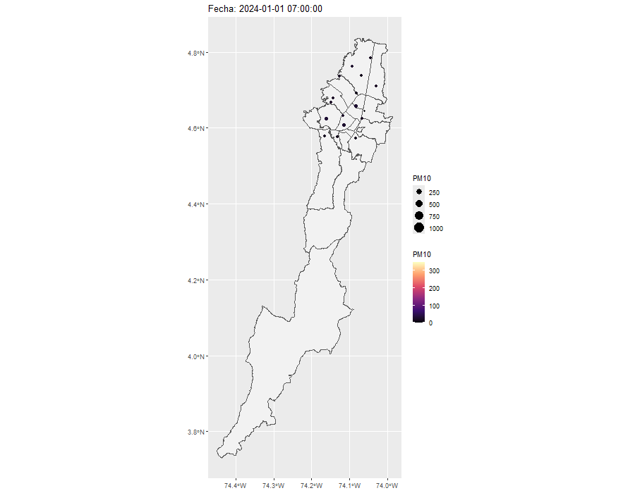

```{r Librerias, include=FALSE}
#setwd("C:/PERSONAL_MAPU/UNIVERSIDADES/NACIONAL/ESTADÍSTICA_ESPACIAL/PARCIAL_2")
library(readxl)
library(dplyr)
library(stringr)
library(lubridate) # para función lubridate::hour, lubridate::minute y lubridate::second
library(tidyverse)
library(corrplot)
library(sf)
library(ggplot2)
library(kableExtra)
library(measurements)
library(gganimate) # para hacer película
library(gifski) #para renderizar la película
library(spdep)
library(adespatial)
library(gstat)
library(sp)
library(spacetime)

```

```{r PM10-O3, eval=FALSE, warning=FALSE, include=FALSE}
reporte_ene_jun_2024 <- read_excel("reporteIbocaene-jun-2024.xlsx", 
    sheet = "Sheet1", range = "A5:T4350")
reporte_ene_jun_2024 <- reporte_ene_jun_2024 %>% 
  dplyr::mutate(`Fecha & Hora` = ymd_hms(`Fecha & Hora`)
  ) %>% 
  dplyr::filter(lubridate::hour(`Fecha & Hora`) == 12,
         lubridate::minute(`Fecha & Hora`) == 0,
         lubridate::second(`Fecha & Hora`) == 0)
reporte_ene_jun_2024 <- reporte_ene_jun_2024 %>% 
  dplyr::mutate(
    across(
      -`Fecha & Hora`,
      ~ na_if(.x, "Sin data")
    )
  )
reporte_ene_jun_2024 <- reporte_ene_jun_2024 %>%
  mutate(
    across(-1, as.numeric)
  )
reporteIbocajul_dic2024 <- read_excel("reporteIbocajul-dic2024.xlsx", 
    range = "A5:T3806")
reporteIbocajul_dic2024 <- reporteIbocajul_dic2024 %>% 
  dplyr::mutate(`Fecha & Hora` = ymd_hms(`Fecha & Hora`)) %>% 
  dplyr::filter(lubridate::hour(`Fecha & Hora`) == 12,
         lubridate::minute(`Fecha & Hora`) == 0,
         lubridate::second(`Fecha & Hora`) == 0)
reporteIbocajul_dic2024 <- reporteIbocajul_dic2024 %>% 
  dplyr::mutate(
    across(
      -`Fecha & Hora`,
      ~ na_if(.x, "Sin data")
    )
  )
reporteIbocajul_dic2024 <- reporteIbocajul_dic2024 %>%
  mutate(
    across(-1, as.numeric)
  )
reporteIboca <- read_excel("reporteIboca.xlsx", 
    range = "A5:T4281")
reporteIboca <- reporteIboca %>% 
  dplyr::mutate(`Fecha & Hora` = ymd_hms(`Fecha & Hora`)) %>% 
  dplyr::filter(lubridate::hour(`Fecha & Hora`) == 12,
         lubridate::minute(`Fecha & Hora`) == 0,
         lubridate::second(`Fecha & Hora`) == 0)
reporteIboca <- reporteIboca %>% 
  dplyr::mutate(
    across(
      -`Fecha & Hora`,
      ~ na_if(.x, "Sin data")
    )
  )
reporteIboca <- reporteIboca %>%
  mutate(
    across(-1, as.numeric)
  )
reporteIbocajul_dic <- read_excel("reporteIbocajul-dic.xlsx", 
    range = "A5:T4183")
reporteIbocajul_dic <- reporteIbocajul_dic %>% 
  dplyr::mutate(`Fecha & Hora` = ymd_hms(`Fecha & Hora`)) %>% 
  dplyr::filter(lubridate::hour(`Fecha & Hora`) == 12,
         lubridate::minute(`Fecha & Hora`) == 0,
         lubridate::second(`Fecha & Hora`) == 0)
reporteIbocajul_dic <- reporteIbocajul_dic %>% 
  dplyr::mutate(
    across(
      where(is.character) & -`Fecha & Hora`,
      ~ na_if(.x, "Sin data")
    )
  )
reporteIbocajul_dic <- reporteIbocajul_dic %>%
  mutate(
    across(-1, as.numeric)
  )
PM10 <- bind_rows(
  reporte_ene_jun_2024,
  reporteIbocajul_dic2024,
  reporteIboca,
  reporteIbocajul_dic
)
PM10 <- PM10 %>%
  tidyr::pivot_longer(
    cols = -`Fecha & Hora`,      # Mantener la fecha fija
    names_to = "Estacion",       # Las columnas de estaciones pasan a ser filas
    values_to = "PM10"           # Los valores van a una nueva columna llamada PM10
  )

reporte_ene_jun_2024_o <- read_excel("reporte_ene_jun_o.xlsx", 
    sheet = "Sheet1", range = "A5:T4345")
reporte_ene_jun_2024_o <- reporte_ene_jun_2024_o %>% 
  dplyr::mutate(`Fecha & Hora` = ymd_hms(`Fecha & Hora`)
  ) %>% 
  dplyr::filter(lubridate::hour(`Fecha & Hora`) == 12,
         lubridate::minute(`Fecha & Hora`) == 0,
         lubridate::second(`Fecha & Hora`) == 0)
reporte_ene_jun_2024_o <- reporte_ene_jun_2024_o %>% 
  dplyr::mutate(
    across(
      -`Fecha & Hora`,
      ~ na_if(.x, "Sin data")
    )
  )
reporte_ene_jun_2024_o <- reporte_ene_jun_2024_o %>%
  mutate(
    across(-1, as.numeric)
  )
reporteIbocajul_dic2024_o <- read_excel("reporte_jul_dic_o_2024.xlsx", 
    range = "A5:T3791")
reporteIbocajul_dic2024_o <- reporteIbocajul_dic2024_o %>% 
  dplyr::mutate(`Fecha & Hora` = ymd_hms(`Fecha & Hora`)) %>% 
  dplyr::filter(lubridate::hour(`Fecha & Hora`) == 12,
         lubridate::minute(`Fecha & Hora`) == 0,
         lubridate::second(`Fecha & Hora`) == 0)
reporteIbocajul_dic2024_o <- reporteIbocajul_dic2024_o %>% 
  dplyr::mutate(
    across(
      -`Fecha & Hora`,
      ~ na_if(.x, "Sin data")
    )
  )
reporteIbocajul_dic2024_o <- reporteIbocajul_dic2024_o %>%
  mutate(
    across(-1, as.numeric)
  )
reporte_ene_jun_o_2025 <- read_excel("reporte_ene_jun_o_2025.xlsx", 
    range = "A5:T4301")
reporte_ene_jun_o_2025 <- reporte_ene_jun_o_2025 %>% 
  dplyr::mutate(`Fecha & Hora` = ymd_hms(`Fecha & Hora`)) %>% 
  dplyr::filter(lubridate::hour(`Fecha & Hora`) == 12,
         lubridate::minute(`Fecha & Hora`) == 0,
         lubridate::second(`Fecha & Hora`) == 0)
reporte_ene_jun_o_2025 <- reporte_ene_jun_o_2025 %>% 
  dplyr::mutate(
    across(
      -`Fecha & Hora`,
      ~ na_if(.x, "Sin data")
    )
  )
reporte_ene_jun_o_2025 <- reporte_ene_jun_o_2025 %>%
  mutate(
    across(-1, as.numeric)
  )
reporteIbocajul_dic_o_2025 <- read_excel("reporte_jul_dic_o_2025.xlsx", 
    range = "A5:T4200")
reporteIbocajul_dic_o_2025 <- reporteIbocajul_dic_o_2025 %>% 
  dplyr::mutate(`Fecha & Hora` = ymd_hms(`Fecha & Hora`)) %>% 
  dplyr::filter(lubridate::hour(`Fecha & Hora`) == 12,
         lubridate::minute(`Fecha & Hora`) == 0,
         lubridate::second(`Fecha & Hora`) == 0)
reporteIbocajul_dic_o_2025 <- reporteIbocajul_dic_o_2025 %>% 
  dplyr::mutate(
    across(
      where(is.character) & -`Fecha & Hora`,
      ~ na_if(.x, "Sin data")
    )
  )
reporteIbocajul_dic_o_2025 <- reporteIbocajul_dic_o_2025 %>%
  mutate(
    across(-1, as.numeric)
  )
O3 <- bind_rows(
  reporte_ene_jun_2024_o,
  reporteIbocajul_dic2024_o,
  reporte_ene_jun_o_2025,
  reporteIbocajul_dic_o_2025
)
O3 <- O3 %>%
  tidyr::pivot_longer(
    cols = -`Fecha & Hora`,      # Mantener la fecha fija
    names_to = "Estacion",       # Las columnas de estaciones pasan a ser filas
    values_to = "O3"             # Los valores van a una nueva columna llamada O3
  )

estaciones <- read_excel("Base_Trabajo2.xlsx", 
    sheet = "Ubicaciones", range = "A3:J23")

reporte_completo$Estacion <-
  stringi::stri_trans_general(reporte_completo$Estacion, "Latin-ASCII")

estaciones$Estacion <-
  stringi::stri_trans_general(estaciones$Estacion, "Latin-ASCII")

estaciones <- estaciones %>%
  mutate(
    Estacion = recode(
      Estacion,
      "Centro de alto rendimiento" = "CDAR",
      "Carvajal-Sevillana" = "Carvajal - Sevillana",
      "El Jazmin" = "Jazmin",
      "Estacion movil 7ma" = "Movil 7ma"
    )
  )

reporte_completo <- reporte_completo  %>% 
  left_join(
    estaciones,
    by = "Estacion"
  )

```

# Introducción


##  Planteamiento del problema

Las redes fijas de monitoreo solo ofrecen datos puntuales, lo que dificulta evaluar la exposición real de la población a la contaminación. En el área metropolitana de Bogotá, las fuentes de emisión y la topografía generan una gran variabilidad espacial en el material particulado.

Por ello, este estudio utiliza geoestadística para estimar la distribución espacial de $PM_{10}$, un contaminante para la salud respiratoria. El objetivo principal es reconstruir la superficie continua de $PM_{10}$ a partir de 19 estaciones dispersas, reduciendo la incertidumbre de la interpolación y el ruido en los datos de los sensores.


```{r base-datos}
#writexl::write_xlsx(reporte_completo,"reporte_completo.xlsx")
reporte_completo <- read_excel("reporte_completo.xlsx")
dms_a_decimal <- function(x) {

  nums <- str_extract_all(x, "\\d+\\.?\\d*")

  decimal <- sapply(seq_along(nums), function(i) {

    v <- as.numeric(nums[[i]])

    dec <- v[1] + v[2] / 60 + v[3] / 3600

    if (str_detect(x[i], "[WS]$")) {
      dec <- -dec
    }

    dec
  })

  decimal
}
reporte_completo$Longitud <- dms_a_decimal(reporte_completo$Longitud)
reporte_completo$Latitud  <- dms_a_decimal(reporte_completo$Latitud)
reporte_completo <- reporte_completo  %>% 
  rename(fecha_hora = `Fecha & Hora`)
str(reporte_completo)
summary(reporte_completo)
tabla_conteos_NAS <- data.frame(
  estaciones=names(reporte_completo)[-1],
  conteos=colSums(is.na(reporte_completo))[-1],
  row.names = NULL
)

# Mapa de Bogotá
bogota <- st_read("Loca.shp")
estaciones_sf <- st_as_sf(
  reporte_completo,
  coords = c("Longitud", "Latitud"),
  crs = 4326
)


```


# Base de datos {.tabset}

La base de datos proviene del sistema de monitoreo de calidad del aire, consolidando registros espacio-temporales. Para efectos del análisis geoestadístico espacial, la dimensión temporal se filtra mediante agregación, aislando la señal espacial intrínseca de cada estación. 


> La estructura de los datos y la naturaleza de las variables medidas en la red de monitoreo se detallan en Tabla \@ref(tab:tabla-diccionario).


```{r tabla-diccionario, echo=FALSE, message=FALSE, warning=FALSE}
library(knitr)
library(kableExtra)

# 1. Definición del dataset
diccionario <- data.frame(
  Variable = c("Estacion", "Latitud", "Longitud", "Altitud (m)", "PM10", "Tipo de estación"),
  Descripción = c(
    "Nombre del sitio de monitoreo",
    "Coordenada geográfica Norte-Sur",
    "Coordenada geográfica Este-Oeste",
    "Elevación sobre el nivel del mar",
    "Concentración de material particulado <10µm",
    "Clasificación del entorno de medición"
  ),
  `Tipo de Dato` = c(
    "Categórica (Nominal)",
    "Numérica (Continua)",
    "Numérica (Continua)",
    "Numérica (Continua)",
    "Numérica (Continua)",
    "Categórica (Ordinal)"
  ),
  `Ejemplo / Rango` = c(
    '"Kennedy", "Suba"',
    "4.53° a 4.78°",
    "-74.17° a -74.03°",
    "2547 m a 2688 m",
    "1.00 a 1000.00 µg/m³",
    '"Tráfico", "Residencial"'
  ),
  check.names = FALSE
)

# 2. Generación y formateo de la tabla
kbl(
  diccionario,
  caption = "Diccionario de datos y muestra representativa de la red de monitoreo.",
  booktabs = TRUE,
  align = c("l", "l", "l", "l"),
  escape = FALSE
) %>%
  kableExtra::kable_styling(
    bootstrap_options = c("striped", "hover", "condensed", "responsive"),
    latex_options = c("striped", "hold_position", "scale_down"),
    full_width = FALSE,
    position = "center"
  ) %>%
  column_spec(1, bold = TRUE, monospace = TRUE) %>% # Destaca los nombres de variables como código
  kableExtra::row_spec(
    0,
    bold = TRUE,
    background = "#2c3e50",
    color = "white"
  ) 
```


## Primeras 10 filas.

```{r primeras-filas}
reporte_completo %>% 
  head(10) %>% 
  kableExtra::kbl(
  caption = "Primeras 10 filas de la base de datos",
  col.names = c(
    "Fecha & Hora",
    "Estación",
    bquote(PM_10),
    bquote(O_3),
    "Sigla",
    "Latitud",
    "Longitud",
    "Altitud (m)",
    "Altura (m)",
    "Localidad",
    "Tipo de zona",
    "Tipo de estación",
    "Dirección"),
  align = c("l", "l", "c", "c", "c",
            "l", "l", "c", "c", "c",
            "c", "c", "l")
) %>%
  kableExtra::kable_styling(
    full_width = FALSE,
    position = "center"
  ) %>%
  kableExtra::row_spec(
    0,
    bold = TRUE,
    background = "#2c3e50",
    color = "white"
  ) 
```

## Últimas 10 filas.

```{r ultimas-filas}
reporte_completo %>% 
  tail(10) %>% 
  kableExtra::kbl(
  caption = "Últimas 10 filas de la base de datos",
  col.names = c(
    "Fecha & Hora",
    "Estación",
    bquote(PM_10),
    bquote(O_3),
    "Sigla",
    "Latitud",
    "Longitud",
    "Altitud (m)",
    "Altura (m)",
    "Localidad",
    "Tipo de zona",
    "Tipo de estación",
    "Dirección"),
  align = c("l", "l", "c", "c", "c",
            "l", "l", "c", "c", "c",
            "c", "c", "l")
) %>%
  kableExtra::kable_styling(
    full_width = FALSE,
    position = "center"
  ) %>%
  kableExtra::row_spec(
    0,
    bold = TRUE,
    background = "#2c3e50",
    color = "white"
  ) 
```

# Calidad de datos {.tabset}

## Datos faltantes

LSe encontro que la variable $PM_{10}$ tiene 1 911 datos faltantes (`NA`) sobre un total de 13 243 registros horarios, debido a fallas técnicas o mantenimiento de las estaciones.


```{r faltantes, tab.cap="Conteo de datos faltantes"}
tabla_conteos_NAS %>% 
  kableExtra::kbl(
  caption = "Conteo de datos faltantes",
  col.names = c(
    "Estaciones",
    "Conteos"),
  align = c("l", "c")
) %>%
  kableExtra::kable_styling(
    full_width = FALSE,
    position = "center"
  ) %>%
  kableExtra::row_spec(
    0,
    bold = TRUE,
    background = "#2c3e50",
    color = "white"
  ) %>%
  kableExtra::row_spec(
    2:4,
    bold = TRUE,
    background = "#e8f4fd"
  ) 
```

## Boxplot de $PM_{10}$

Al evaluar puntualmente el $PM_{10}$ se observa un valor máximo de 1 000 $\mu g/m^3$, asociado a saturación o fallas del sensor. Mantener este valor atípico distorsiona la estimación del variograma al inflar la varianza e incrementar artificialmente el efecto pepita (*nugget effect*), distorsionando el cálculo del alcance espacial del $PM_{10}$.

```{r boxplot-pm10, fig.cap="Diagrama de caja de la variable PM10", fig.height=14, message=FALSE, warning=FALSE}
ggplot()+
  geom_boxplot(data = reporte_completo, aes(y = PM10),fill = "#41B7C4")
```

# Exploración espacial{.tabset}

## Distribución

La distribución univariada del $PM_{10}$, una vez agregada espacialmente, exhibe asimetría positiva. La media aritmética (32.73 $\mu g/m^3$) supera a la mediana (27.00 $\mu g/m^3$), con una cola derecha prolongada impulsada por episodios de alta contaminación o por error instrumental. 


```{r exploratorio_p10, echo=FALSE, fig.cap="Distribución empírica de la concentración de PM10.", out.width="80%", fig.align="center"}
ggplot(reporte_completo, aes(x = PM10)) +
  geom_histogram(binwidth = 5, fill = "#41B7C4", color = "black", alpha = 0.8) +
  geom_vline(aes(xintercept = mean(PM10, na.rm=T)), color = "red", linetype = "dashed") +
  geom_vline(aes(xintercept = median(PM10, na.rm=T)), color = "blue", linetype = "dotted") +
  labs(x = expression(PM[10]~(mu*g/m^3)), y = "Frecuencia") +
  theme_minimal()
```


## Mapa de bogotá

```{r mapa-bogota}
ggplot() +
  geom_sf(
    data = bogota,
    fill = "gray95",
    color = "black"
  ) +
  geom_sf(
    data = estaciones_sf,
    color = "red",
    size = 3
  ) +
  labs(
    title = "Estaciones de monitoreo de Bogotá"
  ) +
  theme_minimal()
```

## Visualización con la variable

```{r generar-gif, eval=FALSE, include=FALSE}
estaciones_anim <- reporte_completo %>%
  sf::st_as_sf(
    coords = c("Longitud", "Latitud"),
    crs = 4326,
    remove = FALSE
  )
p <- ggplot() +
  geom_sf(data = bogota, fill = "gray95") +
  geom_sf(
    data = estaciones_anim,
    aes(size = PM10,color = PM10)
  ) +
  transition_time(fecha_hora) +
  labs(
    title = "Fecha: {frame_time}",
    color = "PM10"
  ) +
  scale_color_viridis_c(
  option = "magma",
  limits = c(0, 350),
  oob = scales::squish
)
anim <- animate(
  p,
  width = 900,
  height = 700,
  fps = 10,
  renderer = gifski_renderer()
)

anim_save("PM10_Bogota.gif", anim)
```

```{r anim-bogota, echo=FALSE, results='asis'}

```


# Relaciones entre variables {.tabset}

## Correlación con la variable de interés $PM_{10}$

```{r correlacion-variable, fig.height=10, fig.width=10}
mat_cor <- cor(
  reporte_completo  %>% 
    dplyr::select(PM10, O3, `Altitud (m)`, `Altura (m)`),
  use = "complete.obs"
)

corrplot(
  mat_cor,
  method = "color",
  addCoef.col = "black",
  tl.col = "black",
  number.cex = 0.8
)
```

## Dispersión con longitud

```{r dispm10lon, message=FALSE, warning=FALSE}
ggplot(reporte_completo,
       aes(Longitud, PM10))+
    geom_point(alpha=.3)+
    geom_smooth(method="loess")
```

## Dispersión con latitud

```{r disPM10lat, message=FALSE, warning=FALSE}
ggplot(reporte_completo,
       aes(Latitud, PM10))+
    geom_point(alpha=.3)+
    geom_smooth(method="loess")
```

## Moran

Aunque los datos presentan variabilidad y ruido instrumental, existe una fuerte dependencia espacial. El test de Moran ($I = 0.333$, $p < 0.001$) rechaza la aleatoriedad espacial y confirma un patrón de agrupamiento (*clustering*), donde estaciones cercanas registran niveles similares de $PM_{10}$. Lo cual justifica la implementación de la geoestadística.


```{r moran}
set.seed(1110)
datos_moran <- reporte_completo  %>% 
  group_by(Estacion, Longitud, Latitud)  %>% 
  summarise(
    PM10 = mean(PM10, na.rm = TRUE),
    O3 = mean(O3, na.rm = TRUE),
    .groups = "drop"
  )
datos_sf <- st_as_sf(
  datos_moran,
  coords = c("Longitud", "Latitud"),
  crs = 4326
)

coords <- st_coordinates(datos_sf)

vecinos <- knearneigh(coords, k = 4)
vecinos <- knn2nb(vecinos)

pesos <- nb2listw(
  vecinos,
  style = "W"
)

plot(st_geometry(datos_sf))
plot(vecinos, coords, add = TRUE)
moran.test(
  datos_sf$PM10,
  listw = pesos
)
```

## Moran local

```{r}
moran_local <- localmoran(
  datos_sf$PM10,
  pesos
)

head(moran_local)
```

## Moran bivariado

```{r}
moran_bv(
  x = datos_sf$PM10,
  y = datos_sf$O3,
  listw = pesos,
  nsim = 999
)
```

## Modelo de regresión normal

```{r}
modelo <- lm(
    PM10 ~ Longitud + Latitud,
    data = datos_moran
)

summary(modelo)
```

# Exploración temporal: correlograma temporal {.tabset}

## Temporal

```{r temporal}
datos_temporal <- reporte_completo %>%
  group_by(fecha_hora) %>%
  summarise(
    PM10 = mean(PM10, na.rm = TRUE),
    O3 = mean(O3, na.rm = TRUE),
    .groups = "drop"
  )
```

```{r ggplottemporal}
ggplot(datos_temporal, aes(x = fecha_hora, y = PM10)) +
  geom_line(color = "steelblue") +
  geom_smooth(
    method = "loess",
    color = "red",
    se = FALSE
  ) +
  labs(
    x = "Fecha",
    y = "PM10 promedio",
    title = "Serie temporal promedio de PM10 en Bogotá"
  ) +
  theme_minimal()
```

## Correlogramas temporales {.tabset}


### Bolivia y Carvajal - Sevillana.

```{r bolycar}
Estacion1 <- reporte_completo  %>% 
  filter(Estacion == "Bolivia")  %>% 
  arrange(fecha_hora)
Estacion2 <- reporte_completo  %>% 
  filter(Estacion == "Carvajal - Sevillana")  %>% 
  arrange(fecha_hora)
```

```{r acfbolycar}
par(mfrow=c(1,2))
acf(
  Estacion1$PM10,
  na.action = na.pass
)
acf(
  Estacion2$PM10,
  na.action = na.pass
)
```

### CDAR y Ciudad Bolivar

```{r CDARyCbol}
Estacion1 <- reporte_completo  %>% 
  filter(Estacion == "CDAR")  %>% 
  arrange(fecha_hora)
Estacion2 <- reporte_completo  %>% 
  filter(Estacion == "Ciudad Bolivar")  %>% 
  arrange(fecha_hora)
```

```{r acfCDARyCbol}
par(mfrow=c(1,2))
acf(
  Estacion1$PM10,
  na.action = na.pass
)
acf(
  Estacion2$PM10,
  na.action = na.pass
)
```

### Colina y Fontibon

```{r ColyFon}
Estacion1 <- reporte_completo  %>% 
  filter(Estacion == "Colina")  %>% 
  arrange(fecha_hora)
Estacion2 <- reporte_completo  %>% 
  filter(Estacion == "Fontibon")  %>% 
  arrange(fecha_hora)
```

```{r acfColyfon}
par(mfrow=c(1,2))
acf(
  Estacion1$PM10,
  na.action = na.pass
)
acf(
  Estacion2$PM10,
  na.action = na.pass
)
```

### Guaymaral y Jazmin

```{r Guayyjaz}
Estacion1 <- reporte_completo  %>% 
  filter(Estacion == "Guaymaral")  %>% 
  arrange(fecha_hora)
Estacion2 <- reporte_completo  %>% 
  filter(Estacion == "Jazmin")  %>% 
  arrange(fecha_hora)
```

```{r acfGuayyjaz}
par(mfrow=c(1,2))
acf(
  Estacion1$PM10,
  na.action = na.pass
)
acf(
  Estacion2$PM10,
  na.action = na.pass
)
```

### Kennedy y Las ferias

```{r Kenyfer}
Estacion1 <- reporte_completo  %>% 
  filter(Estacion == "Kennedy")  %>% 
  arrange(fecha_hora)
Estacion2 <- reporte_completo  %>% 
  filter(Estacion == "Las Ferias")  %>% 
  arrange(fecha_hora)
```

```{r acfKenyFer}
par(mfrow=c(1,2))
acf(
  Estacion1$PM10,
  na.action = na.pass
)
acf(
  Estacion2$PM10,
  na.action = na.pass
)
```

### MinAmbiente y Movil 7ma

```{r MinAyMo7}
Estacion1 <- reporte_completo  %>% 
  filter(Estacion == "MinAmbiente")  %>% 
  arrange(fecha_hora)
Estacion2 <- reporte_completo  %>% 
  filter(Estacion == "Movil 7ma")  %>% 
  arrange(fecha_hora)
```

```{r acfMinAyMo7}
par(mfrow=c(1,2))
acf(
  Estacion1$PM10,
  na.action = na.pass
)
acf(
  Estacion2$PM10,
  na.action = na.pass
)
```

### Movil Fontibón y Puente Aranda

```{r MoFonyPAr}
Estacion1 <- reporte_completo  %>% 
  filter(Estacion == "Movil Fontibon")  %>% 
  arrange(fecha_hora)
Estacion2 <- reporte_completo  %>% 
  filter(Estacion == "Puente Aranda")  %>% 
  arrange(fecha_hora)
```

```{r acfMoFonyPAr}
par(mfrow=c(1,2))
acf(
  Estacion1$PM10,
  na.action = na.pass
)
acf(
  Estacion2$PM10,
  na.action = na.pass
)
```

### San Cristobal y Suba

```{r SCysuba}
Estacion1 <- reporte_completo  %>% 
  filter(Estacion == "San Cristobal")  %>% 
  arrange(fecha_hora)
Estacion2 <- reporte_completo  %>% 
  filter(Estacion == "Suba")  %>% 
  arrange(fecha_hora)
```

```{r acfSCysuba}
par(mfrow=c(1,2))
acf(
  Estacion1$PM10,
  na.action = na.pass
)
acf(
  Estacion2$PM10,
  na.action = na.pass
)
```

### Tunal y Usaquén

```{r tunyus}
Estacion1 <- reporte_completo  %>% 
  filter(Estacion == "Tunal")  %>% 
  arrange(fecha_hora)
Estacion2 <- reporte_completo  %>% 
  filter(Estacion == "Usaquen")  %>% 
  arrange(fecha_hora)
```

```{r acftunyus}
par(mfrow=c(1,2))
acf(
  Estacion1$PM10,
  na.action = na.pass
)
acf(
  Estacion2$PM10,
  na.action = na.pass
)
```

### Usme y promedio temporal

```{r usme}
Estacion1 <- reporte_completo  %>% 
  filter(Estacion == "Usme")  %>% 
  arrange(fecha_hora)
```

```{r acfusme}
par(mfrow=c(1,2))
acf(
  Estacion1$PM10,
  na.action = na.pass
)
acf(
  datos_temporal$PM10, 
  na.action = na.pass
)
```

# Formulación del modelo geoestadístico

La exploración gráfica no evidenció una tendencia espacial marcada en la media de las concentraciones de PM10, mientras que la serie temporal mostró un comportamiento oscilatorio sin una tendencia sostenida. Adicionalmente, el índice global de Moran y el correlograma espacial evidenciaron autocorrelación espacial significativa. Bajo estas condiciones, resulta razonable considerar un modelo geoestadístico con media constante,

$$
\mathbf{Y}(s,t)=\mu+\mathbf(Z)(s,t)
$$

donde $\mathbf{Z}(s,t)$ representa un proceso aleatorio de media cero que captura la dependencia espacial, temporal y espacio-temporal presente en las observaciones.

## Estimación variograma

```{r}
datos <- reporte_completo %>%
  arrange(fecha_hora, Estacion)
estaciones <- datos %>%
  distinct(
    Estacion,
    Longitud,
    Latitud
  )
datos_sf <- st_transform(
  datos_sf,
  3116
)
estaciones_sf <- st_as_sf(
  estaciones,
  coords = c("Longitud", "Latitud"),
  crs = 4326
)

estaciones_sf <- st_transform(
  estaciones_sf,
  3116
)

estaciones_sp <- as(estaciones_sf, "Spatial")
tiempo <- sort(unique(datos$fecha_hora))
datos_st <- STFDF(
  sp = estaciones_sp,
  time = tiempo,
  data = data.frame(
    PM10 = datos$PM10,
    O3 = datos$O3
  )
)
variograma <-  variogramST(
  PM10 ~ 1,
  data = datos_st,
  tlags = 0:24,
  cutoff = 30000,
  width = 3000
)
modelo_sep_ini <- vgmST(
  "separable",
  space = vgm(
    psill = 500,
    model = "Exp",
    range = 18000,
    nugget = 250
  ),
  time = vgm(
    psill = 500,
    model = "Exp",
    range = 10,
    nugget = 250
  ),
  sill = 700
)
modelo_metric_ini <- vgmST(
  "metric",
  joint = vgm(
    psill = 500,
    model = "Exp",
    range = 18000,
    nugget = 250
  ),
  stAni = 1700
)

modelo_sum_ini <- vgmST(
  "sumMetric",

  space = vgm(
    psill = 1,
    model = "Exp",
    range = 18000,
    nugget = 0.5
  ),

  time = vgm(
    psill = 1,
    model = "Exp",
    range = 12,
    nugget = 0.5
  ),

  joint = vgm(
    psill = 1,
    model = "Exp",
    range = 18000,
    nugget = 0.5
  ),

  stAni = 1500
)

modelo_prod_ini <- vgmST(
  "productSum",

  space = vgm(
    psill = 1,
    model = "Exp",
    range = 18000,
    nugget = 30
  ),

  time = vgm(
    psill = 60,
    model = "Exp",
    range = 7,
    nugget = 80
  ),

  k = 10
)

modelo_metric <- fit.StVariogram(
  variograma,
  modelo_metric_ini
)

modelo_sep <- fit.StVariogram(
  variograma,
  model = modelo_sep_ini
)

modelo_sum <- fit.StVariogram(
  variograma,
  modelo_sum_ini,
  lower = c(
    0.001,   # sill.s
    1000,    # range.s
    0,        # nugget.s
    0.001,    # sill.t
    0.1,      # range.t
    0,        # nugget.t
    0.001,    # sill.st
    1000,     # range.st
    0,        # nugget.st
    1         # anis
  ),
  upper = c(
    1000,
    50000,
    1000,
    1000,
    100,
    1000,
    1000,
    50000,
    1000,
    10000
  )
)

modelo_prod <- fit.StVariogram(
  variograma,
  modelo_prod_ini,
  lower = c(
    0.001,   # sill.s
    1000,    # range.s
    0,       # nugget.s
    0.001,   # sill.t
    0.1,     # range.t
    0,       # nugget.t
    0.001    # k
  ),
  upper = c(
    1000,
    50000,
    1000,
    1000,
    100,
    1000,
    1000
  )
)
```
```{r fig.width=10}
plot(variograma)
```

```{r}
plot(variograma, modelo_sep)
```
```{r}
attr(modelo_sep, "MSE")
```

```{r}
attr(modelo_sep, "optim.output")
```

```{r}
plot(variograma, modelo_metric)
```
```{r}
attr(modelo_metric, "MSE")
```

```{r}
attr(modelo_metric, "optim.output")
```
```{r}
plot(variograma, modelo_sum)
```
```{r}
attr(modelo_sum, "MSE")
```

```{r}
attr(modelo_sum, "optim.output")
```
```{r}
plot(variograma, modelo_prod)
```
```{r}
attr(modelo_prod, "MSE")
```

```{r}
attr(modelo_prod, "optim.output")
```


# Kriging espacio-temporal

```{r}
bogota <- st_transform(bogota, 3116)

# Malla de puntos cada 500 m
grilla <- st_make_grid(
  bogota,
  cellsize = 500,
  what = "centers"
)

grilla <- st_sf(geometry = grilla)

# Conservar únicamente los puntos dentro de Bogotá
grilla <- st_intersection(grilla, bogota)
```
```{r}
plot(
  st_geometry(bogota),
  border = "black",
  col = "white"
)

plot(
  st_geometry(grilla),
  add = TRUE,
  col = "red",
  pch = 16,
  cex = 0.15
)
```

```{r}
datos_obs <- datos  %>% 
  dplyr::filter(!is.na(PM10))
coordinates(datos_obs) <- ~Longitud + Latitud
proj4string(datos_obs) <- CRS(st_crs(bogota)$wkt)
datos_obs_st <- STIDF(
  sp = as(datos_obs, "SpatialPoints"),
  time = datos_obs$fecha_hora,
  data = data.frame(PM10 = datos_obs$PM10)
)

tiempo_pred <- c(
  max(reporte_completo$fecha_hora),
  max(reporte_completo$fecha_hora) + 3600
)

grilla_sp <- as(grilla, "Spatial")
tiempos <- sort(unique(reporte_completo$fecha_hora))
tiempo_pred <- c(tiempos[200],tiempos[200]+3600)

pred_st <- STF(
  sp = grilla_sp,
  time = tiempo_pred
)
krig_pm10 <- krigeST(
  formula = PM10 ~ 1,
  data = datos_obs_st,
  newdata = pred_st,
  modelList = modelo_sum
)
```

```{r}
pred_df <- as.data.frame(krig_pm10)
head(pred_df)

pred1 <- subset(
  pred_df,
  time == min(time)
)
```

```{r}
ggplot(pred1) +
  geom_raster(
    aes(
      x = coords.x1,
      y = coords.x2,
      fill = var1.pred
    )
  ) +
  coord_equal() +
  scale_fill_viridis_c() +
  labs(
    fill = "PM10",
    title = "Predicción mediante Kriging espacio-temporal"
  ) +
  theme_minimal()
```


