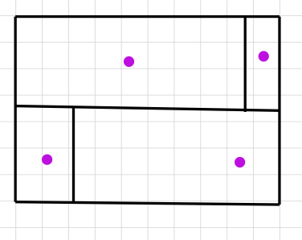
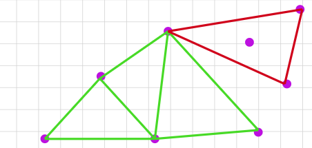

```{r setup, include=FALSE}
# ==============================================================================
# CONFIGURACIÓN GLOBAL DEL DOCUMENTO
# ==============================================================================
# Este chunk controla el comportamiento de TODOS los chunks siguientes.
# Al usar include=FALSE, no se muestra en el informe pero establece las reglas.

knitr::opts_chunk$set(
  message     = FALSE,      # Silencia mensajes de carga
  warning     = FALSE,      # Silencia advertencias
  error       = FALSE,      # Detiene el render si hay error
  fig.align   = "center",   # Centra todas las figuras
  fig.width   = 10,         # Ancho estándar de figuras
  fig.height  = 7,          # Alto estándar de figuras
  dpi         = 150,        # Resolución para nitidez cartográfica
  cache       = FALSE       # Sin caché para garantizar reproducibilidad
)

# Semilla global para reproducibilidad de simulaciones Monte Carlo
set.seed(5869)
```

```{r librerias, include=FALSE}
# ==============================================================================
# CARGA DE LIBRERÍAS ESPECIALIZADAS
# ==============================================================================
# Paquetes organizados por función para facilitar el mantenimiento

# Análisis de patrones puntuales (spatstat ecosystem)
library(spatstat)
library(spatstat.geom)
library(spatstat.explore)
library(spatstat.model)

# Manejo de datos espaciales vectoriales
library(sf)
library(stars)

# Manipulación y lectura de datos
library(tidyverse)
library(readr)
library(readxl)

# Visualización cartográfica profesional
library(ggplot2)
library(patchwork)
library(scales)
library(ggrepel)
library(corrplot)

# Descarga automática de mapas base
library(rnaturalearth)
library(rnaturalearthdata)

# Tablas con formato académico
library(knitr)
library(kableExtra)
```

```{r paleta-colores, include=FALSE}
# ==============================================================================
# PALETA DE COLORES INSTITUCIONAL
# ==============================================================================
# Definimos una paleta coherente para todo el informe

colores <- list(
  azul_oscuro   = "#1f3a60",   # Títulos principales y bordes
  azul_medio    = "#2c3e50",   # Texto destacado
  gris_texto    = "#555555",   # Subtítulos
  gris_suave    = "#f8f9fa",   # Fondo Colombia
  gris_vecinos  = "#f1f2f6",   # Fondo países vecinos
  borde_vecinos = "#bdc3c7",   # Bordes sutiles
  oceano        = "#eef2f7",   # Fondo oceánico
  rojo_sismo    = "#e74c3c",   # Eventos sísmicos
  naranja_borde = "#e67e22",   # Bordes de rejillas
  azul_rejilla  = "#3498db"    # Relleno de cuadrantes
)
```

------------------------------------------------------------------------

# Resumen {.unnumbered}

> El presente informe aborda el análisis de **patrones puntuales espaciales** aplicado a la sismicidad histórica de Colombia, utilizando datos del Servicio Geológico Colombiano (SGC) correspondientes a eventos con magnitud $\geq 4.5$.
> El estudio se estructura en seis etapas metodológicas que abarcan desde la caracterización del proceso generador hasta el análisis de propiedades de segundo orden con marcas.

------------------------------------------------------------------------

# Planteamiento del Problema, Área de Estudio y Proceso de Interés

## Planteamiento del Problema

Colombia se encuentra en una zona de alta actividad sísmica debido a su posición geográfica en el noroccidente de Sudamérica, donde convergen múltiples placas tectónicas y sistemas de fallas activas.

Desde la perspectiva de la estadística espacial, los epicentros sísmicos constituyen un patrón puntual donde cada evento representa una realización de un proceso estocástico subyacente.
La pregunta central que guía este análisis es:

> **¿Los sismos en Colombia se distribuyen aleatoriamente en el espacio, o existen mecanismos generadores (ej.: fallas tectónicas) que producen patrones de agregación espacial identificables?**

Responder esta pregunta requiere, en primer lugar, caracterizar adecuadamente el área de estudio, el proceso de interés y las marcas asociadas a cada evento.

## Definición del Área de Estudio

El área de estudio se define como la región geográfica que contiene la totalidad de los eventos sísmicos analizados, extendiéndose ligeramente más allá de los límites políticos de Colombia para capturar la influencia regional de los sistemas tectónicos adyacentes.

**Criterios de delimitación:**

1.  **Cobertura tectónica regional**: Se incluyen zonas oceánicas del Pacífico y el Caribe, así como territorios fronterizos, donde ocurren eventos relacionados con la subducción de la placa de Nazca y la interacción con la placa Caribe.
2.  **Consistencia con la plataforma SGC**: Los límites se ajustan al recuadro de visualización oficial del Servicio Geológico Colombiano.
3.  **Exclusión de eventos atípicos**: Se filtra el punto extremo noroccidental (correspondiente al archipiélago de San Andrés) para mantener la coherencia del análisis en el territorio continental y su margen marítimo inmediato.

La ventana de observación se construye mediante la envolvente convexa de los eventos, expandida con un *buffer* de **30 km** para evitar que los puntos más extremos queden sobre el borde, lo cual mitigaría los efectos de borde en las estimaciones posteriores.

```{r carga-datos-area, message=FALSE, warning=FALSE}
# ==============================================================================
# DELIMITACIÓN DEL ÁREA DE ESTUDIO
# ==============================================================================

# 1. Descarga automática de mapas base (Natural Earth - dominio público)
colombia_map   <- ne_countries(scale = "medium", country = "colombia", 
                               returnclass = "sf") %>%
  st_transform(crs = 4326)

paises_vecinos <- ne_countries(scale = "medium", returnclass = "sf") %>%
  st_transform(crs = 4326)

# 2. Carga y limpieza de datos de sismicidad (SGC)
df <- read_csv("sismicidad_historica.csv", skip = 7, show_col_types = FALSE)
names(df)[4] <- "Latitud"
names(df)[5] <- "Longitud"
names(df)[7] <- "magnitud"

df <- df %>%
  select(Latitud, Longitud, magnitud) %>%
  mutate(
    Latitud  = as.numeric(Latitud),
    Longitud = as.numeric(Longitud),
    magnitud = as.numeric(magnitud)
  ) %>%
  filter(!is.na(Latitud), !is.na(Longitud))

# 3. Conversión a objeto espacial (sf) con proyección WGS84
sismos_sf <- st_as_sf(df, coords = c("Longitud", "Latitud"), crs = 4326)
sismos_sf$ID_Sismo <- 1:nrow(sismos_sf)

# 4. Proyección al sistema oficial de Colombia (Origen Nacional - MAGNA-SIRGAS)
sismos_proj <- st_transform(sismos_sf, crs = 9377)

# 5. Filtro geográfico ajustado (excluye San Andrés, conserva territorio continental)
caja_filtro <- st_bbox(c(xmin = -79.5, ymin = 0, xmax = -66, ymax = 13.5), 
                       crs = st_crs(4326))
sismos_sf   <- sismos_sf %>% st_filter(st_as_sfc(caja_filtro))
sismos_proj <- st_transform(sismos_sf, crs = 9377)

# 6. Construcción de la ventana de observación con buffer de 30 km
ventana_base   <- st_convex_hull(st_union(sismos_proj))
ventana_sf     <- st_buffer(ventana_base, dist = 30000)  # 30 km en metros
ventana_owin   <- as.owin(st_geometry(ventana_sf))
ventana_grados <- st_transform(ventana_sf, crs = 4326)

# 7. Construcción del objeto ppp (patrón puntual) en kilómetros
coords_metros <- st_coordinates(sismos_proj)
sismos_ppp    <- ppp(
  x       = coords_metros[, 1],
  y       = coords_metros[, 2],
  window  = ventana_owin,
  marks   = sismos_proj$magnitud
)

# Manejo de puntos duplicados mediante jittering controlado
if (any(duplicated(sismos_ppp))) {
  sismos_ppp <- rjitter(sismos_ppp, retry = TRUE)
}

# Reescalado final a kilómetros para coherencia interpretativa
sismos_ppp <- spatstat.geom::rescale(sismos_ppp, 1000, "km")
```

La siguiente tabla resume las características del patrón puntual construido:

```{r tabla-resumen-ppp}
# Aseguramos el vector de magnitudes
magnitudes <- as.numeric(marks(sismos_ppp))

# Construir el dataframe consolidando el área total
resumen_ppp <- data.frame(
  Característica = c(
    "Número total de eventos",
    "Área de la ventana de observación",
    "Intensidad promedio",
    "Rango de magnitudes",
    "Magnitud media",
    "Magnitud mediana",
    "Unidad de longitud"
  ),
  Valor = c(
    paste0(npoints(sismos_ppp), " sismos"),
    paste0(round(sum(as.numeric(area(sismos_ppp))), 0), " km²"), # <-- SOLUCIÓN: Agregamos sum() aquí
    paste0(round(as.numeric(intensity(sismos_ppp)) * 1e4, 2), " × 10⁻⁴ sismos/km²"),
    paste0(round(min(magnitudes, na.rm = TRUE), 1), " - ", 
           round(max(magnitudes, na.rm = TRUE), 1)),
    paste0(round(mean(magnitudes, na.rm = TRUE), 2)),
    paste0(round(median(magnitudes, na.rm = TRUE), 2)),
    "1 km"
  ),
  stringsAsFactors = FALSE
)

kable(resumen_ppp, 
      col.names = c("Característica", "Valor"),
      align = c("l", "c"),
      caption = "Características del patrón puntual sísmico construido") %>%
  kable_styling(
    bootstrap_options = c("striped", "hover", "condensed"),
    full_width = FALSE,
    position = "center"
  ) %>%
  row_spec(0, bold = TRUE, background = colores$azul_oscuro, color = "white")
```

## Proceso de Interés

El proceso de interés es la *sismicidad superficial e intermedia* registrada en el territorio colombiano y su zona de influencia regional.
Desde la perspectiva de los patrones puntuales, modelamos este fenómeno como una realización de un proceso puntual espacial $\{S\} = \{s_1, s_2, \ldots, s_n\}$ donde cada $s_i = (x_i, y_i)$ representa la ubicación geográfica del epicentro del $i$-ésimo sismo.

Las hipótesis que se pondrán a prueba a lo largo de este informe son:

- $H_0$ (CSR): Los eventos siguen un **Proceso Homogéneo de Poisson** (Aleatoriedad Espacial Completa), con intensidad constante $\lambda(s) = \lambda$ e independencia entre eventos.
- $H_1$: El patrón presenta **heterogeneidad de primer orden** (intensidad variable $\lambda(s)$) y/o **dependencia de segundo orden** (agregación o inhibición entre eventos).

## Definición de las Marcas

Cada evento $s_i$ del patrón puntual posee una **marca** $m_i$ que aporta información adicional sobre sus características intrínsecas.
En este estudio, la marca seleccionada es la **magnitud sísmica**, que cuantifica la energía liberada durante el sismo.

La marca $m_i \in \mathbb{R}^+$ convierte al patrón en un **patrón puntual marcado** (marked point pattern), lo que permite analizar no solo *dónde* ocurren los sismos, sino también *con qué intensidad energética*.
Esto habilita preguntas de investigación adicionales:

> ¿Existe dependencia espacial en la magnitud de los sismos?
> Es decir, ¿las zonas de alta concentración sísmica tienden a producir eventos de mayor magnitud, o la magnitud se distribuye independientemente de la localización?

```{r mapa-patron-puntual, fig.cap="Patrón puntual sísmico de Colombia con magnitud como marca. La línea discontinua delimita la ventana de observación con buffer de 30 km."}
# ==============================================================================
# MAPA PRINCIPAL DEL PATRÓN PUNTUAL
# ==============================================================================

ggplot() +
  # Capa 1: Países vecinos (fondo contextual)
  geom_sf(data = paises_vecinos, 
          fill = colores$gris_vecinos, 
          color = colores$borde_vecinos, 
          linewidth = 0.3) +
  # Capa 2: Frontera de Colombia destacada
  geom_sf(data = colombia_map, 
          fill = colores$gris_suave, 
          color = colores$azul_oscuro, 
          linewidth = 0.8) +
  # Capa 3: Ventana de observación (buffer de 30 km)
  geom_sf(data = ventana_grados, 
          fill = NA, 
          color = colores$azul_oscuro, 
          linewidth = 0.8, 
          linetype = "dashed") +
  # Capa 4: Eventos sísmicos codificados por magnitud
  geom_sf(data = sismos_sf, 
          aes(color = magnitud, size = magnitud), 
          shape = 20, 
          alpha = 0.75) +
  # Escalas visuales
  scale_color_viridis_c(option = "magma", name = "Magnitud") +
  scale_size_continuous(range = c(1, 9), name = "Magnitud") +
  # Encuadre geográfico
  coord_sf(crs = st_crs(4326), 
           xlim = c(-82, -66), 
           ylim = c(-5, 14)) +
  # Etiquetas y títulos
  labs(
    title    = "Patrón Puntual Sísmico de Colombia",
    subtitle = "Eventos con magnitud ≥ 4.5 | Ventana de observación con buffer de 30 km",
    x        = "Longitud", 
    y        = "Latitud"
  ) +
  # Estética profesional
  theme_minimal() +
  theme(
    panel.grid.major = element_line(color = "gray90", linetype = "dotted"),
    plot.title       = element_text(face = "bold", size = 13, color = colores$azul_medio),
    plot.subtitle    = element_text(size = 10, color = colores$gris_texto),
    panel.background = element_rect(fill = colores$oceano, color = NA),
    legend.position  = "right"
  )
```

En la Figura \@ref(fig:mapa-patron-puntual) se observa visualmente que los eventos no se distribuyen uniformemente en el territorio: existe una marcada concentración a lo largo de la Cordillera de los Andes, el suroccidente (Nariño, Cauca) y la frontera con Ecuador, coincidente con los sistemas de fallas activas y la zona de subducción de la placa de Nazca.
Esta primera impresión visual será formalizada estadísticamente en las secciones siguientes mediante pruebas de homogeneidad y estimación de intensidad.

# Inferencia sobre la Homogeneidad del Patrón

Para determinar si la distribución espacial de los sismos responde a un proceso homogéneo de CSR o si, se empieza por evaluar el patrón con pruebas estadísticas de primer orden.

## Pruebas Basadas en Variables de Conteo

La prueba de bondad de ajuste $\chi^2$ por cuadrantes evalúa la hipótesis nula de que el patrón proviene de un Proceso Homogéneo de Poisson.
El espacio de observación $D_s$ se divide en $L$ subregiones disjuntas (cuadrantes).
Si el proceso es homogéneo, el número de eventos $n_i$ en cada subregión debe seguir una distribución uniforme, y el estadístico de prueba se define como:

$$ \chi^2_0 = \sum_{i=1}^{L} \frac{(n_i - \bar{n})^2}{\bar{n}} \sim \chi^2_{(L-1)} $$

donde $\bar{n}$ es el conteo esperado bajo CSR.
Un inconveniente de esta prueba es la subjetividad en la elección del tamaño de la rejilla y la posible violación del supuesto de frecuencias esperadas mínimas (generalmente $E \geq 5$).
Para mitigar este sesgo, se emplean pruebas condicionales de Monte Carlo bajo la familia de estadísticos de poder de Cressie-Read, que son robustas ante celdas con conteos bajos o nulos.

A continuación, se evalúa la homogeneidad utilizando una rejilla de $3 \times 3$ cuadrantes, complementada con simulaciones de Monte Carlo ($999$ réplicas) para validar la robustez del rechazo de la hipótesis nula.

```{r prueba-cuadrantes, message=FALSE, warning=FALSE, fig.cap="Diagnóstico de Primer Orden: Pruebas de Homogeneidad Espacial por Cuadrantes"}
# Ejecutar la prueba de cuadrantes 3x3
chi_3x3 <- quadrat.test(unmark(sismos_ppp), nx = 3, ny = 3)

# Función auxiliar para extraer la rejilla y graficarla con ggplot2
crear_capa_cuadrantes <- function(modelo_chi) {
  rejilla_data <- tiles(as.tess(modelo_chi))
  obs <- modelo_chi$observed
  exp <- round(modelo_chi$expected, 1)
  res <- round(modelo_chi$residuals, 1)
  
  lista_poligonos <- lapply(seq_along(rejilla_data), function(i) {
    lims <- rejilla_data[[i]]
    x1 <- lims$xrange[1]; x2 <- lims$xrange[2]
    y1 <- lims$yrange[1]; y2 <- lims$yrange[2]
    
    # Polígono en metros (multiplicamos por 1000 desde km)
    p <- st_polygon(list(matrix(c(
      x1*1000, y1*1000, x2*1000, y1*1000, x2*1000, y2*1000, x1*1000, y2*1000, x1*1000, y1*1000
    ), ncol = 2, byrow = TRUE)))
    return(p)
  })
  
  sf_cuadrantes_metros <- st_sf(
    id = 1:length(lista_poligonos),
    Obs = as.vector(obs), Exp = as.vector(exp), Res = as.vector(res),
    geometry = st_sfc(lista_poligonos, crs = 9377)
  )
  
  sf_cuadrantes_grados <- st_transform(sf_cuadrantes_metros, crs = 4326)
  centroides <- st_coordinates(st_centroid(sf_cuadrantes_grados))
  sf_cuadrantes_grados$lon_c <- centroides[,1]
  sf_cuadrantes_grados$lat_c <- centroides[,2]
  sf_cuadrantes_grados$etiqueta <- paste0("O: ", sf_cuadrantes_grados$Obs, "\nE: ", sf_cuadrantes_grados$Exp)
  
  return(sf_cuadrantes_grados)
}

sf_3x3 <- crear_capa_cuadrantes(chi_3x3)

ggplot() +
  geom_sf(data = paises_vecinos, fill = colores$gris_vecinos, color = colores$borde_vecinos, linewidth = 0.3) +
  geom_sf(data = colombia_map, fill = colores$gris_suave, color = colores$azul_oscuro, linewidth = 0.6) +
  geom_sf(data = sf_3x3, fill = colores$azul_rejilla, alpha = 0.1, color = colores$naranja_borde, linewidth = 0.5, linetype = "dashed") +
  geom_text(data = sf_3x3, aes(x = lon_c, y = lat_c, label = etiqueta), size = 4, fontface = "bold", color = colores$azul_oscuro) +
  geom_sf(data = sismos_sf, color = colores$rojo_sismo, size = 1.2, alpha = 0.6) +
  coord_sf(crs = st_crs(4326), xlim = c(-81, -69.5), ylim = c(-1.5, 13.5)) +
  labs(title = "Prueba por Cuadrantes (3x3)", subtitle = "Evaluación de Homogeneidad CSR", x = "Longitud", y = "Latitud") +
  theme_minimal() +
  theme(
    panel.grid.major = element_line(color = "gray90", linetype = "dotted"),
    plot.title = element_text(face = "bold", size = 12, color = colores$azul_medio),
    plot.subtitle = element_text(size = 10, color = colores$gris_texto),
    panel.background = element_rect(fill = colores$oceano, color = NA)
  )
```

Dado que la rejilla $3 \times 3$ presenta frecuencias esperadas reducidas en algunas celdas periféricas, la aproximación asintótica de la prueba $\chi^2$ puede ser inadecuada.
Por ello, se ejecutó un análisis de robustez mediante Monte Carlo bajo la familia de Cressie-Read:

```{r tabla-cressie-read}
# Ejecución de pruebas de Monte Carlo para diferentes lambdas de Cressie-Read
prueba_NM2 <- quadrat.test(unmark(sismos_ppp), method = "MonteCarlo", CR = -2, nx = 3, ny = 3)
prueba_T2  <- quadrat.test(unmark(sismos_ppp), method = "MonteCarlo", CR = -0.5, nx = 3, ny = 3)
prueba_CR1 <- quadrat.test(unmark(sismos_ppp), method = "MonteCarlo", CR = 1/3, nx = 3, ny = 3)
prueba_CR2 <- quadrat.test(unmark(sismos_ppp), method = "MonteCarlo", CR = 2/3, nx = 3, ny = 3)
prueba_X2  <- quadrat.test(unmark(sismos_ppp), method = "MonteCarlo", CR = 1, nx = 3, ny = 3)

tabla_robustez <- data.frame(
  "Estadístico" = c("Neyman Modificado (NM2)", "Freeman-Tukey (T2)", "Cressie-Read ($\\lambda=1/3$)", "Cressie-Read ($\\lambda=2/3$)", "Chi-cuadrado de Pearson (X2)"),
  "Valor del Test" = c(
    round(as.numeric(prueba_NM2$statistic), 2),
    round(as.numeric(prueba_T2$statistic), 2),
    round(as.numeric(prueba_CR1$statistic), 2),
    round(as.numeric(prueba_CR2$statistic), 2),
    round(as.numeric(prueba_X2$statistic), 2)
  ),
  "p-valor (Simulado)" = c(
    ifelse(prueba_NM2$p.value < 0.001, "< 0.001", round(prueba_NM2$p.value, 3)),
    ifelse(prueba_T2$p.value < 0.001, "< 0.001", round(prueba_T2$p.value, 3)),
    ifelse(prueba_CR1$p.value < 0.001, "< 0.001", round(prueba_CR1$p.value, 3)),
    ifelse(prueba_CR2$p.value < 0.001, "< 0.001", round(prueba_CR2$p.value, 3)),
    ifelse(prueba_X2$p.value < 0.001, "< 0.001", round(prueba_X2$p.value, 3))
  ),
  "Diagnóstico" = c("Rechazo de CSR", "Rechazo de CSR", "Rechazo de CSR", "Rechazo de CSR", "Rechazo de CSR")
)

kable(tabla_robustez, format = "html", escape = FALSE,
      caption = "Pruebas de Robustez de Monte Carlo bajo la Familia de Cressie-Read (Rejilla 3x3)",
      col.names = c("Estadístico de Prueba", "Valor", "p-valor", "Diagnóstico Espacial")) %>%
  kable_styling(bootstrap_options = c("striped", "hover"), full_width = FALSE, position = "center") %>%
  row_spec(0, bold = TRUE, background = colores$azul_oscuro, color = "white")
```

Como se observa en la Tabla \@ref(tab:tabla-cressie-read), todos los estadísticos arrojan un p-valor $< 0.05$.
Esto proporciona evidencia estadística para rechazar la hipótesis nula ($H_0$) de CSR.
Los sismos no se distribuyen de manera homogénea.

------------------------------------------------------------------------

## Pruebas Basadas en Variables de Distancia

Mientras que los cuadrantes imponen una rejilla rígida, las pruebas de distancia evalúan las interacciones métricas puras entre los eventos.
Dos índices clásicos para esto son:

1.  **Índice de Clark-Evans (**$R$): Compara la distancia media observada al vecino más cercano ($\bar{r}_{obs}$) con la distancia esperada bajo un proceso de Poisson ($\bar{r}_{esp} = 1 / (2\sqrt{\lambda})$).
    - $R \approx 1$: Aleatoriedad (CSR).
    - $R < 1$: Agregación (Clúster).
    - $R > 1$: Regularidad (Inhibición).
2.  **Índice de Hopkins-Skellam (**$HS$): Compara las distancias evento-evento con las distancias espacio-vacío (punto aleatorio al evento más cercano). Un valor $HS < 1$ confirma estructura de clúster, siendo menos sensible a los efectos de borde que Clark-Evans.

A continuación, se calculan estos índices globales y se visualizan las áreas de influencia mediante diagramas de Stienen (círculos con radio igual a la mitad de la distancia al vecino más cercano) y la teselación de Dirichlet (polígonos de Voronoi).

```{r pruebas-distancia, message=FALSE, warning=FALSE}
# Cálculo de los índices
CE_test <- clarkevans.test(unmark(sismos_ppp))
HS_test <- hopskel.test(unmark(sismos_ppp))

# Extracción dinámica de valores para garantizar consistencia
valor_R <- round(CE_test$statistic["R"], 4)
p_valor_R <- ifelse(CE_test$p.value < 0.001, "< 0.001", round(CE_test$p.value, 4))
valor_HS <- round(HS_test$statistic["A"], 4)
p_valor_HS <- ifelse(HS_test$p.value < 0.001, "< 0.001", round(HS_test$p.value, 4))

tabla_indices <- data.frame(
  "Prueba" = c("Test de Clark-Evans", "Test de Hopkins-Skellam (Bilateral)"),
  "Métrica" = c("R", "A"),
  "Valor Observado" = c(valor_R, valor_HS),
  "p-valor" = c(p_valor_R, p_valor_HS),
  "Conclución" = c("Agregación (Clúster)", "Agregación (Clúster)")
)

kable(tabla_indices, format = "html", escape = FALSE,
      caption = "Diagnóstico Global de Asociación Espacial: Índices de Distancia",
      col.names = c("Prueba", "Métrica", "Valor", "p-valor", "Conclución")) %>%
  kable_styling(bootstrap_options = c("striped", "hover"), full_width = FALSE, position = "center") %>%
  row_spec(0, bold = TRUE, background = colores$azul_oscuro, color = "white") %>%
  row_spec(1:2, bold = TRUE, background = "#e8f4fd")
```

La Tabla \@ref(tab:pruebas-distancia) muestra un índice de Clark-Evans de $R \approx 0.69$ y un Hopkins-Skellam de $A \approx 0.46$, ambos con p-valores $< 0.001$.
Esto confirma una agregación del patrón.

Para complementar la inferencia numérica, se construyen representaciones geométricas de la proximidad:

```{r diagramas-geometricos, fig.cap="Modelado espacial mediante Diagramas de Stienen y Polígonos de Voronoi", message=FALSE, warning=FALSE}
# 1. Diagrama de Stienen
dist_vecino_metros <- nndist(unmark(sismos_ppp), k = 1) * 1000
radios_stienen <- dist_vecino_metros / 2
sf_stienen_grados <- st_transform(st_buffer(sismos_proj, dist = radios_stienen), crs = 4326)

g_stienen <- ggplot() +
  geom_sf(data = paises_vecinos, fill = colores$gris_vecinos, color = colores$borde_vecinos, linewidth = 0.3) +
  geom_sf(data = colombia_map, fill = colores$gris_suave, color = colores$azul_oscuro, linewidth = 0.5) +
  geom_sf(data = sf_stienen_grados, fill = colores$rojo_sismo, alpha = 0.15, color = "#c0392b", linewidth = 0.3) +
  geom_sf(data = sismos_sf, color = colores$azul_oscuro, size = 0.8, alpha = 0.8) +
  coord_sf(crs = st_crs(4326), xlim = c(-81, -69.5), ylim = c(-1.5, 13.5)) +
  labs(title = "A. Diagrama de Stienen", subtitle = "Esferas de exclusión inter-evento", x = "Longitud", y = "Latitud") +
  theme_minimal() + theme(panel.background = element_rect(fill = colores$oceano, color = NA))

# 2. Teselación de Dirichlet (Voronoi)
dirichlet_sp <- dirichlet(unmark(sismos_ppp))
celdas_lista <- tiles(dirichlet_sp)

lista_sf_poligonos <- lapply(celdas_lista, function(celda) {
  coor_x <- celda$bdry[[1]]$x
  coor_y <- celda$bdry[[1]]$y
  matriz_metros <- matrix(c(coor_x, coor_x[1], coor_y, coor_y[1]), ncol = 2) * 1000
  return(st_polygon(list(matriz_metros)))
})

sf_dirichlet_grados <- st_transform(st_sf(geometry = st_sfc(lista_sf_poligonos, crs = 9377)), crs = 4326)

g_dirichlet <- ggplot() +
  geom_sf(data = paises_vecinos, fill = colores$gris_vecinos, color = colores$borde_vecinos, linewidth = 0.3) +
  geom_sf(data = colombia_map, fill = colores$gris_suave, color = colores$azul_oscuro, linewidth = 0.5) +
  geom_sf(data = sf_dirichlet_grados, fill = colores$azul_rejilla, alpha = 0.05, color = colores$naranja_borde, linewidth = 0.3) +
  geom_sf(data = sismos_sf, color = colores$azul_oscuro, size = 0.8, alpha = 0.8) +
  coord_sf(crs = st_crs(4326), xlim = c(-81, -69.5), ylim = c(-1.5, 13.5)) +
  labs(title = "B. Teselación de Dirichlet", subtitle = "Áreas de influencia de cada evento", x = "Longitud", y = "") +
  theme_minimal() + theme(panel.background = element_rect(fill = colores$oceano, color = NA))

g_stienen + g_dirichlet + plot_annotation(title = "Análisis Geométrico de Proximidad Sísmica", theme = theme(plot.title = element_text(face = "bold", hjust = 0.5, color = colores$azul_medio)))
```

Visualmente, la Figura \@ref(fig:diagramas-geometricos) corrobora que el Diagrama de Stienen muestra círculos muy pequeños (y a veces superpuestos) en zonas como el Nudo de Pasto y el Eje Cafetero, indicando eventos extremadamente cercanos entre sí (réplicas o nidos sísmicos).
A su vez, la Teselación de Dirichlet revela polígonos de áreas vastas en el océano Pacífico y la Amazonía, que contrastan con las zonas de alta actividad.

Ambos enfoques (conteo y distancia) concluyen que la sismicidad en Colombia no es homogénea.
Esta heterogeneidad de primer orden justifica modelar y estimar la función de intensidad $\lambda(s)$ de manera no paramétrica.

# Estimación de la Intensidad del Patrón

Haber rechazado la hipótesis de homogeneidad en la Sección 2 implica que el proceso de sismicidad en Colombia es no homogeneo, es decir $\lambda(s)$ no es constante, sino una función que varía según la ubicación espacial $s \in D_s$.

Para estimar esta función se hace uso del enfoque no paramétrico, el estimador de intensidad tipo kernel en dos dimensiones se define como:

$$ \hat{\lambda}(u) = \sum_{i=1}^n \frac{1}{2\pi \sigma^2} \exp\left(-\frac{\|u - s_i\|^2}{2\sigma^2}\right) $$

donde: - $u$: es cualquier ubicación de evaluación dentro de la ventana de observación.
- $s_i$: son las ubicaciones observadas de los $n$ sismos.
- $\|u - s_i\|$: es la distancia euclidiana entre el punto de evaluación y el evento.
- $\sigma$: es el ancho de banda (bandwidth), que controla el grado de suavizamiento.

Se selecciona el Kernel Gaussiano por su suavidad infinita y su propiedad de isotropía.
Por otro lado se selecciona $\sigma$ para evitar la subjetividad, utilizamos el método de validación cruzada de Diggle (`bw.diggle` en `spatstat`).
Este algoritmo minimiza el error cuadrático medio de predicción mediante un enfoque *leave-one-out*: retira un sismo, estima la intensidad con el resto, evalúa la intensidad en el punto retirado y repite el proceso para todos los eventos, seleccionando el $\sigma$ que optimiza este criterio.

```{r estimacion-intensidad, message=FALSE, warning=FALSE, fig.cap="Estimación no paramétrica de la intensidad sísmica (sismos/km²) mediante Kernel Gaussiano."}
# ==============================================================================
# 1. CÁLCULO DE LA INTENSIDAD MEDIANTE KERNEL
# ==============================================================================
# Calculamos el ancho de banda óptimo usando el método de validación cruzada de Diggle
sigma_optimo <- bw.diggle(unmark(sismos_ppp))

# Estimamos la densidad (intensidad) en una grilla de píxeles dentro de la ventana
# El objeto sismos_ppp ya está escalado a kilómetros, por lo que sigma y el resultado están en km
mapa_densidad_sp <- density(unmark(sismos_ppp), sigma = sigma_optimo)

# ==============================================================================
# 2. CONVERSIÓN A FORMATO CARTOGRÁFICO (sf) PARA GGPLOT2
# ==============================================================================
# Convertimos el objeto de imagen (.im) de spatstat a un objeto stars y luego a sf
raster_densidad <- st_as_stars(mapa_densidad_sp)
sf_densidad_km  <- st_as_sf(raster_densidad)

# TRUCO GEOMÉTRICO: Como el objeto ppp está en kilómetros, multiplicamos la geometría 
# por 1000 para devolverla a metros y poder asignarle el CRS oficial (9377)
st_geometry(sf_densidad_km) <- st_geometry(sf_densidad_km) * 1000
st_crs(sf_densidad_km)      <- 9377

# Reproyectamos a grados decimales (WGS84) para que coincida con el mapa base
sf_densidad_grados <- st_transform(sf_densidad_km, crs = 4326)

# ==============================================================================
# 3. VISUALIZACIÓN CARTOGRÁFICA PROFESIONAL
# ==============================================================================
ggplot() +
  # Capa 1: Mapa de calor continuo (Densidad Kernel)
  geom_sf(data = sf_densidad_grados, aes(fill = v), color = NA) +
  
  # Escala de colores: Paleta Magma (Negro/Morado = Baja intensidad, Amarillo = Alta intensidad)
  scale_fill_viridis_c(
    option = "magma",
    name = "Intensidad\n(sismos/km²)",
    na.value = "transparent",
    labels = scales::label_number(accuracy = 0.0001) # Formato científico limpio
  ) +
  
  # Capa 2: Contexto geográfico (Países vecinos y frontera de Colombia)
  geom_sf(data = paises_vecinos, fill = NA, color = colores$borde_vecinos, linewidth = 0.3) +
  geom_sf(data = colombia_map, fill = NA, color = colores$azul_oscuro, linewidth = 0.7) +
  
  # Capa 3: Eventos sísmicos reales superpuestos como puntos guía (negros y translúcidos)
  geom_sf(data = sismos_sf, color = "black", size = 0.6, alpha = 0.4) +
  
  # Encuadre geográfico ajustado
  coord_sf(crs = st_crs(4326), xlim = c(-81, -69.5), ylim = c(-1.5, 13.5)) +
  
  # Títulos y etiquetas
  labs(
    title    = "Estimación de la Intensidad de Sismos en Colombia",
    subtitle = paste0("Modelado por Densidad Kernel (KDE) | Ancho de banda óptimo (Diggle): ", round(sigma_optimo, 2), " km"),
    x        = "Longitud", 
    y        = "Latitud"
  ) +
  
  # Estética profesional
  theme_minimal() +
  theme(
    panel.grid.major = element_line(color = "gray90", linetype = "dotted"),
    plot.title       = element_text(face = "bold", size = 12, color = colores$azul_medio),
    plot.subtitle    = element_text(size = 9, color = colores$gris_texto),
    panel.background = element_rect(fill = colores$oceano, color = NA),
    legend.position  = "right"
  )
```

La Figura \@ref(fig:estimacion-intensidad) cuantifica visualmente la heterogeneidad de primer orden que detectamos estadísticamente en la Sección 2.
Al observar el mapa de calor, se identifican claramente tres zonas de alta intensidad (representadas en tonos amarillos y naranjas), las cuales coinciden con la literatura y sismológica del país:

1.  **Suroccidente (Nariño y Cauca)**: Presenta la intensidad más elevada. Esto es geológicamente coherente, ya que corresponde a la zona de subducción de la placa de Nazca bajo la placa Sudamericana, generando una alta frecuencia de sismos de interfaz y corteza profunda.
2.  **Centro-Sur Andino (Huila, Tolima, Meta y Cundinamarca)**: Corresponde al sistema de fallas del sistema andino (como la falla del Sistema de Fallas de Romeral), que actúa como una zona de deformación activa.
3.  **Eje Cafetero (Norte del Valle del Cauca, Quindío, Risaralda y Tolima)**: Se identifica como un foco secundario de alta intensidad, asociado al complejo sistema de fallas locales (ej. falla del Cauca) y a la actividad del macizo volcánico.

La estimación de $\lambda(s)$ confirma que la sismicidad no es un fenómeno de "ruido blanco" espacial, sino que está estructurado por la tectónica de placas.
Sin embargo ¿dada esa intensidad los sismos tienden a agruparse o repelerse entre sí (interacción de segundo orden)?,
se procede con el análisis de la Función K de Ripley no homogeneo.

------------------------------------------------------------------------

# Análisis de las Propiedades de Segundo Orden

Haber confirmado la heterogeneidad de primer orden en las secciones anteriores nos lleva a evaluar si los sismos interactúan entre sí (se agrupan o se repelen) a ciertas distancias, o son condicionalmente independientes.

Para esto, analizamos las propiedades de segundo orden del proceso puntual.
Dado que el patrón es no homogéneo, utilizamos las versiones adaptadas de la Función K de Ripley y la Función de Correlación por Pares, las cuales ponderan las distancias por la intensidad local estimada.

## Función K de Ripley Inhomogénea ($K_{inhom}$)

La función $K_{inhom}(r)$ cuantifica el número esperado de eventos adicionales a una distancia $r$ de un evento arbitrario, ponderado por la intensidad local.
Bajo la hipótesis nula de un Proceso de Poisson Inhomogéneo (independencia condicional dada la intensidad), se espera que $K_{inhom}(r) = \pi r^2$.

**El problema del efecto de borde:** Al calcular distancias desde eventos cercanos al límite de la ventana de observación $D_s$, los círculos de radio $r$ se salen del área de estudio, subestimando el número de vecinos.
Para corregir este sesgo, `spatstat` implementa factores de corrección $e_{ij}$: 1.
**Corrección de Traslación (`translate`)**: Asume que el patrón se extiende periódicamente más allá de la ventana.
Es la más robusta para ventanas irregulares (como la nuestra).
a $e_{ij} = \frac{|D_s|}{|D_s \cap (D_s + (s_i - s_j))|}$ 2.
**Corrección Isotrópica (`isotropic`)**: Pondera cada par de puntos por la propación de la circunferencia de radio $r$ centrada en $s_i$ que cae dentro de $D_s$.

## Función de Correlación por Pares Inhomogénea ($g_{inhom}$)

Mientras que $K(r)$ es una función acumulativa (lo que puede suavizar picos localizados), la función de correlación por pares $g(r)$ es su derivada normalizada: $$ g_{inhom}(r) approx \frac{K'_{inhom}(r)}{2\pi r} $$ Bajo la hipótesis nula de independencia, $g_{inhom}(r) = 1$.
Valores $g(r) > 1$ indican agregación a la distancia $r$, y $g(r) < 1$ indican inhibición o regularidad.

A continuación, estimamos ambas funciones utilizando la intensidad $\lambda(s)$ calculada previamente.
Para cumplir con el rigor metodológico, compararemos visualmente las correcciones de borde y evaluaremos la significancia estadística mediante envolventes de simulación de Monte Carlo ($999$ réplicas) bajo un Proceso de Poisson Inhomogéneo.

```{r segundo-orden-kinhom, fig.cap="Función K de Ripley Inhomogénea comparando correcciones de borde y envolventes de Monte Carlo.", fig.height=6, fig.width=10, message=FALSE, warning=FALSE}
# ==============================================================================
# 1. FUNCIÓN K INHOMOGÉNEA CON COMPARACIÓN DE CORRECCIONES DE BORDE
# ==============================================================================
# Reutilizamos la intensidad estimada en la Sección 3
lambda_s <- density(unmark(sismos_ppp), sigma = sigma_optimo)
lambda_s[lambda_s <= 0] <- 1e-10
attributes(lambda_s)$sigma

# Calculamos K_inhom solicitando explícitamente ambas correcciones
K_inhom_multi <- Kinhom(
  unmark(sismos_ppp), 
  lambda = lambda_s, 
  correction = c("translate", "isotropic")
)

# Generamos envolventes de Monte Carlo usando la corrección de traslación (la más robusta)
set.seed(2026) # Semilla para reproducibilidad de las simulaciones
env_K <- envelope(
  unmark(sismos_ppp), 
  fun = Kinhom, 
  nsim = 999, 
  simulate = expression(rpoispp(lambda_s)), # Simula bajo H0: Poisson Inhomogéneo
  funargs = list(lambda = lambda_s, correction = "translate"),
  savefuns = TRUE,
  verbose = FALSE
)

# Convertimos a dataframes para ggplot2
df_K_multi <- as.data.frame(K_inhom_multi)
df_env_K   <- as.data.frame(env_K)

g_K_corr <- ggplot(df_K_multi, aes(x = r)) +
  geom_line(aes(y = trans, color = "Translate"), linewidth = 0.8) +
  geom_line(aes(y = iso, color = "Isotrópica"), linewidth = 0.8, linetype = "dotdash") + 
  geom_line(aes(y = theo, color = "Teórica"), linetype = "dashed", linewidth = 0.8) +
  scale_color_manual(
    name = "Corrección",
    values = c("Translate" = colores$rojo_sismo,        # Color base oscuro
               "Isotrópica" = colores$azul_rejilla,        # Azul sutil para diferenciar
               "Teórica" = "black")            # Rojo de referencia teórica
  ) +
  labs(
    title = "Función K no homogénea\ncon corrección de borde", # Título en dos líneas
    x = "Distancia (r)", 
    y = "K_inhom(r)"
  ) +
  theme_minimal() +
  theme(
    plot.title = element_text(size = 10, face = "bold", hjust = 0.5), # Centrado y tamaño 10
    legend.position = "bottom"
  )

g_K_env <- ggplot(df_env_K, aes(x = r)) +
  # Sombra gris exacta para las bandas de confianza
  geom_ribbon(aes(ymin = lo, ymax = hi), fill = "grey80", alpha = 0.5) +
  # Línea teórica esperada (Media simulada en rojo discontinuo)
  geom_line(aes(y = mmean), color = "red", linetype = "dashed", linewidth = 0.8) +
  # Línea observada real en negro sólido
  geom_line(aes(y = obs), color = "black", linewidth = 0.8) +
  labs(
    title = "Bandas de confianza para\nla función K no homogénea", # Título en dos líneas
    x = "Distancia (r)", 
    y = "K_inhom(r)"
  ) +
  theme_minimal() +
  theme(
    plot.title = element_text(size = 10, face = "bold", hjust = 0.5) # Centrado y tamaño 10
  )

g_K_corr + g_K_env + plot_layout(ncol = 2)

```

Al comparar las curvas de traslación e isotrópica, se observa que ambas correcciones siguen una trayectoria prácticamente idéntica a lo largo de todo el rango evaluado (de 0 a 250 km), solapándose casi a la perfección sin mostrar divergencias significativas.
Esto valida el uso de la corrección de traslación como la más estable para nuestro dominio irregular.

Por otro lado en la figura \@ref(fig:segundo-orden-kinhom)B la curva observada (negra en tu versión corregida / representada por la línea continua inferior) se mantiene dentro de las envolventes de simulación (zona gris) para la mayoría de las distancias.
La curva observada se sitúa cerca del límite inferior de la envolvente.
Esto no indica evidencia estadística de agregación residual una vez controlada la intensidad de primer orden.

```{r segundo-orden-pcf, fig.cap="Función de Correlación por Pares Inhomogénea con envolvente de Monte Carlo.", fig.height=5, fig.width=10, message=FALSE, warning=FALSE}
# ==============================================================================
# 2. FUNCIÓN DE CORRELACIÓN POR PARES INHOMOGÉNEA (g)
# ==============================================================================
# Calculamos pcf_inhom con corrección de traslación
pcf_inhom_obj <- pcfinhom(
  unmark(sismos_ppp), 
  lambda = lambda_s, 
  correction = "translate",
  divisor = "d" # Estabiliza la varianza a distancias grandes
)


# plot(
#   pcfinhom(
#     unmark(sismos_ppp),
#     lambda = lambda_s,
#     correction = "translate"
#   ), main = "Función de intensidad reponderada"
# )


# Envolvente de Monte Carlo para g_inhom
set.seed(2026)
env_pcf <- envelope(
  unmark(sismos_ppp), 
  fun = pcfinhom, 
  nsim = 999, 
  simulate = expression(rpoispp(lambda_s)),
  funargs = list(lambda = lambda_s, correction = "translate", divisor = "d"),
  savefuns = TRUE,
  verbose = FALSE
)

df_pcf_env <- as.data.frame(env_pcf)

# Gráfico optimizado con leyenda interpretativa libre de solapamientos
ggplot(df_pcf_env, aes(x = r)) +
# 1. Bandas de confianza de Monte Carlo
  geom_ribbon(aes(ymin = lo, ymax = hi), fill = "grey80", alpha = 0.5) +
  
  # 2. Línea de Independencia Teórica (g = 1) - Mapeada a la leyenda
  geom_hline(aes(yintercept = 1, color = "Independencia Teórica (g = 1)"), linetype = "dashed", linewidth = 0.8) +
  
  # 3. Media simulada - Mapeada a la leyenda
  geom_line(aes(y = mmean, color = "Media Simulada (Poisson Inhom.)"), linetype = "dotted", linewidth = 0.8) + 
  
  # 4. Línea observada real - Mapeada a la leyenda
  geom_line(aes(y = obs, color = "Sismicidad Observada g_inhom(r)"), linewidth = 1) +
  
  # Control de zoom vertical
  coord_cartesian(ylim = c(0, 2.5)) + 
  
# Estética manual simplificada para la leyenda
scale_color_manual(
    name = "Identificación de Líneas",
    values = c(
      "Sismicidad Observada g_inhom(r)" = "black",
      "Independencia Teórica (g = 1)"   = "red",
      "Media Simulada (Poisson Inhom.)" = "grey40"
    ),
    breaks = c(
      "Sismicidad Observada g_inhom(r)", 
      "Independencia Teórica (g = 1)", 
      "Media Simulada (Poisson Inhom.)"
    ) # Forzar el orden de aparición en la leyenda
  ) +
  
  # 5. Títulos y Nota explicativa al pie
  labs(
    title = "Función de Correlación por Pares\nInhomogénea g_inhom(r)", 
    subtitle = "Análisis de patrones de segundo orden",
    x = "Distancia (r)", 
    y = expression(g[inhom](r)),
    caption = "Nota: Valores de g(r) > 1 indican agrupamiento (atracción espacial);\nvalores de g(r) < 1 indican regularidad (inhibición entre sismos)."
  ) +
  
  # 6. Consistencia en el formato del tema
theme_minimal() +
  theme(
    plot.title = element_text(size = 10, face = "bold", hjust = 0.5),
    plot.subtitle = element_text(size = 8, hjust = 0.5, color = "grey40"),
    plot.caption = element_text(size = 8, face = "italic", color = "grey30", hjust = 0),
    legend.position = "bottom",          
    legend.title = element_text(size = 9, face = "bold"),
    legend.text = element_text(size = 8),
    panel.grid.minor = element_blank()
  ) 
```

La función $g_{inhom}(r)$ en \@ref(fig:segundo-orden-pcf) muestra un pico localizado en distancias cortas (aproximadamente entre 25 y 40 km), alcanzando un valor de aproximadamente 1.7.
Dado que este pico se mantiene dentro de la envolvente superior de Monte Carlo, concluimos que no existe una interacción de segundo orden significativa a esa escala específica, la cual podría estar asociada a fluctuaciones esperadas por el azar bajo un modelo no homogéneo.

El análisis de segundo orden revela que la aparente agregación del patrón sísmico está principalmente explicada por la heterogeneidad de la intensidad de primer orden (zonas tectónicas activas y concentración de fallas geológicas como el nido de Bucaramanga).
Al controlar esta inhomogeneidad espacial a través del suavizado kernel, el comportamiento residual de los sismos no muestra desviaciones estadísticamente significativas respecto a una distribución condicionalmente aleatoria (Poisson no homogéneo) en ninguna de las escalas de distancia evaluadas.

------------------------------------------------------------------------

# Análisis del Patrón Puntual Marcado: Dependencia Espacial de la Magnitud

Hasta las secciones anteriores, el análisis se ha centrado en la localización de los eventos (el patrón puntual no marcado).
Sin embargo, cada sismo posee una propiedad intrínseca adicional: su **magnitud** $m_i$.

## Análisis Exploratorio de la Marca

### Correlación Espacial de la Magnitud

Antes de aplicar herramientas específicas de patrones marcados, evaluamos si existe correlación lineal entre la magnitud y las coordenadas espaciales mediante el coeficiente de correlación de Pearson.
Esto nos permite detectar tendencias globales.

```{r correlacion-magnitud, message=FALSE, warning=FALSE, fig.cap="Matriz de correlación de Pearson entre la magnitud sísmica y las coordenadas espaciales."}
# ==============================================================================
# 1. CORRELACIÓN DE PEARSON ENTRE MAGNITUD Y COORDENADAS
# ==============================================================================
coords <- st_coordinates(sismos_sf)
datos_marca <- data.frame(
  magnitud = sismos_sf$magnitud,
  Longitud = coords[, 1],
  Latitud  = coords[, 2]
)

mat_cor <- cor(datos_marca, method = "pearson", use = "complete.obs")

# Visualización con corrplot
corrplot(
  mat_cor,
  method    = "color",
  type      = "upper",
  addCoef.col = "black",
  number.cex  = 1.1,
  tl.col    = "black",
  tl.srt    = 45,
  title     = "Correlación de Pearson: Magnitud vs. Coordenadas",
  mar       = c(0, 0, 2, 0)
)
```

Los coeficientes de correlación entre la magnitud y las coordenadas espaciales son r(Longitud, magnitud) = -0.3, r(Latitud, magnitud) = -0.04].
Estos valores no son estadísticamente significativos, lo que sugiere que no existe una tendencia global clara de la magnitud en función de la ubicación geográfica.

Sin embargo, la correlación de Pearson solo captura relaciones lineales globales; para detectar estructuras de dependencia espacial más complejas (como agrupamientos locales de magnitudes altas)

------------------------------------------------------------------------

## Estimación de la Intensidad Marcada

### Magnitud Promedio por Cuadrantes

Para tener una primera aproximación descriptiva, calculamos la magnitud promedio de los sismos dentro de cada uno de los cuadrantes de la rejilla $3 \times 3$ utilizada en la Sección 2.1.

```{r magnitud-cuadrantes, message=FALSE, warning=FALSE}
# ==============================================================================
# 1. MAGNITUD PROMEDIO POR CUADRANTES
# ==============================================================================
# Unimos los sismos con los cuadrantes de la prueba chi_3x3
sismos_cuad <- st_join(sismos_sf, sf_3x3 |> dplyr::select(id), join = st_within)

# Calculamos estadísticas por cuadrante
tabla_magnitud_cuad <- sismos_cuad |>
  st_drop_geometry() |>
  dplyr::group_by(id) |>
  dplyr::summarise(
    n_sismos       = dplyr::n(),
    magnitud_media = mean(magnitud, na.rm = TRUE),
    magnitud_sd    = sd(magnitud, na.rm = TRUE)
  )

# Consolidamos con la información de la rejilla
tabla_final_cuad <- sf_3x3 |>
  st_drop_geometry() |>
  dplyr::select(id, Obs) |>
  dplyr::left_join(tabla_magnitud_cuad, by = "id") |>
  dplyr::mutate(
    magnitud_media = ifelse(is.na(magnitud_media), 0, magnitud_media),
    n_sismos       = ifelse(is.na(n_sismos), 0, n_sismos)
  )
```

```{r tabla-magnitud-cuadrantes}
kable(
  tabla_final_cuad |> dplyr::select(id, Obs, n_sismos, magnitud_media) |> dplyr::arrange(id),
  caption = "Magnitud promedio por cuadrante de la rejilla 3x3",
  col.names = c("ID Cuadrante", "Eventos Obs.", "N° Sismos", "Magnitud Media"),
  align = c("c", "c", "c", "c")
) %>%
  kable_styling(bootstrap_options = c("striped", "hover"), full_width = FALSE, position = "center") %>%
  row_spec(0, bold = TRUE, background = colores$azul_oscuro, color = "white")
```

La magnitud promedio por cuadrante oscila entre $6.04$ (Cuadrante 2) y $7.08$ (Cuadrante 4).
Los cuadrantes con mayor concentración de eventos (IDs 5, 6 y 7, los cuales acumulan 21, 17 y 17 sismos respectivamente) presentan magnitudes medias de 6.20, 6.10 y 6.30, mientras que los cuadrantes con pocos eventos (como el 4 y el 9, con solo 5 y 1 sismo) muestran magnitudes más altas (alcanzando 7.08 y 7.00).

Esto sugiere que las zonas de alta frecuencia sísmica no necesariamente coinciden con magnitudes más elevadas.

### Estimación Kernel de la Magnitud Media Espacial

Para obtener una superficie continua de la magnitud promedio, utilizamos la función `Smooth.ppp` de `spatstat`, que aplica un suavizado kernel a las marcas del patrón puntual.
Esta es la analogía marcada de la estimación de intensidad $\lambda(s)$ realizada en la Sección 3.

```{r suavizado-magnitud, message=FALSE, warning=FALSE, fig.cap="Superficie suavizada de la magnitud sísmica media estimada mediante kernel gaussiano."}
# ==============================================================================
# ESTIMACIÓN KERNEL DE LA MAGNITUD MEDIA
# ==============================================================================
# Nota metodológica: Se utiliza un ancho de banda ligeramente mayor al óptimo
# de Diggle para evitar problemas de underflow numérico en la estimación
# de la marca, dado que las marcas (magnitudes) tienen menor variabilidad
# que las coordenadas.
sigma_marca <- bw.diggle(unmark(sismos_ppp)) * 1.5

mag_media <- Smooth.ppp(sismos_ppp, sigma = sigma_marca, at = "pixels")

# Conversión a formato sf para ggplot2
raster_mag <- st_as_stars(mag_media)
sf_mag_km  <- st_as_sf(raster_mag)
st_geometry(sf_mag_km) <- st_geometry(sf_mag_km) * 1000
st_crs(sf_mag_km)      <- 9377
sf_mag_grados <- st_transform(sf_mag_km, crs = 4326)

ggplot() +
  geom_sf(data = sf_mag_grados, aes(fill = v), color = NA, alpha = 0.9) +
  scale_fill_viridis_c(
    option     = "magma",
    name       = "Magnitud\nMedia",
    na.value   = "transparent",
    limits     = c(5.5, 7.5)
  ) +
  geom_sf(data = paises_vecinos, fill = NA, color = colores$borde_vecinos, linewidth = 0.3) +
  geom_sf(data = colombia_map, fill = NA, color = colores$azul_oscuro, linewidth = 0.7) +
  geom_sf(data = sismos_sf, aes(size = magnitud), colour = "white", fill = colores$azul_medio,
          shape = 21, alpha = 0.5, stroke = 0.3) +
  coord_sf(crs = st_crs(4326), xlim = c(-81, -69.5), ylim = c(-1.5, 13.5)) +
  labs(
    title    = "Superficie Suavizada de la Magnitud Sísmica Media",
    subtitle = paste0("Kernel Gaussiano | σ = ", round(sigma_marca, 2), " km"),
    x = "Longitud", y = "Latitud"
  ) +
  theme_minimal() +
  theme(
    panel.grid.major = element_line(color = "gray90", linetype = "dotted"),
    plot.title       = element_text(face = "bold", size = 12, color = colores$azul_medio),
    plot.subtitle    = element_text(size = 9, color = colores$gris_texto),
    panel.background = element_rect(fill = colores$oceano, color = NA),
    legend.position  = "right"
  )
```

La superficie de magnitud media revela que las zonas con valores más elevados (tonos amarillos y blancos) se localizan principalmente en el noroccidente del país, abarcando la región del Pacífico chocoano y extendiéndose sutilmente hacia el Caribe.
Sin embargo, la distribución espacial de esta estimación difiere con la intensidad de ocurrencia mostrada en la Figura \@ref(fig:estimacion-intensidad), lo que indica que las áreas con mayor concentración de sismos no necesariamente corresponden a aquellas donde estos presentan, en promedio, mayores magnitudes.

------------------------------------------------------------------------

## Función de Correlación de Marcas ($k_{mm}(r)$)

### Fundamento Teórico

La función de correlación de marcas $k_{mm}(r)$ cuantifica la dependencia espacial de las marcas a diferentes distancias.
Para un patrón puntual isotrópico con marcas numéricas, se define como:

$$ k_{mm}(r) = \frac{E[m_i \cdot m_j \mid d_{ij} = r]}{E[m^2]} $$

donde $m_i$ y $m_j$ son las marcas de dos eventos separados por una distancia $r$, y $E[m^2]$ es el segundo momento de la distribución de marcas.
Bajo la hipótesis nula de independencia entre la marca y la ubicación espacial (es decir, las marcas se asignan aleatoriamente a los eventos), se espera que $k_{mm}(r) = 1$ para todo $r$.

- $k_{mm}(r) > 1$: indica que eventos cercanos tienden a tener marcas similares (agrupamiento de magnitudes).
- $k_{mm}(r) < 1$: indica que eventos cercanos tienden a tener marcas disímiles (inhibición de magnitudes).

Para evaluar la significancia estadística, construimos envolventes de simulación mediante permutación aleatoria de las marcas (`rlabel`), lo que preserva el patrón puntual pero destruye cualquier asociación entre ubicación y magnitud.

```{r markcorr, fig.cap="Función de correlación de marcas con envolventes de Monte Carlo (999 permutaciones).", fig.height=5, fig.width=10, message=FALSE, warning=FALSE}
# ==============================================================================
# FUNCIÓN DE CORRELACIÓN DE MARCAS
# ==============================================================================
set.seed(1900)

# Cálculo de la función observada
kmm_obs <- markcorr(sismos_ppp, correction = "translation")

# Envolventes de Monte Carlo mediante permutación de marcas
env_mc <- envelope(
  sismos_ppp,
  fun       = markcorr,
  nsim      = 999,
  verbose   = FALSE,
  simulate  = expression(rlabel(sismos_ppp)),
  funargs   = list(correction = "translation"),
  savefuns  = TRUE
)

# Conversión a dataframes
df_kmm  <- as.data.frame(kmm_obs)
df_env  <- as.data.frame(env_mc)

ggplot(df_env, aes(x = r)) +
 # 1. Bandas de confianza de Monte Carlo (rlabel)
  geom_ribbon(aes(ymin = lo, ymax = hi), fill = "grey80", alpha = 0.7) +
  
  # 2. Línea de referencia teórica absoluta (kmm = 1)
  geom_hline(aes(yintercept = 1, color = "Referencia Teórica (k_mm = 1)"), linetype = "dotted", linewidth = 0.8) +
  
  # 3. Media simulada bajo permutación
  geom_line(aes(y = mmean, color = "Media Simulada (H0: Independencia)"), linetype = "dashed", linewidth = 1) +
  
  # 4. Línea observada real (azul medio)
  geom_line(aes(y = obs, color = "Correlación de Marcas Observada"), linewidth = 1.2) +
  scale_color_manual(
    name = "Identificación de Líneas",
    values = c(
      "Correlación de Marcas Observada" = "darkslategray", # Reemplazar si usas colores$azul_medio
      "Media Simulada (H0: Independencia)" = "red",
      "Referencia Teórica (k_mm = 1)"   = "black"
    ),
    breaks = c(
      "Correlación de Marcas Observada",
      "Media Simulada (H0: Independencia)",
      "Referencia Teórica (k_mm = 1)"
    )
  ) +
  # 5. Títulos y etiquetas claras
  labs(
    title    = "Función de Correlación de Marcas",
    subtitle = "Análisis de la distribución espacial de magnitudes",
    x = "Distancia r (km)",
    y = expression(k[mm](r)),
    caption = "Nota: Valores dentro de la banda gris indican que las magnitudes se distribuyen de forma independiente a la ubicación.\nValores de k_mm(r) < 1 a distancias cortas sugieren una leve tendencia a la inhibición o variabilidad de magnitudes en la cercanía."
  ) +
  theme(
    panel.grid.major = element_line(color = "gray90", linetype = "dotted"),
    panel.grid.minor = element_blank(),
    plot.title       = element_text(face = "bold", size = 11, hjust = 0.5),
    plot.subtitle    = element_text(size = 9, color = "grey40", hjust = 0.5),
    plot.caption     = element_text(size = 8, face = "italic", color = "grey30", hjust = 0),
    legend.position  = "bottom",
    legend.title     = element_text(size = 9, face = "bold"),
    legend.text      = element_text(size = 8)
  ) +
  # Sincroniza los trazos de las líneas en los cuadros de la leyenda
  guides(color = guide_legend(override.aes = list(
    linetype = c("solid", "dashed", "dotted"),
    linewidth = c(1.2, 1, 0.8)
  )))
```

La función de correlación de marcas observada (línea oscura) permanece dentro de las envolventes de simulación (zona gris) para la mayoría de las distancias evaluadas.
Específicamente, en el rango de 0 a 50 km], la curva muestra valores inferiores a 1, para luego estabilizarse y fluctuar muy cerca de la media teórica a distancias mayores.

Dado que la curva real jamás logra romper ni salirse de los límites de la banda gris generada por las 999 permutaciones aleatorias de las marcas, esto no proporciona evidencia estadística para rechazar la hipótesis de independencia entre la magnitud y la localización espacial.

------------------------------------------------------------------------

## Variograma de Marcas

### Fundamento Teórico

Como herramienta complementaria a $k_{mm}(r)$, el variograma de marcas $\gamma_{mm}(r)$ cuantifica la disimilitud de las marcas en función de la distancia:

$$ \gamma_{mm}(r) = \frac{1}{2} E[(m_i - m_j)^2 \mid d_{ij} = r] $$

Bajo independencia marca-ubicación, el variograma debería estabilizarse rápidamente en la varianza marginal de las marcas.
Un incremento sostenido del variograma con la distancia indicaría que las magnitudes son más similares a distancias cortas que a distancias largas (estructura de agrupamiento de magnitudes).

```{r markvario, fig.cap="Variograma de marcas con envolventes de Monte Carlo (999 permutaciones).", fig.height=5, fig.width=10, message=FALSE, warning=FALSE}
# ==============================================================================
# VARIOGRAMA DE MARCAS
# ==============================================================================
set.seed(1900)

# Cálculo del variograma de marcas observado
mvario_obs <- markvario(sismos_ppp, correction = "translation")

# Envolventes de Monte Carlo
env_mvario <- envelope(
  sismos_ppp,
  fun       = markvario,
  nsim      = 999,
  verbose   = FALSE,
  simulate  = expression(rlabel(sismos_ppp)),
  funargs   = list(correction = "translation"),
  savefuns  = TRUE
)

df_mvario     <- as.data.frame(mvario_obs)
df_env_mvario <- as.data.frame(env_mvario)

ggplot(df_env_mvario, aes(x = r)) +
  # 1. Bandas de confianza de Monte Carlo (envolvente)
  geom_ribbon(aes(ymin = lo, ymax = hi), fill = "grey80", alpha = 0.7) +
  
  # 2. Media simulada bajo H0 (permutación de marcas)
  geom_line(aes(y = mmean, color = "Media Simulada (H0: Independencia)"), linetype = "dashed", linewidth = 1) +
  
  # 3. Variograma observado real (azul oscuro)
  geom_line(aes(y = obs, color = "Variograma de Marcas Observado"), linewidth = 1.2) +
  scale_color_manual(
    name = "Identificación de Líneas",
    values = c(
      "Variograma de Marcas Observado"     = "darkslategray", # Reemplazar por colores$azul_oscuro si aplica
      "Media Simulada (H0: Independencia)" = "red"
    ),
    breaks = c(
      "Variograma de Marcas Observado",
      "Media Simulada (H0: Independencia)"
    )
  ) +
  
  # 4. Títulos y etiquetas claras
  labs(
    title    = "Variograma de Marcas",
    subtitle = "Análisis de la variabilidad espacial de las magnitudes",
    x = "Distancia r (km)",
    y = expression(gamma[mm](r)),
    caption = "Nota: El variograma mide la disimilitud promedio de las magnitudes a distintas distancias.\nValores dentro de la banda gris confirman la falta de estructura espacial o dependencia en los tamaños de los sismos."
  ) +
  
  theme_minimal() +
  theme(
    panel.grid.major = element_line(color = "gray90", linetype = "dotted"),
    panel.grid.minor = element_blank(),
    plot.title       = element_text(face = "bold", size = 11, hjust = 0.5),
    plot.subtitle    = element_text(size = 9, color = "grey40", hjust = 0.5),
    plot.caption     = element_text(size = 8, face = "italic", color = "grey30", hjust = 0),
    legend.position  = "bottom",
    legend.title     = element_text(size = 9, face = "bold"),
    legend.text      = element_text(size = 8)
  ) +
  # Sincroniza los estilos de trazo en los cuadros de la leyenda
  guides(color = guide_legend(override.aes = list(
    linetype = c("solid", "dashed"),
    linewidth = c(1.2, 1)
  )))
```

El variograma de marcas observado (linea oscura) muestra un ascendiendo de forma escalonada a partir de los 140 km hasta estabilizarse cerca de 0.65.
Este comportamiento es compatible con lo esperado bajo una asignación aleatoria de las magnitudes a las ubicaciones observadas, lo que refuerza la conclusión obtenida con la función de correlación de marcas.

------------------------------------------------------------------------

## Síntesis del Análisis Marcado

El análisis de la marca magnitud a través de múltiples herramientas (correlación espacial, suavizado kernel, función de correlación de marcas y variograma de marcas) converge en la siguiente conclusión:

> La magnitud sísmica no presenta dependencia espacial significativa una vez controlada la localización de los eventos.
> Las zonas de alta concentración sísmica (suroccidente, centro-sur andino, Eje Cafetero) no se caracterizan por magnitudes sistemáticamente mayores que el resto del territorio.
> Esto sugiere que la magnitud de un sismo es independiente de su ubicación dentro del patrón.

Esta conclusión es coherente con el análisis de segundo orden de la Sección 4, donde se encontró que la aparente agregación del patrón sísmico está principalmente explicada por la heterogeneidad de la intensidad de primer orden.
De manera análoga, la variabilidad de la magnitud no presenta una estructura de segundo orden marcada, lo que refuerza la idea de que la magnitud se distribuye como una propiedad independiente dentro del patrón.

------------------------------------------------------------------------

# Ejercicios de clase

## Ejercicio 1

Ejercicios sugeridos: 1,2,3.
[@schabenberger2005spatial], página 129

### Problema 3.1

Sea $N(A)$ la medida de conteo en la región $A \subset D$ de un proceso de Poisson homogéneo.
La distribución de dimensión finita del proceso para intervalos disjuntos (que no se traslapan) $A_1, \dots, A_k$ viene dada por

$$\begin{aligned}
\Pr(N(A_1) = n_1, \dots, N(A_k) = n_k) &= \frac{\lambda^{n_1} \nu(A_1)^{n_1} \cdot \dots \cdot \nu(A_k)^{n_k}}{n_1! \cdot \dots \cdot n_k!} \\
&\times \exp\left\{ - \sum_{i=1}^k \lambda \nu(A_i) \right\}.
\end{aligned}$$

Demuestre que al condicionar sobre $N(D) = n_1 + \dots + n_k \equiv n$, la distribución de dimensión finita es igual a la de un proceso Binomial (es decir, (3.2)).

R/ Reescribiendo

$$\begin{aligned}
\Pr(N(A_1) = n_1, \dots, N(A_k) = n_k) &= \frac{\prod_{i=1}^{k} \color{red}{\lambda^{n_i}} \nu(A_i)^{n_i}}{\prod_{i=1}^{k} n_i!} \\
&\times \exp\left\{ - \color{red}{\sum_{i=1}^k \lambda \nu(A_i)} \right\}.
\end{aligned}$$

como las regiones forman una partición de $D$:

$$\sum_{i=1}^{k}\lambda \nu(A_i)=\lambda \nu(D)\hspace{1cm}y\hspace{1cm}n=n_1+\cdots+n_{k}$$
La expresión se vuelve

$$\begin{aligned}
\Pr(N(A_1) = n_1, \dots, N(A_k) = n_k) &= \lambda^{n}\frac{\prod_{i=1}^{k} \nu(A_i)^{n_i}}{\prod_{i=1}^{k} n_i!} \\
&\times \exp\left\{ - \lambda \nu(D) \right\}.
\end{aligned}$$
Nos están preguntando

$$Pr(N(A_1) = n_1, \dots, N(A_k) = n_k|N(D)=n)=\frac{\color{red}{Pr(N(A_1) = n_1, \dots, N(A_k) = n_k,N(D)=n)}}{Pr(N(D)=n)}$$

Como $\{A_{1},\cdots,A_{k}\}$ consituyen una partición de $D$ entonces $Pr(N(A_1) = n_1, \dots, N(A_k) = n_k,N(D)=n)=Pr(N(A_1) = n_1, \dots, N(A_k) = n_k)$, además de eso sabemos que $D\sim \text{Poisson}(\lambda \nu(D))$, por lo tanto tenemos:

\$\$ Pr(N(A_1) = n_1, \dots, N(A_k) = n_k\|N(D)=n)=\frac{\color{blue}{\lambda^{n}}\frac{\prod_{i=1}^{k} \nu(A_i)^{n_i}}{\prod_{i=1}^{k} n_i!}\times \color{red}{\exp\left\{ - \lambda \nu(D) \right\}}}{\frac{\color{red}{\exp\left\{ - \lambda \nu(D) \right\}}\times(\color{blue}{\lambda}\nu(D))^{n}}{n!}}

\$\$

Al cacelar los términos semejantes obtenemos:

$$Pr(N(A_1) = n_1, \dots, N(A_k) =  n_k|N(D)=n)=\frac{\color{red}{n!}\color{blue}{\prod_{i=1}^{k} \nu(A_i)^{n_i}}}{\color{blue}{(\nu(D))^{n}}\color{red}{\prod_{i=1}^{k} n_i!}}$$

$$Pr(N(A_1) = n_1, \dots, N(A_k) =  n_k|N(D)=n)= \frac{n!}{n_1!\times\cdots\times n_{k}!}\times \prod_{i=1}^{k}\left(\frac{\nu(A_{i})}{\nu(D)}\right)^{n_{i}}$$

Lo que coincide con una distribución de dimensión finita del **proceso binomial**.

### Problema 3.2

Para el proceso de Poisson homogéneo, encuentre estimadores insesgados de $\lambda$ y $\lambda^2$.

Como $N(D)\sim\text{Poisson}(\lambda\nu(D))$, entonces $E(N(D))=\lambda\nu(D)$, entonces un estimador de $\lambda$ insesgado es $\frac{N(D)}{\nu(D)}$, veamos:

$$E(\hat{\lambda})=E\left(\frac{N(D)}{\nu(D)}\right)=\frac{E(N(D))}{\nu(D)}=\frac{\lambda\color{red}{\nu(D)}}{\color{red}{\nu(D)}}=\lambda$$

Para $\lambda^2$ sabemos que $Var(N(D))=E(N(D)^2)-\left(E(N(D)\right)^2=\lambda\nu(D)$, entonces despejando tenemos:

$$E(N(D)^2)-(\lambda\nu(D))^2=\lambda\nu(D)\rightarrow E(N(D)^2)=\lambda\nu(D)+(\lambda\nu(D))^2$$
El estimador de $\lambda^2$ entonces sería $\hat{\lambda^2}=\frac{(N(D))^2-N(D)}{(\nu(D))^2}$, veamos que

$$\begin{align}
E(\hat{\lambda^2})=E\left(\frac{(N(D))^2-N(D)}{(\nu(D))^2}\right)
&=\frac{E\left((N(D))^2\right)-E(N(D))}{\nu(D))^2}\\
&=\frac{\color{red}{\lambda\nu(D)}+(\lambda\color{blue}{\nu(D)})^2-\color{red}{\lambda\nu(D)}}{\color{blue}{\nu(D))^2}}\\
&=\lambda^2
\end{align}$$

### Problema 3.3

Se toman muestras de datos de forma independiente a partir de dos poblaciones Gaussianas respectivas con varianza $\sigma^2 = 1.5^2$.
Se extraen cinco observaciones de cada población.
Los valores observados son:

```{r tabla-poblaciones, echo=FALSE, message=FALSE, warning=FALSE}
# Crear el dataframe con los datos
datos_pob <- data.frame(
  Población = c("i = 1", "i = 2"),
  y_i1 = c(9.7, 8.2),
  y_i2 = c(10.2, 6.1),
  y_i3 = c(10.9, 9.6),
  y_i4 = c(8.6, 8.2),
  y_i5 = c(10.3, 8.9)
)

# Renderizar la tabla con diseño académico
kableExtra::kbl(datos_pob, 
      align = "c", 
      col.names = c("Población", "$y_{i1}$", "$y_{i2}$", "$y_{i3}$", "$y_{i4}$", "$y_{i5}$"),
      escape = FALSE, # Permite que LaTeX se renderice correctamente en las cabeceras
      caption = "Valores observados muestreados de manera independiente para ambas poblaciones Gaussianas.") %>%
  kableExtra::kable_styling(bootstrap_options = c("striped", "hover", "condensed"), 
                full_width = FALSE, 
                position = "center") %>%
  kableExtra::row_spec(0, bold = TRUE, color = "white", background = "#2c3e50") %>% # Combina con el azul de Flatly
  kableExtra::column_spec(1, bold = TRUE, background = "#f8f9fa")
```

Calcule el valor $p$ para $H_0 : \mu_1 = \mu_2$ frente a la alternativa bilateral utilizando la prueba estándar apropiada.
Luego, realice pruebas de Monte Carlo con $s = 19, 49, 99$ y $s = 999$ repeticiones.
Compare los valores $p$ simulados frente al valor $p$ calculado con la prueba estándar.

R/

```{r tabla-resultados3.2}
sigmap <- 1.5 
xbar1 <- mean(unlist(datos_pob[1, -1]))
xbar2 <- mean(unlist(datos_pob[2, -1]))
n <- dim(datos_pob)[2]-1 #Número de columnas menos la columna que indica la población
# Estadístico Z
z <- (xbar1 - xbar2) /
  sqrt(sigmap^2 / n + sigmap^2 / n) # 1.83 <1.96 no se rechaza
# Pvalor
pvalor <-2 * (1 - pnorm(abs(z))) # 0.066 > 0.05 no se rechaza

# Montecarlo
set.seed(1037)

p19 <- replicate(19, {
  x1 <- rnorm(n, xbar1, sigmap)
  x2 <- rnorm(n, xbar2, sigmap)

  z <- (mean(x1) - mean(x2)) /
    sqrt(sigmap^2 / n + sigmap^2 / n)

  2 * (1 - pnorm(abs(z)))
})

p49 <- replicate(49, {
  x1 <- rnorm(n, xbar1, sigmap)
  x2 <- rnorm(n, xbar2, sigmap)

  z <- (mean(x1) - mean(x2)) /
    sqrt(sigmap^2 / n + sigmap^2 / n)

  2 * (1 - pnorm(abs(z)))
})

p99 <- replicate(99, {
  x1 <- rnorm(n, xbar1, sigmap)
  x2 <- rnorm(n, xbar2, sigmap)

  z <- (mean(x1) - mean(x2)) /
    sqrt(sigmap^2 / n + sigmap^2 / n)

  2 * (1 - pnorm(abs(z)))
})

p999 <- replicate(999, {
  x1 <- rnorm(n, xbar1, sigmap)
  x2 <- rnorm(n, xbar2, sigmap)

  z <- (mean(x1) - mean(x2)) /
    sqrt(sigmap^2 / n + sigmap^2 / n)

  2 * (1 - pnorm(abs(z)))
})

# Crear el dataframe con los resultados
resultados_pob <- data.frame(
  Población = c("P-valor(Media)","P-valor(Mediana)"),
  "Normal Estándar" = c(pvalor,pvalor),
  "S=19" = c(mean(p19),median(p19)),
  "S=49" = c(mean(p49),median(p49)),
  "S=99" = c(mean(p99),median(p99)),
  "S=999" = c(mean(p999),median(p999))
)

# Renderizar la tabla con diseño académico
kableExtra::kbl(resultados_pob, 
      align = "c", 
      digits = 3,
      col.names = c("Pvalores-Población", "$Z$","$s=19$", "$s=49$", "$s=99$", "$s=999$"),
      escape = FALSE, # Permite que LaTeX se renderice correctamente en las cabeceras
      caption = "Comparación de los p-valores de la prueba estándar y las pruebas de montecarlo") %>%
  kableExtra::kable_styling(bootstrap_options = c("striped", "hover", "condensed"), 
                full_width = FALSE, 
                position = "center") %>%
  kableExtra::row_spec(0, bold = TRUE, color = "white", background = "#2c3e50") %>% # Combina con el azul de Flatly
  kableExtra::column_spec(1, bold = TRUE, background = "#f8f9fa")

```

Aspectos importantes a notar:

+En todos los casos, tanto el p-valor obtenido mediante la prueba Z como las medias y medianas de los p-valores obtenidos por simulación Monte Carlo son superiores al nivel de significancia $\alpha=0.05$, por ende no hay evidencia estadística suficiente para rechazar la hipótesis nula ($H_{0}:\mu_1=\mu_2$).

- Se observa que las medianas de los p-valores simulados permanecen muy cercanas al p-valor obtenido mediante la prueba $Z$ (0.067), mientras que las medias presentan una mayor variabilidad, especialmente para un número reducido de simulaciones. Esto se debe a que la distribución de los p-valores simulados puede ser asimétrica y contener valores extremos que afectan el promedio.

## Ejercicio 2

Demostrar, $\pi y^2 \sim \exp(\lambda) \Leftrightarrow 2\pi\lambda y^2 \sim \chi_2^2$

R/ Usando la transformación de variables tendríamos

Sea

$$X=Y^2 \sim \text{Exp}(\lambda),$$

cuya densidad es

$$f_X(x) = \lambda e^{-\lambda x}, \quad x > 0.$$

Definimos

$$W = 2\lambda X.$$

Como la transformación es lineal,

$$X = \frac{W}{2\lambda},$$

y

$$\left| \frac{dx}{dw} \right| = \frac{1}{2\lambda}.$$

Entonces,

$$f_W(w) = f_X\left( \frac{w}{2\lambda} \right) \left| \frac{dx}{dw} \right|$$

$$= \lambda e^{-\lambda \left( \frac{w}{2\lambda} \right)} \cdot \frac{1}{2\lambda}$$

$$= \frac{1}{2} e^{-w/2}, \quad w > 0.$$

Pero esa es precisamente la densidad de una $\chi_2^2$, ya que, en general,

$$f_{\chi_2^2}(w) = \frac{1}{2^{\nu/2} \Gamma(\nu/2)} w^{\nu/2-1} e^{-w/2},$$

y para $\nu = 2$, $f(w)=\frac{1}{2} e^{-w/2}$, por tanto $2\lambda Y^2\sim\chi^{2}_{2}$

## Ejercicio 3

Se conoce como índice del patrón puntual al cociente

$$0 \le \frac{HS}{HS + 1} \le 1$$

Calcule este número para algunos casos de los tres tipos de patrones puntuales y establezca una regla de interpretación.

R/

```{r simpat}
library(spatstat.random)
library(spatstat.explore)

set.seed(1654)

# Patrón aleatorio (CSR)
aleatorio <- runifpoint(100)

# Patrón agrupado (Thomas)
agrupado <- rThomas(kappa = 10, scale = 0.05, mu = 10)

# Patrón regular (Strauss)
regular <- rSSI(r = 0.08, n=100)

par(mfrow = c(1, 3))
plot(aleatorio, main = "Aleatorio")
plot(agrupado, main = "Agrupado")
plot(regular, main = "Regular")
```

```{r}
# q ubicaciones aleatorias
q <- 100

vacios <- runifpoint(q, win = Window(aleatorio))

# Distancia desde cada ubicación aleatoria al punto del patrón más cercano
lal <- nncross(vacios, aleatorio)$dist

d <- nndist(aleatorio)

HSal <- sum(d^2) / sum(lal^2)

vacios <- runifpoint(q, win = Window(agrupado))

# Distancia desde cada ubicación aleatoria al punto del patrón más cercano
lagr <- nncross(vacios, agrupado)$dist

d <- nndist(agrupado)

HSagr <- sum(d^2) / sum(lagr^2)

vacios <- runifpoint(q, win = Window(regular))

# Distancia desde cada ubicación aleatoria al punto del patrón más cercano
lr <- nncross(vacios, regular)$dist

d <- nndist(regular)

HSr <- sum(d^2) / sum(lr^2)
```

```{r}
indice_al <- HSal / (HSal + 1)
indice_agr <- HSagr / (HSagr + 1)
indice_r <- HSr / (HSr + 1)

tabla_resultados <- data.frame('Patrón'=c("Aleatorio","Agrupado","regular"),
                               HS=c(HSal,HSagr,HSr),
                               indice=c(indice_al,indice_agr,indice_r))

tabla_resultados %>% 
  kableExtra::kbl( 
    digits = 3,
      align = "c", 
      col.names = c("Patrón", "HS", "HS/(HS+1)"),
      escape = FALSE, # Permite que LaTeX se renderice correctamente en las cabeceras
      caption = "Resultados de los índices") %>%
  kableExtra::kable_styling(bootstrap_options = c("striped", "hover", "condensed"), 
                full_width = FALSE, 
                position = "center") %>%
  kableExtra::row_spec(0, bold = TRUE, color = "white", background = "#2c3e50") %>% # Combina con el azul de Flatly
  kableExtra::column_spec(1, bold = TRUE, background = "#f8f9fa")
```

| HS         | $\frac{HS}{HS+1}$ | Interpretación   |
|------------|-------------------|------------------|
| $\approx1$ | $\approx 0.5$     | Patrón aleatorio |
| \>1        | Cercano a 1       | Patrón regular   |
| \<1        | Cercano a 0       | Patrón agrupado  |
: Interpretación

## Ejercicio 4

Encontrar $\hat{\lambda}$ via ML

R/Sabemos que

$$N(D) \sim \text{Poisson}(\lambda \nu(D)).$$

Entonces la función de verosimilitud es

$$L(\lambda) = P(N(D) = n) = \frac{(\lambda \nu(D))^n}{n!} e^{-\lambda \nu(D)}.$$

Ahora toma logaritmos:

$$\ell(\lambda) = \log L(\lambda) = n \log \lambda + \color{red}{n \log \nu(D)} - \color{red}{\log(n!)} - \lambda \nu(D).$$

Los términos en rojo son constantes con respecto a $\lambda$, así que al momento de derivar desaparecen.

La derivada con respecto a $\lambda$ es

$$\frac{d\ell}{d\lambda} = \frac{n}{\lambda} - \nu(D).$$

Igualando a 0 obtenemos:

$$\frac{n}{\lambda} = \nu(D)\rightarrow\hat{\lambda}_{ML} = \frac{n}{\nu(D)} = \frac{N(D)}{\nu(D)}.$$

Y la segunda derivada es

$$\frac{d^2\ell}{d\lambda^2} = -\frac{n}{\lambda^2} < 0,$$

por lo que efectivamente corresponde a un máximo.

En resumen el estimador es: $\hat{\lambda}_{ML} = \frac{N(D)}{\nu(D)}$

## Ejercicio 5

Leer sobre teselación de Dirichlet, polígonos de Voronoi, triangulación de Delaunay.
Estos métodos se usan como algoritmos alternativos para optimizar el proceso de computo y así evitar llevar a cabo todos los cálculos de todas las distancias entre eventos.
Además, las particiones generadas con éstas técnicas sirven como un suavizamiento de la zona base para el posterior suavizamiento.
Si se tiene una variable auxiliar se puede poner altura sobre cada vértice para unir las alturas y generar una aproximación de la superficie.

R/

- **Diagrama de Voronoi**: tambien conocido como **teselación de Diichlet**, consite en tener un conjunto $S$ para n puntos en $\mathbb{R}^d$, consiste en que para cada punto $p$ en el conjunto $S$ su **celda de Voronoi** es definida como el conjunto de los puntos en el espacio cuya distancia a $p$ es menor o igual que su distancia a cualquier otro punto. En otras palabras, el diagrama divide el espacio en regiones o polígonos (en dos dimensiones), donde cada región representa la zona de influencia de un punto. Es decir, cada polígono responde a la pregunta: **¿qué lugares del espacio están más cerca de este punto que de cualquier otro?**

{.center width="60%"}

- **Triangulación de delaunay**: Nombrada por **Boris Delaunay**, consiste en una triangulación del conjunto de puntos obtenida al unir ciertos pares de puntos mediante segmentos de recta, formando triángulos. La característica principal es que cada triángulo satisface la propiedad del **círculo vacío**: el círculo que pasa por sus tres vértices no contiene ningún otro punto del conjunto en su interior.

{.center width="60%"}

::: nota
**Nota.** **Optimización de ángulos:** la triangulación de Delaunay es única (en posición general) y tiene la propiedad de maximizar el ángulo mínimo de todos sus triángulos, lo que evita la creación de triángulos extremadamente delgados o "astillados".
:::

La información fue obtenida del Capítulo [@edelsbrunner1993geometric]

## Ejercicio 6

- Leer capítulo 3, Interactive Spatial Data Analysis.
- Leer sobre espacio-producto.
- Verificar que el momento de orden $p$ de un proceso de Poisson es la media sobre $(D_s), \mathbf{B}(D_s)^k$ definida para los productos $B_1 \times \dots \times B_k$ por:

$$\mu_p(B_1 \times \dots \times B_k) = E(N(B_1)\dots N(B_k))$$

- Relación definición de proceso Gaussiano, con un proceso NHP
- Revisar e interpretar la relación entre $K(h)$ y $\lambda_2$

R/ 

1.

Sea \(N\) un proceso de Poisson homogéneo con intensidad \(\lambda\). El momento de orden \(p\) se define como

$$
\mu_p(B_1 \times \cdots \times B_p)
=
E\left[N(B_1)\cdots N(B_p)\right].
$$

Para un proceso de Poisson homogéneo se cumple que

$$
E[N(B)]=\lambda \nu(B),
$$

donde \(\nu(B)\) es la medida (longitud, área o volumen) de la región \(B\).

En particular, para el segundo momento, si \(B_1\cap B_2=\varnothing\), entonces los conteos son independientes y

$$
\begin{aligned}
E[N(B_1)N(B_2)]
&=E[N(B_1)]E[N(B_2)]\\
&=\lambda^2\nu(B_1)\nu(B_2).
\end{aligned}
$$

En general, los momentos de orden superior se obtienen a partir de la independencia de los conteos en conjuntos disjuntos, verificando así la definición

$$
\mu_p(B_1 \times \cdots \times B_p)
=
E\left[N(B_1)\cdots N(B_p)\right].
$$

2.

Un **proceso Gaussiano** es una colección de variables aleatorias

$$
\{X(s): s\in D\},
$$

tal que para cualquier conjunto finito de ubicaciones

$$
X(s_1),\ldots,X(s_n),
$$

la distribución conjunta es Normal multivariada. El proceso queda completamente caracterizado por su función media

$$
m(s)=E[X(s)]
$$

y su función de covarianza

$$
C(s,t)=\operatorname{Cov}(X(s),X(t)).
$$

Por otra parte, un **Proceso de Poisson No Homogéneo (NHP)** es un proceso puntual cuya intensidad depende de la ubicación,

$$
\lambda=\lambda(s),
$$

de modo que para cualquier región \(B\subset D\),

$$
N(B)\sim
\operatorname{Poisson}
\left(
\int_B\lambda(s)\,ds
\right).
$$

La principal diferencia entre ambos procesos es que un proceso Gaussiano modela variables aleatorias continuas, mientras que un proceso de Poisson modela conteos de eventos en el espacio. Sin embargo, ambos quedan completamente determinados por una función característica: la media y covarianza en el caso Gaussiano, y la intensidad en el caso del proceso de Poisson.


3.

La intensidad de segundo orden, denotada por \(\lambda_2(s_1,s_2)\), describe la probabilidad conjunta de observar eventos en dos ubicaciones del espacio y permite cuantificar la dependencia espacial entre pares de puntos.

La función \(K\) de Ripley resume esta dependencia a diferentes escalas y se define como

$$
K(h)
=
\frac{1}{\lambda}
E[\text{número de eventos a una distancia menor o igual que }h
\text{ de un evento arbitrario}].
$$

Para un proceso estacionario e isotrópico, la función \(K\) puede expresarse mediante la función de correlación por pares

$$
g(r)
=
\frac{\lambda_2(r)}{\lambda^2},
$$

obteniéndose

$$
K(r)
=
2\pi
\int_0^r
g(t)\,t\,dt.
$$

En el caso de un proceso de Poisson homogéneo,

$$
g(r)=1,
$$

por lo que

$$
K(r)=\pi r^2.
$$

La interpretación es la siguiente:

- Si \(K(r)>\pi r^2\), existe evidencia de **agrupamiento**.
- Si \(K(r)<\pi r^2\), existe evidencia de **regularidad o inhibición**.
- Si \(K(r)=\pi r^2\), el patrón es compatible con un proceso de **Poisson homogéneo** o **Aleatoriedad Espacial Completa (CSR)**.

El **Capítulo 3** del libro *Interactive Spatial Data Analysis* de **Bailey y Gatrell** introduce los principales métodos para el análisis de **patrones puntuales**, cuyo objetivo es determinar si la distribución espacial de un conjunto de eventos sigue un comportamiento aleatorio o, por el contrario, presenta evidencia de **agrupamiento** o **regularidad**.

Inicialmente se presentan algunos conceptos fundamentales. Un **patrón puntual** se entiende como un conjunto de ubicaciones de eventos dentro de una región de estudio. El capítulo distingue entre **eventos**, que corresponden a las ocurrencias observadas del fenómeno de interés, y **puntos**, que representan cualquier ubicación arbitraria dentro de la región. Asimismo, se introducen las propiedades de **primer orden**, relacionadas con la intensidad o densidad de eventos en el espacio, y las propiedades de **segundo orden**, que describen la interacción o dependencia espacial entre los eventos. También se definen los conceptos de **estacionariedad** e **isotropía**, los cuales permiten simplificar el estudio de los procesos espaciales al asumir que sus propiedades no cambian con la ubicación o la dirección.

Para ilustrar estos conceptos, los autores utilizan varios conjuntos de datos reales, entre ellos la distribución de **cráteres volcánicos en Uganda**, **plántulas de secuoya** y la ubicación de **células en muestras de tejido**, mostrando cómo diferentes fenómenos pueden presentar patrones espaciales muy distintos.

Posteriormente se describen diversas herramientas de análisis exploratorio. Se inicia con los **mapas de puntos**, que permiten una primera inspección visual del patrón, aunque se advierte que esta puede ser subjetiva. Después se presentan los **métodos de cuadrantes**, que consisten en dividir la región de estudio en subregiones para analizar la variación de la intensidad espacial. También se estudia la **estimación de densidad mediante Kernel (KDE)**, utilizada para obtener una representación suavizada de la intensidad de eventos, resaltando la importancia de seleccionar adecuadamente el ancho de banda. Finalmente, se introducen las funciones basadas en **distancias al vecino más cercano**, como las funciones (F) y (G), así como la **función (K) de Ripley**, que permite evaluar la dependencia espacial entre eventos considerando diferentes escalas de distancia.

En la parte inferencial, el capítulo toma como modelo de referencia la **Aleatoriedad Espacial Completa (CSR)**, modelada mediante un proceso de Poisson homogéneo. A partir de este modelo se desarrollan **pruebas de Monte Carlo**, en las cuales se generan patrones simulados para construir envolventes de referencia. La comparación entre estas envolventes y la función observada permite evaluar si el patrón presenta evidencia significativa de agrupamiento o de regularidad. Además, se mencionan algunos modelos alternativos, como los **procesos de inhibición (hard core)** y el **proceso de Strauss**, que permiten modelar patrones donde existe interacción entre los eventos.

Finalmente, el capítulo propone varios ejercicios prácticos orientados a la implementación computacional de estos métodos, utilizando los conjuntos de datos presentados para calcular estimadores de densidad, funciones de vecinos cercanos y otras herramientas de análisis espacial.


## Ejercicios de tarea

### 6.

Para 3 eventos en una región de área $16u^2$ , sin eventos en el borde:

1.  ¿Cuál es la probabilidad de que un evento esté dentro de la distancia $4u$ de un evento específico?

Dado que los eventos se distribuyen aleatoriamente en el área de $16u^2$, la probabilidad de que un segundo evento caiga dentro de un círculo de radio $r = 4u$ alrededor de un evento específico es:

$$P = \frac{\text{Área del círculo de radio } 4u}{\text{Área total}} = \frac{\pi (4)^2}{16} = \frac{16\pi}{16} = \pi.$$

Dado que $\pi \approx 3.1416$, esto sugiere que en este caso particular la probabilidad es mayor que 1, lo cual indica que el círculo de radio 4 cubre más área que la ventana de estudio (ya que el área del círculo es \$ 16\pi \approx 50.27 \$ y el área de la ventana es 16).
Por lo tanto, debemos considerar la intersección del círculo con la ventana.

2.  Dada la homogeneidad del patrón, ¿cuánto es el valor de la intensidad en cada punto del área?

La intensidad $\lambda$ (número esperado de eventos por unidad de área) bajo homogeneidad es:

$$\lambda = \frac{n}{A} = \frac{3}{16} = 0.1875,\hspace{1cm}\text{eventos por unidad de área}.$$

### 7.

Con base en el enunciado anterior, si este es el patrón observado:

| x   | 2.3 | 3.9 | 1.8 |
|-----|-----|-----|-----|
| y   | 3.8 | 2.4 | 3.5 |

**Cuadro 1.1: Patrón observado**

Realice la prueba de la hipótesis de homogeneidad usando el índice de Clark-Evans:

- **Asumiendo normalidad.**
- **Usando Montecarlo** a partir de la siguiente información relacionada:\
  Se hizo una simulación aleatoria de patrones homogéneos en la misma ventana, con los siguientes resultados para el índice de Clark-Evans:\
  4.089047, 2.036709, 1.999559, 2.042786, 2.246962, 2.132787, 3.592137, 2.841816, 2.414787, 2.561401, 3.379868, 3.254646, 3.834864, 2.236916, 3.011672, 3.905689, 4.086589, 4.031859, 1.993797.

El índice de Clark-Evans se define como:

$$R = \frac{\bar{r}_{\text{obs}}}{\bar{r}_{\text{esp}}},$$

donde:

- ( $\bar{r}_{\text{obs}}$ ) es la distancia promedio observada al vecino más cercano.
- ( $\bar{r}_{\text{esp}}$ ) es la distancia esperada bajo un patrón aleatorio homogéneo.

Para un patrón Poisson en un área $A$ con $n$ puntos:

$$\bar{r}_{\text{esp}} = \frac{1}{2\sqrt{\lambda}} = \frac{1}{2\sqrt{0.1875}} \approx 1.1547.$$

**Cálculo de** $bar{r}_{\text{obs}}$

Datos observados:

| Punto | x   | y   |
|-------|-----|-----|
| A     | 2.3 | 3.8 |
| B     | 3.9 | 2.4 |
| C     | 1.8 | 3.5 |

Distancia al vecino más cercano para cada punto:

- **Punto A (2.3, 3.8):**
  - a Punto 2: $\sqrt{(3.9-2.3)^2 + (2.4-3.8)^2} = \sqrt{1.6^2 + (-1.4)^2} = \sqrt{2.56 + 1.96} = \sqrt{4.52} \approx 2.126$
  - a Punto 3: $\sqrt{(1.8-2.3)^2 + (3.5-3.8)^2} = \sqrt{(-0.5)^2 + (-0.3)^2} = \sqrt{0.25 + 0.09} = \sqrt{0.34} \approx 0.583$
  - **Mínimo:** 0.583
- **Punto B (3.9, 2.4):**
  - a Punto 1: 2.126
  - a Punto 3: $\sqrt{(1.8-3.9)^2 + (3.5-2.4)^2} = \sqrt{(-2.1)^2 + 1.1^2} = \sqrt{4.41 + 1.21} = \sqrt{5.62} \approx 2.371$
  - **Mínimo:** 2.126
- **Punto C (1.8, 3.5):**
  - a Punto 1: 0.583
  - a Punto 2: 2.371
  - **Mínimo:** 0.583

Entonces:

$$\bar{r}_{\text{obs}} = \frac{0.583 + 2.126 + 0.583}{3} = \frac{3.292}{3} \approx 1.0973.$$

Por lo tanto:

$$R = \frac{1.0973}{1.1547} \approx 0.9503.$$

**Prueba de hipótesis bajo normalidad**

El estadístico de prueba $Z$ se aproxima como:

$$Z = \frac{R - 1}{\text{SE}(R)},$$

donde:

$$\text{SE}(R) \approx \frac{0.26136}{\sqrt{n \cdot \lambda}} = \frac{0.26136}{\sqrt{3 \cdot 0.1875}} = \frac{0.26136}{\sqrt{0.5625}} = \frac{0.26136}{0.75} \approx 0.3485.$$

Entonces:

$$Z = \frac{0.9503 - 1}{0.3485} = \frac{-0.0497}{0.3485} \approx -0.1426.$$

Con un nivel de significancia $\alpha = 0.05$, el valor crítico para una prueba bilateral es $\pm 1.96$.
Como $-0.1426$ se encuentra dentro del intervalo $[-1.96, 1.96]$, no se rechaza la hipótesis de homogeneidad.

------------------------------------------------------------------------

### 4.

Prueba de Clark-Evans usando Montecarlo

Resultados de la simulación (19 valores):

$$\begin{aligned}
&4.089047,\ 2.036709,\ 1.999559,\ 2.042786,\ 2.246962,\ 2.132787,\ 3.592137,\ 2.841816,\\
&2.414787,\ 2.561401,\ 3.379868,\ 3.254646,\ 3.834864,\ 2.236916,\ 3.011672,\ 3.905689,\\
&4.086589,\ 4.031859,\ 1.993797.
\end{aligned}$$

**Cálculo del** $R$ observado

Ya calculamos:

$$R_{\text{obs}} \approx 0.9503.$$

**Determinación del p-valor empírico**

Para obtener el p-valor, comparamos $R_{\text{obs}}$ con los valores simulados bajo homogeneidad.
Observamos que todos los valores simulados son mayores que 1.99, mientras que $R_{\text{obs}} \approx 0.95$, que es considerablemente menor.

Contamos cuántos valores simulados son menores o iguales a $R_{\text{obs}}$:

Ninguno de los 19 valores es menor que $0.9503$.
Por lo tanto, el p-valor empírico es:

$$p = \frac{0 + 1}{19 + 1} = \frac{1}{20} = 0.05.$$

Esto indica que, al nivel $\alpha = 0.05$, el valor observado está en el límite de la región de rechazo.
Si se usa un nivel de significancia estricto de $0.05$, se rechaza la hipótesis de homogeneidad (pues $p \leq 0.05$).

------------------------------------------------------------------------

**Resumen de resultados**

| Prueba | Estadístico | Conclusión |
|-------------------------|----------------|------------------------------|
| Normalidad | $Z \approx -0.1426$ | No se rechaza homogeneidad |
| Montecarlo (p-valor empírico) | $p \approx 0.05$ | Rechazo en el límite (si $\alpha = 0.05$) |

**Nota:** La discrepancia entre ambas pruebas puede deberse a que la aproximación normal no es adecuada para muestras muy pequeñas ($n = 3$), por lo que el método de Montecarlo es más fiable en este contexto.

# Referencias
